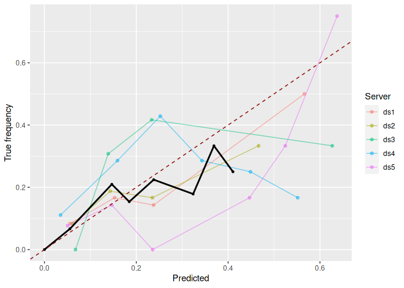
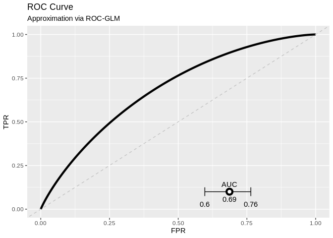
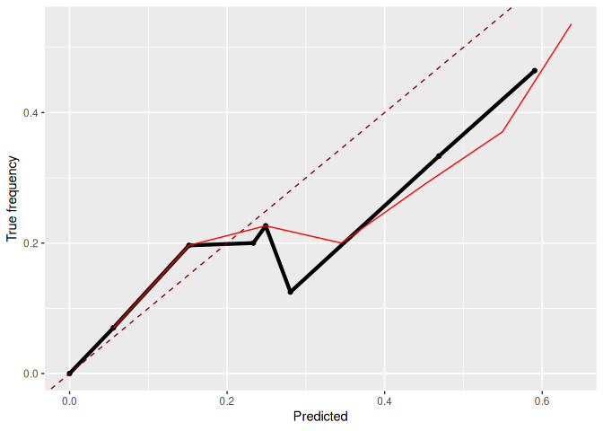

DataSHIELD Use-case: Distributed non-disclosive validation of predictive
models by a modified ROC-GLM
================

<!-- README.md is generated from README.Rmd. Please edit that file -->

  - [About the repository](#about-the-repository)
      - [Structure of the repository](#structure-of-the-repository)
  - [Setup](#setup)
      - [Install packages](#install-packages)
      - [Generate data and fit model](#generate-data-and-fit-model)
      - [Install package on DataSHIELD and upload
        data](#install-package-on-datashield-and-upload-data)
  - [Analysis](#inspect-results-using-the-docker)
      - [Log into DataSHIELD test
        server](#log-into-datashield-test-server)
      - [Push and predict](#push-and-predict)
      - [Analyse calibration of the
        predictions](#analyse-calibration-of-the-predictions)
      - [Evaluate the model using ROC
        analysis](#evaluate-the-model-using-roc-analysis)
      - [Cross check on pooled test
        data](#cross-check-on-pooled-test-data)
  - [Log out from DataSHIELD servers](#log-out-from-datashield-servers)

<!-- README.md is generated from README.Rmd. Please edit that file -->

## About the repository

This repository contains a short use-case base on the three packages
`dsPredictBase`, `dsCalibration`, and `dsROCGLM`. The main intend is to
have a use-case to demonstrate how to distributively evaluate a model
using the distributed
[ROC-GLM](https://pubmed.ncbi.nlm.nih.gov/10877289/).

The following contains the preparation of test data and a test model as
[setup](#setup) while the second part is the [analysis](#analysis).

Last time rendered: 17:24 - 09. Mar 2022 by user runner

Autobuild: [](https://github.com/difuture-lmu/datashield-demo-survival/actions/workflows/render-readme.yaml)

### Structure of the repository

  - `R`:
      - `create-model.R`: Creates a
        [`ranger`](https://cran.r-project.org/web/packages/ranger/ranger.pdf)
        used for the use-case based on the data in `generate-data.R`
      - `generate-data.R`: Takes the data set `GBSG2` (see `?GBSG2` for
        a description) from the
        [`TH.data`](https://cran.r-project.org/web/packages/TH.data/index.html),
        splits it into trian and test using 60 - 40 % of the data, and
        furhter splits the 40 % for testing into 5 parts for the
        distributed setup.
      - `helper.R`: Helper functions to locally calculate the
        [ROC-GLM](https://pubmed.ncbi.nlm.nih.gov/10877289/) and compute
        confidence intervals etc.
      - `install-ds-packages.R`: Install the necessary packages
        (`ranger`, `dsPredictBase`, `dsCalibration`, and `dsROCGLM`)
        **at the DataSHIELD servers**.
      - `install-packages.R`: Install ncessary packages locally.
      - `upload-data.R` Creates a project at the DataSHIELD server and
        uploads the data created by `generate-data.R`.
  - `data`: All data is stored here:
      - Train and test split of the GBSG2 data set (`data-train.csv` and
        `data-test.csv`).
      - The 5 splits of the `data-test.csv` for the servers (`SRV1.csv`,
        `SRV2.csv`, `SRV3.csv`, `SRV4.csv`, and `SRV5.csv`).
      - The model created by `create-model.R` (`mod.Rda`).
      - A csv file for logging each rendering (`log.csv`). This file can
        be used to get an overview about the important values and when
        each rendering was conducted. The main purpose is to show that
        the results are reproduced at each rendering.
      - The ROC-GLM of the last rendering (`roc-glm.Rda`).
  - `figures`: Figures created by the rendering are placed here. These
    are the `.pdf` fuiles used in the publication but also the `.png`
    files of the README.
  - `tables`: Tables created by the rendering are placed here.

## Setup

### Install packages

Install all packages locally:

``` r
remotes::install_github("difuture-lmu/dsPredictBase", upgrade = "never")
#> Using github PAT from envvar GITHUB_PAT
#> Downloading GitHub repo difuture-lmu/dsPredictBase@HEAD
#> Downloading GitHub repo datashield/dsBaseClient@HEAD
#> Installing 12 packages: gridExtra, dotCall64, data.table, pbapply, mathjaxr, maps, viridis, spam, panelaggregation, metafor, fields, DSI
#> Installing packages into '/home/runner/work/_temp/Library'
#> (as 'lib' is unspecified)
#> * checking for file ‘/tmp/RtmpOSGzQH/remotes906ab1fd33a/datashield-dsBaseClient-d22ba51/DESCRIPTION’ ... OK
#> * preparing ‘dsBaseClient’:
#> * checking DESCRIPTION meta-information ... OK
#> * checking for LF line-endings in source and make files and shell scripts
#> * checking for empty or unneeded directories
#> * building ‘dsBaseClient_6.1.1.tar.gz’
#> Installing package into '/home/runner/work/_temp/Library'
#> (as 'lib' is unspecified)
#> Installing 4 packages: backports, DSI, checkmate, DSOpal
#> Installing packages into '/home/runner/work/_temp/Library'
#> (as 'lib' is unspecified)
#> Skipping install of 'dsBaseClient' from a github remote, the SHA1 (d22ba514) has not changed since last install.
#>   Use `force = TRUE` to force installation
#> * checking for file ‘/tmp/RtmpOSGzQH/remotes906a22d07a81/difuture-lmu-dsPredictBase-ed79fd1/DESCRIPTION’ ... OK
#> * preparing ‘dsPredictBase’:
#> * checking DESCRIPTION meta-information ... OK
#> * checking for LF line-endings in source and make files and shell scripts
#> * checking for empty or unneeded directories
#>   NB: this package now depends on R (>= 3.5.0)
#>   WARNING: Added dependency on R >= 3.5.0 because serialized objects in
#>   serialize/load version 3 cannot be read in older versions of R.
#>   File(s) containing such objects:
#>     ‘dsPredictBase/inst/extdata/mod.Rda’
#> * building ‘dsPredictBase_0.0.1.tar.gz’
#> Installing package into '/home/runner/work/_temp/Library'
#> (as 'lib' is unspecified)
remotes::install_github("difuture-lmu/dsCalibration", upgrade = "never")
#> Using github PAT from envvar GITHUB_PAT
#> Downloading GitHub repo difuture-lmu/dsCalibration@HEAD
#> * checking for file ‘/tmp/RtmpOSGzQH/remotes906a589aab04/difuture-lmu-dsCalibration-1805632/DESCRIPTION’ ... OK
#> * preparing ‘dsCalibration’:
#> * checking DESCRIPTION meta-information ... OK
#> * checking for LF line-endings in source and make files and shell scripts
#> * checking for empty or unneeded directories
#> * building ‘dsCalibration_0.0.1.tar.gz’
#> Installing package into '/home/runner/work/_temp/Library'
#> (as 'lib' is unspecified)
remotes::install_github("difuture-lmu/dsROCGLM", upgrade = "never")
#> Using github PAT from envvar GITHUB_PAT
#> Downloading GitHub repo difuture-lmu/dsROCGLM@HEAD
#> * checking for file ‘/tmp/RtmpOSGzQH/remotes906a1209c6b3/difuture-lmu-dsROCGLM-92bdca9/DESCRIPTION’ ... OK
#> * preparing ‘dsROCGLM’:
#> * checking DESCRIPTION meta-information ... OK
#> * checking for LF line-endings in source and make files and shell scripts
#> * checking for empty or unneeded directories
#> * building ‘dsROCGLM_0.0.1.tar.gz’
#> Installing package into '/home/runner/work/_temp/Library'
#> (as 'lib' is unspecified)
```

### Generate data and fit model

The used data is the `GBSG2` from the `TH.data` packages. For further
details see the help page `?TH.data::GBSG2`. The task is to predict
whether hormonal therapy shows an improvement w.r.t. survival time. The
model we are using is a random forest from the `ranger` package. The
following code uses the `GBSG2` data, splits it into train and test data
with 60 % for training and 40 % for testing. The test data is further
split into 5 parts that are uploaded to DataSHIELD and used to simulate
the distributed setup.

``` r
source(here::here("R/generate-data.R"))
source(here::here("R/create-model.R"))
```

### Install package on DataSHIELD and upload data

``` r
source(here::here("R/upload-data.R"))
source(here::here("R/install-ds-packages.R"))
```

## Analysis

### Log into DataSHIELD test server

``` r
library(DSI)
#> Loading required package: progress
#> Loading required package: R6
library(DSOpal)
library(dsBaseClient)

library(dsPredictBase)
library(dsCalibration)
library(dsROCGLM)

library(ggplot2)

builder = newDSLoginBuilder()

surl     = "https://opal-demo.obiba.org/"
username = "administrator"
password = "password"

datasets = paste0("SRV", seq_len(5L))
for (i in seq_along(datasets)) {
  builder$append(
    server   = paste0("ds", i),
    url      = surl,
    user     = username,
    password = password,
    table    = paste0("DIFUTURE-TEST.", datasets[i])
  )
}

## Get data of the servers:
conn = datashield.login(logins = builder$build(), assign = TRUE)
#> 
#> Logging into the collaborating servers
#> 
#>   No variables have been specified. 
#>   All the variables in the table 
#>   (the whole dataset) will be assigned to R!
#> 
#> Assigning table data...
datashield.symbols(conn)
#> $ds1
#> [1] "D"
#> 
#> $ds2
#> [1] "D"
#> 
#> $ds3
#> [1] "D"
#> 
#> $ds4
#> [1] "D"
#> 
#> $ds5
#> [1] "D"

## Data dimensions per server:
(ddim = ds.dim("D"))
#> $`dimensions of D in ds1`
#> [1] 56 11
#> 
#> $`dimensions of D in ds2`
#> [1] 49 11
#> 
#> $`dimensions of D in ds3`
#> [1] 60 11
#> 
#> $`dimensions of D in ds4`
#> [1] 49 11
#> 
#> $`dimensions of D in ds5`
#> [1] 60 11
#> 
#> $`dimensions of D in combined studies`
#> [1] 274  11
```

### Push and predict

``` r
## Load the pre-calculated logistic regression:
load(here::here("data/mod.Rda"))

## Push the model to the servers (upload takes ~11 Minutes):
t0 = proc.time()
pushObject(conn, obj = mod)
#> [2022-03-09 17:26:37] Your object is bigger than 1 MB (14.4 MB). Uploading larger objects may take some time.
(t0 = proc.time() - t0)
#>    user  system elapsed 
#>  79.270  79.707 776.840
datashield.symbols(conn)
#> $ds1
#> [1] "D"   "mod"
#> 
#> $ds2
#> [1] "D"   "mod"
#> 
#> $ds3
#> [1] "D"   "mod"
#> 
#> $ds4
#> [1] "D"   "mod"
#> 
#> $ds5
#> [1] "D"   "mod"

## Time point:
which(ranger::timepoints(mod) >= 730)[1]
#> [1] 134

## Predict the model on the data sets located at the servers:
pfun = "ranger:::predict.ranger(mod, data = D)$survival[, 127]"
predictModel(conn, mod, "probs", predict_fun = pfun, package = "ranger")
datashield.symbols(conn)
#> $ds1
#> [1] "D"     "mod"   "probs"
#> 
#> $ds2
#> [1] "D"     "mod"   "probs"
#> 
#> $ds3
#> [1] "D"     "mod"   "probs"
#> 
#> $ds4
#> [1] "D"     "mod"   "probs"
#> 
#> $ds5
#> [1] "D"     "mod"   "probs"

# Because labels are flipped for the 0-1-setting we also calculate
# 1 - probs:
datashield.assign(conn, "pinv", quote(1 - probs))
```

### Analyse calibration of the predictions

``` r
brier = dsBrierScore(conn, "D$valid", "pinv")
brier
#> [1] 0.1721405

cc = dsCalibrationCurve(conn, "D$valid", "pinv")
cc
#> $individuals
#> $individuals$ds1
#>          bin  n lower upper      truth       prob
#> 1    (0,0.1] 12   0.0   0.1 0.08333333 0.05573981
#> 2  (0.1,0.2] 12   0.1   0.2 0.16666667 0.15281753
#> 3  (0.2,0.3] 14   0.2   0.3 0.14285714 0.23768818
#> 4  (0.3,0.4]  1   0.3   0.4         NA         NA
#> 5  (0.4,0.5]  4   0.4   0.5         NA         NA
#> 6  (0.5,0.6]  6   0.5   0.6 0.50000000 0.56610773
#> 7  (0.6,0.7]  4   0.6   0.7         NA         NA
#> 8  (0.7,0.8]  0   0.7   0.8         NA         NA
#> 9  (0.8,0.9]  0   0.8   0.9         NA         NA
#> 10   (0.9,1]  0   0.9   1.0         NA         NA
#> 
#> $individuals$ds2
#>          bin  n lower upper      truth      prob
#> 1    (0,0.1] 12   0.0   0.1 0.08333333 0.0616019
#> 2  (0.1,0.2] 16   0.1   0.2 0.18750000 0.1431774
#> 3  (0.2,0.3]  6   0.2   0.3 0.16666667 0.2349759
#> 4  (0.3,0.4]  1   0.3   0.4         NA        NA
#> 5  (0.4,0.5]  6   0.4   0.5 0.33333333 0.4662758
#> 6  (0.5,0.6]  3   0.5   0.6         NA        NA
#> 7  (0.6,0.7]  2   0.6   0.7         NA        NA
#> 8  (0.7,0.8]  0   0.7   0.8         NA        NA
#> 9  (0.8,0.9]  0   0.8   0.9         NA        NA
#> 10   (0.9,1]  0   0.9   1.0         NA        NA
#> 
#> $individuals$ds3
#>          bin  n lower upper     truth      prob
#> 1    (0,0.1] 14   0.0   0.1 0.0000000 0.0676965
#> 2  (0.1,0.2] 13   0.1   0.2 0.3076923 0.1389881
#> 3  (0.2,0.3] 12   0.2   0.3 0.4166667 0.2334543
#> 4  (0.3,0.4]  4   0.3   0.4        NA        NA
#> 5  (0.4,0.5]  4   0.4   0.5        NA        NA
#> 6  (0.5,0.6]  3   0.5   0.6        NA        NA
#> 7  (0.6,0.7]  6   0.6   0.7 0.3333333 0.6267099
#> 8  (0.7,0.8]  1   0.7   0.8        NA        NA
#> 9  (0.8,0.9]  0   0.8   0.9        NA        NA
#> 10   (0.9,1]  0   0.9   1.0        NA        NA
#> 
#> $individuals$ds4
#>          bin n lower upper     truth       prob
#> 1    (0,0.1] 9   0.0   0.1 0.1111111 0.03511216
#> 2  (0.1,0.2] 7   0.1   0.2 0.2857143 0.15901472
#> 3  (0.2,0.3] 7   0.2   0.3 0.4285714 0.25236634
#> 4  (0.3,0.4] 7   0.3   0.4 0.2857143 0.34306077
#> 5  (0.4,0.5] 8   0.4   0.5 0.2500000 0.44863063
#> 6  (0.5,0.6] 6   0.5   0.6 0.1666667 0.55147884
#> 7  (0.6,0.7] 4   0.6   0.7        NA         NA
#> 8  (0.7,0.8] 0   0.7   0.8        NA         NA
#> 9  (0.8,0.9] 0   0.8   0.9        NA         NA
#> 10   (0.9,1] 0   0.9   1.0        NA         NA
#> 
#> $individuals$ds5
#>          bin  n lower upper      truth       prob
#> 1    (0,0.1] 13   0.0   0.1 0.07692308 0.05046711
#> 2  (0.1,0.2] 14   0.1   0.2 0.14285714 0.14687493
#> 3  (0.2,0.3] 10   0.2   0.3 0.00000000 0.23572883
#> 4  (0.3,0.4]  0   0.3   0.4         NA         NA
#> 5  (0.4,0.5]  6   0.4   0.5 0.16666667 0.44664107
#> 6  (0.5,0.6]  6   0.5   0.6 0.33333333 0.52449110
#> 7  (0.6,0.7]  8   0.6   0.7 0.75000000 0.63735767
#> 8  (0.7,0.8]  1   0.7   0.8         NA         NA
#> 9  (0.8,0.9]  0   0.8   0.9         NA         NA
#> 10   (0.9,1]  0   0.9   1.0         NA         NA
#> 
#> 
#> $aggregated
#>          bin lower upper      truth       prob missing_ratio
#> 1    (0,0.1]   0.0   0.1 0.06666667 0.05546556     0.0000000
#> 2  (0.1,0.2]   0.1   0.2 0.20967742 0.14678783     0.0000000
#> 3  (0.2,0.3]   0.2   0.3 0.22448980 0.23801622     0.0000000
#> 4  (0.3,0.4]   0.3   0.4 0.15384615 0.18472503     0.4615385
#> 5  (0.4,0.5]   0.4   0.5 0.17857143 0.32380523     0.2857143
#> 6  (0.5,0.6]   0.5   0.6 0.25000000 0.41051942     0.2500000
#> 7  (0.6,0.7]   0.6   0.7 0.33333333 0.36913004     0.4166667
#> 8  (0.7,0.8]   0.7   0.8 0.00000000 0.00000000     1.0000000
#> 9  (0.8,0.9]   0.8   0.9        NaN        NaN           NaN
#> 10   (0.9,1]   0.9   1.0        NaN        NaN           NaN

gg_cal = plotCalibrationCurve(cc, size = 1)
gg_cal
#> Warning: Removed 26 rows containing missing values (geom_point).
#> Warning: Removed 26 row(s) containing missing values (geom_path).
#> Warning: Removed 2 rows containing missing values (geom_point).
#> Warning: Removed 2 row(s) containing missing values (geom_path).
```

<!-- -->

### Evaluate the model using ROC analysis

``` r
# Get the l2 sensitivity
(l2s = dsL2Sens(conn, "D", "pinv"))
#> [1] 0.01598668
epsilon = 0.3
delta = 0.2

# Amount of noise added:
sqrt(2 * log(1.25 / delta)) * l2s / epsilon
#> [1] 0.1020196

# Calculate ROC-GLM
roc_glm = dsROCGLM(conn, "D$valid", "pinv", epsilon = epsilon,
  delta = delta, dat_name = "D", seed_object = "D$age")
#> 
#> [2022-03-09 17:40:05] L2 sensitivity is: 0.016
#> 
#> [2022-03-09 17:40:07] Initializing ROC-GLM
#> 
#> [2022-03-09 17:40:07] Host: Received scores of negative response
#> [2022-03-09 17:40:07] Receiving negative scores
#> [2022-03-09 17:40:10] Host: Pushing pooled scores
#> [2022-03-09 17:40:12] Server: Calculating placement values and parts for ROC-GLM
#> [2022-03-09 17:40:15] Server: Calculating probit regression to obtain ROC-GLM
#> [2022-03-09 17:40:17] Deviance of iter1=32.6342
#> [2022-03-09 17:40:20] Deviance of iter2=40.5945
#> [2022-03-09 17:40:22] Deviance of iter3=43.8294
#> [2022-03-09 17:40:25] Deviance of iter4=44.016
#> [2022-03-09 17:40:27] Deviance of iter5=44.0166
#> [2022-03-09 17:40:30] Deviance of iter6=44.0166
#> [2022-03-09 17:40:30] Host: Finished calculating ROC-GLM
#> [2022-03-09 17:40:30] Host: Cleaning data on server
#> [2022-03-09 17:40:32] Host: Calculating AUC and CI
#> [2022-03-09 17:40:45] Finished!
roc_glm
#> 
#> ROC-GLM after Pepe:
#> 
#>  Binormal form: pnorm(0.81 + 1.18*qnorm(t))
#> 
#>  AUC and 0.95 CI: [0.62----0.7----0.77]
roc_glm$ci
#> [1] 0.6179411 0.7699820

gg_distr_roc = plot(roc_glm)
gg_distr_roc
```

<!-- -->

**Simple check if old (model from the last rendering) and new ROC-GLM
are equal:**

``` r
# Check if roc_glm object is the same for the new and the last run:
if (! file.exists(here::here("data/roc-glm.Rda"))) {
  saveRDS(roc_glm, file = here::here("data/roc-glm.Rda"))
} else {
  roc_glm_last_run = readRDS(here::here("data/roc-glm.Rda"))
  if (! identical(roc_glm_last_run, roc_glm))
    warning("Old and new ROC-GLM are not equal!")

  saveRDS(roc_glm, file = here::here("data/roc-glm.Rda"))
}
#> Warning: Old and new ROC-GLM are not equal!
```

## Cross check on pooled test data

``` r
#' Calculate TPR and FPRs to plot the empirical ROC curve
#'
#' @param labels (`integer()`) True labels as 0-1-coded vector.
#' @param scores (`numeric()`) Score values.
#' @return (`data.frame()`) of the TPR and FPRs.
simpleROC = function(labels, scores) {
  labels = labels[order(scores, decreasing = TRUE)]
  data.frame(
    TPR = cumsum(labels) / sum(labels),
    FPR = cumsum(! labels) / sum(! labels), labels)
}

# Load pooled test data and predict:
dat_test = read.csv(here::here("data/data-test.csv"), stringsAsFactors = TRUE)
probs = ranger:::predict.ranger(mod, data = dat_test)$survival[, 127]

# Calculate empirical AUC and compare with distributed ROC-GLM
auc = pROC::auc(dat_test$valid, 1 - probs)
#> Setting levels: control = 0, case = 1
#> Setting direction: controls < cases
c(auc_emp = auc, auc_distr_roc_glm = roc_glm$auc)
#>           auc_emp auc_distr_roc_glm 
#>         0.6886905         0.6994150

source(here::here("R/helper.R"))
(ci_emp = logitToAUC(pepeCI(toLogit(auc), 0.05, deLongVar(1 - probs, dat_test$valid))))
#> [1] 0.6100142 0.7577965


# Calculate TPR and FPR values and add to distributed ROC-GLM plot
plt_emp_roc_data = simpleROC(dat_test$valid, 1 - probs)

gg_roc_pooled = plot(roc_glm) +
  geom_line(data = plt_emp_roc_data, aes(x = FPR, y = TPR), color = "red")
gg_roc_pooled
```

<!-- -->

``` r

# Calculate pooled brier score and calibration curve
brier_pooled = mean((dat_test$valid - (1 - probs))^2)
c(brier_pooled = brier_pooled, brier_distr = brier)
#> brier_pooled  brier_distr 
#>    0.1721405    0.1721405

cc_pooled = calibrationCurve("dat_test$valid", "1 - probs", nbins = 10)

# Table of elements per server for the calibration curve:
ll_tab = list()
for (i in seq_along(cc$individuals)) {
  ll_tab[[i]] = c(i, cc$individuals[[i]]$n)
}
tab = do.call(rbind, ll_tab)
tab = as.data.frame(rbind(tab, colSums(tab)))
colnames(tab) = c("Server", cc$individuals[[1]]$bin)
tab0 = tab
for (j in seq_along(tab)[-1]) {
  tab[[j]] = paste0("$", ifelse(tab[[j]] < 5, tab[[j]], paste0("\\bm{", tab[[j]], "}")), "$")
}
tab[[1]] = paste0("$", tab[[1]], "$")
tab[6, 1] = "$\\sum$"

# LaTeX Table:
writeLines(knitr::kable(tab, format = "latex", escape = FALSE),
  con = here::here("tables/tab-cc.tex"))

knitr::kable(tab0)
```

| Server | (0,0.1\] | (0.1,0.2\] | (0.2,0.3\] | (0.3,0.4\] | (0.4,0.5\] | (0.5,0.6\] | (0.6,0.7\] | (0.7,0.8\] | (0.8,0.9\] | (0.9,1\] |
| -----: | -------: | ---------: | ---------: | ---------: | ---------: | ---------: | ---------: | ---------: | ---------: | -------: |
|      1 |       12 |         12 |         14 |          1 |          4 |          6 |          4 |          0 |          0 |        0 |
|      2 |       12 |         16 |          6 |          1 |          6 |          3 |          2 |          0 |          0 |        0 |
|      3 |       14 |         13 |         12 |          4 |          4 |          3 |          6 |          1 |          0 |        0 |
|      4 |        9 |          7 |          7 |          7 |          8 |          6 |          4 |          0 |          0 |        0 |
|      5 |       13 |         14 |         10 |          0 |          6 |          6 |          8 |          1 |          0 |        0 |
|     15 |       60 |         62 |         49 |         13 |         28 |         24 |         24 |          2 |          0 |        0 |

``` r


# Visualize distributed calibration curve vs. pooled one:

gg_cal_pooled = plotCalibrationCurve(cc, size = 1.5, individuals = FALSE) +
    geom_line(data = cc_pooled, aes(x = prob, y = truth), color = "red")
gg_cal_pooled
#> Warning: Removed 2 rows containing missing values (geom_point).
#> Warning: Removed 2 row(s) containing missing values (geom_path).
#> Warning: Removed 3 row(s) containing missing values (geom_path).
```

<!-- -->

``` r
# Summary of the results used in the paper:
tex_results = rbind(
  data.frame(command = "\\cidistlower", value = round(roc_glm$ci[1], 4)),
  data.frame(command = "\\cidistupper", value = round(roc_glm$ci[2], 4)),
  data.frame(command = "\\ciemplower", value = round(ci_emp[1], 4)),
  data.frame(command = "\\ciempupper", value = round(ci_emp[2], 4)),
  data.frame(command = "\\aucdist", value = round(roc_glm$auc, 4)),
  data.frame(command = "\\aucpooled", value = round(auc, 4)),
  data.frame(command = "\\rocglmparamOne", value = round(roc_glm$parameter[1], 4)),
  data.frame(command = "\\rocglmparamTwo", value = round(roc_glm$parameter[2], 4)),
  data.frame(command = "\\bsemp", value = round(brier_pooled, 4)),
  data.frame(command = "\\ts", value = 2 * 365),
  data.frame(command = "\\nOne", value = ddim[[1]][1]),
  data.frame(command = "\\nTwo", value = ddim[[2]][1]),
  data.frame(command = "\\nThree", value = ddim[[3]][1]),
  data.frame(command = "\\nFour", value = ddim[[4]][1]),
  data.frame(command = "\\nFive", value = ddim[[5]][1]),
  data.frame(command = "\\privparOne", value = epsilon),
  data.frame(command = "\\privparTwo", value = delta),
  data.frame(command = "\\ltwosensUC", value = round(l2s, 4))
)
writeLines(paste0("\\newcommand{", tex_results[[1]], "}{", tex_results[[2]], "}"),
  here::here("tables/tab-results.tex"))
```

## Log out from DataSHIELD servers

``` r
datashield.logout(conn)
```
