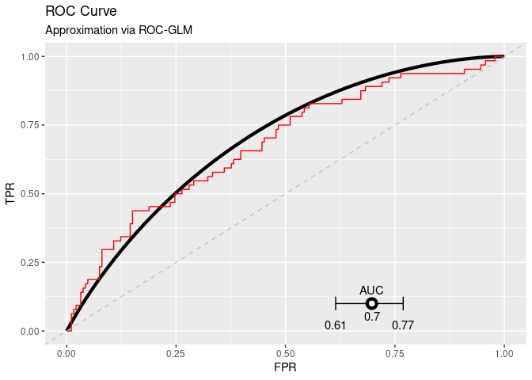

DataSHIELD Use-case: Distributed non-disclosive validation of predictive
models by a modified ROC-GLM
================

<!-- README.md is generated from README.Rmd. Please edit that file -->

  - [About the repository](#about-the-repository)
      - [Structure of the repository](#structure-of-the-repository)
  - [Setup](#setup)
      - [Install packages](#install-packages)
      - [Generate data and fit model](#generate-data-and-fit-model)
      - [Install package on DataSHIELD and upload
        data](#install-package-on-datashield-and-upload-data)
  - [Analysis](#analysis)
      - [Log into DataSHIELD test
        server](#log-into-datashield-test-server)
      - [Push and predict](#push-and-predict)
      - [Analyse calibration of the
        predictions](#analyse-calibration-of-the-predictions)
      - [Evaluate the model using ROC
        analysis](#evaluate-the-model-using-roc-analysis)
      - [Cross check on pooled test
        data](#cross-check-on-pooled-test-data)
  - [Log out from DataSHIELD servers](#log-out-from-datashield-servers)
  - [Session Info](#session-info)

<!-- README.md is generated from README.Rmd. Please edit that file -->

## About the repository

This repository contains a short use-case base on the three packages
`dsPredictBase`, `dsCalibration`, and `dsROCGLM`. The main intend is to
have a use-case to demonstrate how to distributively evaluate a model
using the distributed
[ROC-GLM](https://pubmed.ncbi.nlm.nih.gov/10877289/).

The following contains the preparation of test data and a test model as
[setup](#setup) while the second part is the [analysis](#analysis).

Last time rendered: 10:07 - 16. Mar 2022 by user daniel

Autobuild: [](https://github.com/difuture-lmu/datashield-demo-survival/actions/workflows/render-readme.yaml)

### Structure of the repository

  - `R`:
      - `create-model.R`: Creates a
        [`ranger`](https://cran.r-project.org/web/packages/ranger/ranger.pdf)
        used for the use-case based on the data in `generate-data.R`
      - `generate-data.R`: Takes the data set `GBSG2` (see `?GBSG2` for
        a description) from the
        [`TH.data`](https://cran.r-project.org/web/packages/TH.data/index.html),
        splits it into trian and test using 60 - 40 % of the data, and
        furhter splits the 40 % for testing into 5 parts for the
        distributed setup.
      - `helper.R`: Helper functions to locally calculate the
        [ROC-GLM](https://pubmed.ncbi.nlm.nih.gov/10877289/) and compute
        confidence intervals etc.
      - `install-ds-packages.R`: Install the necessary packages
        (`ranger`, `dsPredictBase`, `dsCalibration`, and `dsROCGLM`)
        **at the DataSHIELD servers**.
      - `install-packages.R`: Install ncessary packages locally.
      - `upload-data.R` Creates a project at the DataSHIELD server and
        uploads the data created by `generate-data.R`.
  - `data`: All data is stored here:
      - Train and test split of the GBSG2 data set (`data-train.csv` and
        `data-test.csv`).
      - The 5 splits of the `data-test.csv` for the servers (`SRV1.csv`,
        `SRV2.csv`, `SRV3.csv`, `SRV4.csv`, and `SRV5.csv`).
      - The model created by `create-model.R` (`mod.Rda`).
      - A csv file for logging each rendering (`log.csv`). This file can
        be used to get an overview about the important values and when
        each rendering was conducted. The main purpose is to show that
        the results are reproduced at each rendering.
      - The ROC-GLM of the last rendering (`roc-glm.Rda`).
  - `figures`: Figures created by the rendering are placed here. These
    are the `.pdf` fuiles used in the publication but also the `.png`
    files of the README.
  - `tables`: Tables created by the rendering are placed here.

## Setup

### Install packages

Install all packages locally:

``` r
remotes::install_github("difuture-lmu/dsPredictBase", upgrade = "never")
#> Skipping install of 'dsPredictBase' from a github remote, the SHA1 (ed79fd17) has not changed since last install.
#>   Use `force = TRUE` to force installation
remotes::install_github("difuture-lmu/dsCalibration", upgrade = "never")
#> Skipping install of 'dsCalibration' from a github remote, the SHA1 (1805632c) has not changed since last install.
#>   Use `force = TRUE` to force installation
remotes::install_github("difuture-lmu/dsROCGLM", upgrade = "never")
#> Skipping install of 'dsROCGLM' from a github remote, the SHA1 (92bdca9a) has not changed since last install.
#>   Use `force = TRUE` to force installation
```

### Generate data and fit model

The used data is the `GBSG2` from the `TH.data` packages. For further
details see the help page `?TH.data::GBSG2`. The task is to predict
whether hormonal therapy shows an improvement w.r.t. survival time. The
model we are using is a random forest from the `ranger` package. The
following code uses the `GBSG2` data, splits it into train and test data
with 60 % for training and 40 % for testing. The test data is further
split into 5 parts that are uploaded to DataSHIELD and used to simulate
the distributed setup.

``` r
source(here::here("R/generate-data.R"))
source(here::here("R/create-model.R"))
```

### Install package on DataSHIELD and upload data

``` r
source(here::here("R/upload-data.R"))
source(here::here("R/install-ds-packages.R"))
```

## Analysis

### Log into DataSHIELD test server

``` r
library(DSI)
#> Loading required package: progress
#> Loading required package: R6
library(DSOpal)
library(dsBaseClient)

library(dsPredictBase)
library(dsCalibration)
library(dsROCGLM)

library(ggplot2)

builder = newDSLoginBuilder()

surl     = "https://opal-demo.obiba.org/"
username = "administrator"
password = "password"

datasets = paste0("SRV", seq_len(5L))
for (i in seq_along(datasets)) {
  builder$append(
    server   = paste0("ds", i),
    url      = surl,
    user     = username,
    password = password,
    table    = paste0("DIFUTURE-TEST.", datasets[i])
  )
}

## Get data of the servers:
conn = datashield.login(logins = builder$build(), assign = TRUE)
#> 
#> Logging into the collaborating servers
#>    [-------------------------------------------------------------------------------------]   0% / 0s  Login ds1 [============>---------------------------------------------------------------]  17% / 0s  Login ds2 [========================>---------------------------------------------------]  33% / 0s  Login ds3 [=====================================>--------------------------------------]  50% / 1s  Login ds4 [==================================================>-------------------------]  67% / 1s  Login ds5 [==============================================================>-------------]  83% / 2s  Logged in all servers [================================================================] 100% / 2s
#> 
#>   No variables have been specified. 
#>   All the variables in the table 
#>   (the whole dataset) will be assigned to R!
#> 
#> Assigning table data...
#>    [-------------------------------------------------------------------------------------]   0% / 0s  Assigning ds1 (DIFUTURE-TEST.SRV1) [=======>-------------------------------------------]  17% / 1s  Assigning ds2 (DIFUTURE-TEST.SRV2) [================>----------------------------------]  33% / 2s  Assigning ds3 (DIFUTURE-TEST.SRV3) [=========================>-------------------------]  50% / 2s  Assigning ds4 (DIFUTURE-TEST.SRV4) [=================================>-----------------]  67% / 3s  Assigning ds5 (DIFUTURE-TEST.SRV5) [=========================================>---------]  83% / 3s  Assigned all tables [==================================================================] 100% / 3s
datashield.symbols(conn)
#> $ds1
#> [1] "D"
#> 
#> $ds2
#> [1] "D"
#> 
#> $ds3
#> [1] "D"
#> 
#> $ds4
#> [1] "D"
#> 
#> $ds5
#> [1] "D"

## Data dimensions per server:
(ddim = ds.dim("D"))
#>    [-------------------------------------------------------------------------------------]   0% / 0s  Checking ds1 (dimDS("D")) [------------------------------------------------------------]   0% / 0s  Getting aggregate ds1 (dimDS("D")) [=======>-------------------------------------------]  17% / 0s  Checking ds2 (dimDS("D")) [=========>--------------------------------------------------]  17% / 0s  Getting aggregate ds2 (dimDS("D")) [================>----------------------------------]  33% / 1s  Checking ds3 (dimDS("D")) [===================>----------------------------------------]  33% / 1s  Getting aggregate ds3 (dimDS("D")) [=========================>-------------------------]  50% / 1s  Checking ds4 (dimDS("D")) [=============================>------------------------------]  50% / 1s  Getting aggregate ds4 (dimDS("D")) [=================================>-----------------]  67% / 1s  Checking ds5 (dimDS("D")) [=======================================>--------------------]  67% / 1s  Getting aggregate ds5 (dimDS("D")) [=========================================>---------]  83% / 1s  Aggregated (dimDS("D")) [==============================================================] 100% / 1s
#> $`dimensions of D in ds1`
#> [1] 56 11
#> 
#> $`dimensions of D in ds2`
#> [1] 49 11
#> 
#> $`dimensions of D in ds3`
#> [1] 60 11
#> 
#> $`dimensions of D in ds4`
#> [1] 49 11
#> 
#> $`dimensions of D in ds5`
#> [1] 60 11
#> 
#> $`dimensions of D in combined studies`
#> [1] 274  11
```

### Push and predict

``` r
## Load the pre-calculated logistic regression:
load(here::here("data/mod.Rda"))

## Push the model to the servers (upload takes ~11 Minutes):
t0 = proc.time()
pushObject(conn, obj = mod)
#> [2022-03-16 10:07:51] Your object is bigger than 1 MB (14.4 MB). Uploading larger objects may take some time.
#>    [-------------------------------------------------------------------------------------]   0% / 0s  Checking ds1 (mod <- decodeBinary("580a000000030004010200030500000000055554462d3800000313000000...  Finalizing assignment ds1 (mod <- decodeBinary("580a000000030004010200030500000000055554462d380...  Checking ds2 (mod <- decodeBinary("580a000000030004010200030500000000055554462d3800000313000000...  Finalizing assignment ds2 (mod <- decodeBinary("580a000000030004010200030500000000055554462d380...  Checking ds3 (mod <- decodeBinary("580a000000030004010200030500000000055554462d3800000313000000...  Finalizing assignment ds3 (mod <- decodeBinary("580a000000030004010200030500000000055554462d380...  Checking ds4 (mod <- decodeBinary("580a000000030004010200030500000000055554462d3800000313000000...  Finalizing assignment ds4 (mod <- decodeBinary("580a000000030004010200030500000000055554462d380...  Checking ds5 (mod <- decodeBinary("580a000000030004010200030500000000055554462d3800000313000000...  Finalizing assignment ds5 (mod <- decodeBinary("580a000000030004010200030500000000055554462d380...  Assigned expr. (mod <- decodeBinary("580a000000030004010200030500000000055554462d38000003130000...
(t0 = proc.time() - t0)
#>    user  system elapsed 
#>  33.293   0.698 671.602
datashield.symbols(conn)
#> $ds1
#> [1] "D"   "mod"
#> 
#> $ds2
#> [1] "D"   "mod"
#> 
#> $ds3
#> [1] "D"   "mod"
#> 
#> $ds4
#> [1] "D"   "mod"
#> 
#> $ds5
#> [1] "D"   "mod"

## Time point:
(tpoint = which(ranger::timepoints(mod) >= 730)[1])
#> [1] 134

## Predict the model on the data sets located at the servers:
pfun = paste0("ranger:::predict.ranger(mod, data = D)$survival[, ", tpoint, "]")
predictModel(conn, mod, "probs", predict_fun = pfun, package = "ranger")
#>    [-------------------------------------------------------------------------------------]   0% / 0s  Checking ds1 (probs <- assignPredictModel("580a000000030004010200030500000000055554462d38000000...  Checking ds2 (probs <- assignPredictModel("580a000000030004010200030500000000055554462d38000000...  Checking ds3 (probs <- assignPredictModel("580a000000030004010200030500000000055554462d38000000...  Checking ds4 (probs <- assignPredictModel("580a000000030004010200030500000000055554462d38000000...  Checking ds5 (probs <- assignPredictModel("580a000000030004010200030500000000055554462d38000000...  Waiting...  (probs <- assignPredictModel("580a000000030004010200030500000000055554462d380000001...  Checking ds1 (probs <- assignPredictModel("580a000000030004010200030500000000055554462d38000000...  Checking ds2 (probs <- assignPredictModel("580a000000030004010200030500000000055554462d38000000...  Checking ds3 (probs <- assignPredictModel("580a000000030004010200030500000000055554462d38000000...  Checking ds4 (probs <- assignPredictModel("580a000000030004010200030500000000055554462d38000000...  Checking ds5 (probs <- assignPredictModel("580a000000030004010200030500000000055554462d38000000...  Waiting...  (probs <- assignPredictModel("580a000000030004010200030500000000055554462d380000001...  Checking ds1 (probs <- assignPredictModel("580a000000030004010200030500000000055554462d38000000...  Finalizing assignment ds1 (probs <- assignPredictModel("580a00000003000401020003050000000005555...  Checking ds2 (probs <- assignPredictModel("580a000000030004010200030500000000055554462d38000000...  Checking ds3 (probs <- assignPredictModel("580a000000030004010200030500000000055554462d38000000...  Checking ds4 (probs <- assignPredictModel("580a000000030004010200030500000000055554462d38000000...  Finalizing assignment ds4 (probs <- assignPredictModel("580a00000003000401020003050000000005555...  Checking ds5 (probs <- assignPredictModel("580a000000030004010200030500000000055554462d38000000...  Finalizing assignment ds5 (probs <- assignPredictModel("580a00000003000401020003050000000005555...  Waiting...  (probs <- assignPredictModel("580a000000030004010200030500000000055554462d380000001...  Checking ds2 (probs <- assignPredictModel("580a000000030004010200030500000000055554462d38000000...  Finalizing assignment ds2 (probs <- assignPredictModel("580a00000003000401020003050000000005555...  Checking ds3 (probs <- assignPredictModel("580a000000030004010200030500000000055554462d38000000...  Finalizing assignment ds3 (probs <- assignPredictModel("580a00000003000401020003050000000005555...  Assigned expr. (probs <- assignPredictModel("580a000000030004010200030500000000055554462d380000...
datashield.symbols(conn)
#> $ds1
#> [1] "D"     "mod"   "probs"
#> 
#> $ds2
#> [1] "D"     "mod"   "probs"
#> 
#> $ds3
#> [1] "D"     "mod"   "probs"
#> 
#> $ds4
#> [1] "D"     "mod"   "probs"
#> 
#> $ds5
#> [1] "D"     "mod"   "probs"

# Because labels are flipped for the 0-1-setting we also calculate
# 1 - probs:
datashield.assign(conn, "pinv", quote(1 - probs))
#>    [-------------------------------------------------------------------------------------]   0% / 0s  Checking ds1 (pinv <- 1 - probs) [-----------------------------------------------------]   0% / 0s  Finalizing assignment ds1 (pinv <- 1 - probs) [======>---------------------------------]  17% / 0s  Checking ds2 (pinv <- 1 - probs) [========>--------------------------------------------]  17% / 0s  Finalizing assignment ds2 (pinv <- 1 - probs) [============>---------------------------]  33% / 0s  Checking ds3 (pinv <- 1 - probs) [=================>-----------------------------------]  33% / 0s  Finalizing assignment ds3 (pinv <- 1 - probs) [===================>--------------------]  50% / 0s  Checking ds4 (pinv <- 1 - probs) [=========================>---------------------------]  50% / 1s  Finalizing assignment ds4 (pinv <- 1 - probs) [==========================>-------------]  67% / 1s  Checking ds5 (pinv <- 1 - probs) [==================================>------------------]  67% / 1s  Finalizing assignment ds5 (pinv <- 1 - probs) [================================>-------]  83% / 1s  Assigned expr. (pinv <- 1 - probs) [===================================================] 100% / 1s
```

### Analyse calibration of the predictions

#### Figure 7, Section 6.3

``` r
brier = dsBrierScore(conn, "D$valid", "pinv")
#>    [-------------------------------------------------------------------------------------]   0% / 0s  Checking ds1 (brierScore("D$valid", "pinv")) [-----------------------------------------]   0% / 0s  Getting aggregate ds1 (brierScore("D$valid", "pinv")) [====>---------------------------]  17% / 0s  Checking ds2 (brierScore("D$valid", "pinv")) [======>----------------------------------]  17% / 0s  Getting aggregate ds2 (brierScore("D$valid", "pinv")) [==========>---------------------]  33% / 0s  Checking ds3 (brierScore("D$valid", "pinv")) [=============>---------------------------]  33% / 0s  Getting aggregate ds3 (brierScore("D$valid", "pinv")) [===============>----------------]  50% / 0s  Checking ds4 (brierScore("D$valid", "pinv")) [===================>---------------------]  50% / 1s  Getting aggregate ds4 (brierScore("D$valid", "pinv")) [====================>-----------]  67% / 1s  Checking ds5 (brierScore("D$valid", "pinv")) [==========================>--------------]  67% / 1s  Getting aggregate ds5 (brierScore("D$valid", "pinv")) [==========================>-----]  83% / 1s  Aggregated (brierScore("D$valid", "pinv")) [===========================================] 100% / 1s
brier
#> [1] 0.1733

cc = dsCalibrationCurve(conn, "D$valid", "pinv")
#>    [-------------------------------------------------------------------------------------]   0% / 0s  Checking ds1 (calibrationCurve("D$valid", "pinv", 10, TRUE)) [-------------------------]   0% / 0s  Getting aggregate ds1 (calibrationCurve("D$valid", "pinv", 10, TRUE)) [==>-------------]  17% / 0s  Checking ds2 (calibrationCurve("D$valid", "pinv", 10, TRUE)) [===>---------------------]  17% / 0s  Getting aggregate ds2 (calibrationCurve("D$valid", "pinv", 10, TRUE)) [====>-----------]  33% / 0s  Checking ds3 (calibrationCurve("D$valid", "pinv", 10, TRUE)) [=======>-----------------]  33% / 0s  Getting aggregate ds3 (calibrationCurve("D$valid", "pinv", 10, TRUE)) [=======>--------]  50% / 0s  Checking ds4 (calibrationCurve("D$valid", "pinv", 10, TRUE)) [===========>-------------]  50% / 1s  Getting aggregate ds4 (calibrationCurve("D$valid", "pinv", 10, TRUE)) [==========>-----]  67% / 1s  Checking ds5 (calibrationCurve("D$valid", "pinv", 10, TRUE)) [================>--------]  67% / 1s  Getting aggregate ds5 (calibrationCurve("D$valid", "pinv", 10, TRUE)) [============>---]  83% / 1s  Aggregated (calibrationCurve("D$valid", "pinv", 10, TRUE)) [===========================] 100% / 1s
cc
#> $individuals
#> $individuals$ds1
#>          bin  n lower upper   truth    prob
#> 1    (0,0.1] 12   0.0   0.1 0.08333 0.05844
#> 2  (0.1,0.2] 11   0.1   0.2 0.09091 0.15889
#> 3  (0.2,0.3] 13   0.2   0.3 0.23077 0.24333
#> 4  (0.3,0.4]  3   0.3   0.4      NA      NA
#> 5  (0.4,0.5]  2   0.4   0.5      NA      NA
#> 6  (0.5,0.6]  7   0.5   0.6 0.71429 0.56052
#> 7  (0.6,0.7]  5   0.6   0.7 0.40000 0.64128
#> 8  (0.7,0.8]  0   0.7   0.8      NA      NA
#> 9  (0.8,0.9]  0   0.8   0.9      NA      NA
#> 10   (0.9,1]  0   0.9   1.0      NA      NA
#> 
#> $individuals$ds2
#>          bin  n lower upper   truth    prob
#> 1    (0,0.1] 11   0.0   0.1 0.09091 0.06182
#> 2  (0.1,0.2] 14   0.1   0.2 0.21429 0.15215
#> 3  (0.2,0.3]  9   0.2   0.3 0.11111 0.25475
#> 4  (0.3,0.4]  1   0.3   0.4      NA      NA
#> 5  (0.4,0.5]  4   0.4   0.5      NA      NA
#> 6  (0.5,0.6]  5   0.5   0.6 0.00000 0.54792
#> 7  (0.6,0.7]  2   0.6   0.7      NA      NA
#> 8  (0.7,0.8]  0   0.7   0.8      NA      NA
#> 9  (0.8,0.9]  0   0.8   0.9      NA      NA
#> 10   (0.9,1]  0   0.9   1.0      NA      NA
#> 
#> $individuals$ds3
#>          bin  n lower upper  truth    prob
#> 1    (0,0.1] 13   0.0   0.1 0.0000 0.06866
#> 2  (0.1,0.2] 12   0.1   0.2 0.2500 0.14194
#> 3  (0.2,0.3] 12   0.2   0.3 0.4167 0.24110
#> 4  (0.3,0.4]  5   0.3   0.4 0.4000 0.33940
#> 5  (0.4,0.5]  3   0.4   0.5     NA      NA
#> 6  (0.5,0.6]  4   0.5   0.6     NA      NA
#> 7  (0.6,0.7]  7   0.6   0.7 0.2857 0.63177
#> 8  (0.7,0.8]  1   0.7   0.8     NA      NA
#> 9  (0.8,0.9]  0   0.8   0.9     NA      NA
#> 10   (0.9,1]  0   0.9   1.0     NA      NA
#> 
#> $individuals$ds4
#>          bin n lower upper  truth   prob
#> 1    (0,0.1] 8   0.0   0.1 0.1250 0.0296
#> 2  (0.1,0.2] 6   0.1   0.2 0.3333 0.1432
#> 3  (0.2,0.3] 9   0.2   0.3 0.3333 0.2627
#> 4  (0.3,0.4] 5   0.3   0.4 0.2000 0.3604
#> 5  (0.4,0.5] 9   0.4   0.5 0.2222 0.4437
#> 6  (0.5,0.6] 6   0.5   0.6 0.3333 0.5504
#> 7  (0.6,0.7] 5   0.6   0.7 0.6000 0.6346
#> 8  (0.7,0.8] 0   0.7   0.8     NA     NA
#> 9  (0.8,0.9] 0   0.8   0.9     NA     NA
#> 10   (0.9,1] 0   0.9   1.0     NA     NA
#> 
#> $individuals$ds5
#>          bin  n lower upper   truth    prob
#> 1    (0,0.1] 13   0.0   0.1 0.07692 0.05122
#> 2  (0.1,0.2] 13   0.1   0.2 0.15385 0.15759
#> 3  (0.2,0.3] 10   0.2   0.3 0.00000 0.24805
#> 4  (0.3,0.4]  1   0.3   0.4      NA      NA
#> 5  (0.4,0.5]  6   0.4   0.5 0.16667 0.45588
#> 6  (0.5,0.6]  5   0.5   0.6 0.40000 0.53876
#> 7  (0.6,0.7]  9   0.6   0.7 0.66667 0.63667
#> 8  (0.7,0.8]  1   0.7   0.8      NA      NA
#> 9  (0.8,0.9]  0   0.8   0.9      NA      NA
#> 10   (0.9,1]  0   0.9   1.0      NA      NA
#> 
#> 
#> $aggregated
#>          bin lower upper   truth    prob missing_ratio
#> 1    (0,0.1]   0.0   0.1 0.07018 0.05573       0.00000
#> 2  (0.1,0.2]   0.1   0.2 0.19643 0.15159       0.00000
#> 3  (0.2,0.3]   0.2   0.3 0.22642 0.24895       0.00000
#> 4  (0.3,0.4]   0.3   0.4 0.20000 0.23326       0.33333
#> 5  (0.4,0.5]   0.4   0.5 0.12500 0.28037       0.37500
#> 6  (0.5,0.6]   0.5   0.6 0.33333 0.46886       0.14815
#> 7  (0.6,0.7]   0.6   0.7 0.46429 0.59042       0.07143
#> 8  (0.7,0.8]   0.7   0.8 0.00000 0.00000       1.00000
#> 9  (0.8,0.9]   0.8   0.9     NaN     NaN           NaN
#> 10   (0.9,1]   0.9   1.0     NaN     NaN           NaN

gg_cal = plotCalibrationCurve(cc, size = 1)
gg_cal
#> Warning: Removed 23 rows containing missing values (geom_point).
#> Warning: Removed 23 row(s) containing missing values (geom_path).
#> Warning: Removed 2 rows containing missing values (geom_point).
#> Warning: Removed 2 row(s) containing missing values (geom_path).
```

<!-- -->

### Evaluate the model using ROC analysis

#### Figure 6, Section 6.2

``` r
# Get the l2 sensitivity
(l2s = dsL2Sens(conn, "D", "pinv"))
#>    [-------------------------------------------------------------------------------------]   0% / 0s  Checking ds1 (dimDS("D")) [------------------------------------------------------------]   0% / 0s  Getting aggregate ds1 (dimDS("D")) [=======>-------------------------------------------]  17% / 0s  Checking ds2 (dimDS("D")) [=========>--------------------------------------------------]  17% / 0s  Getting aggregate ds2 (dimDS("D")) [================>----------------------------------]  33% / 0s  Checking ds3 (dimDS("D")) [===================>----------------------------------------]  33% / 0s  Getting aggregate ds3 (dimDS("D")) [=========================>-------------------------]  50% / 1s  Checking ds4 (dimDS("D")) [=============================>------------------------------]  50% / 1s  Getting aggregate ds4 (dimDS("D")) [=================================>-----------------]  67% / 1s  Checking ds5 (dimDS("D")) [=======================================>--------------------]  67% / 1s  Getting aggregate ds5 (dimDS("D")) [=========================================>---------]  83% / 1s  Aggregated (dimDS("D")) [==============================================================] 100% / 1s
#>    [-------------------------------------------------------------------------------------]   0% / 0s  Checking ds1 (xXcols <- decodeBinary("580a000000030004010200030500000000055554462d38000000fe", ...  Finalizing assignment ds1 (xXcols <- decodeBinary("580a000000030004010200030500000000055554462d...  Checking ds2 (xXcols <- decodeBinary("580a000000030004010200030500000000055554462d38000000fe", ...  Finalizing assignment ds2 (xXcols <- decodeBinary("580a000000030004010200030500000000055554462d...  Checking ds3 (xXcols <- decodeBinary("580a000000030004010200030500000000055554462d38000000fe", ...  Finalizing assignment ds3 (xXcols <- decodeBinary("580a000000030004010200030500000000055554462d...  Checking ds4 (xXcols <- decodeBinary("580a000000030004010200030500000000055554462d38000000fe", ...  Finalizing assignment ds4 (xXcols <- decodeBinary("580a000000030004010200030500000000055554462d...  Checking ds5 (xXcols <- decodeBinary("580a000000030004010200030500000000055554462d38000000fe", ...  Finalizing assignment ds5 (xXcols <- decodeBinary("580a000000030004010200030500000000055554462d...  Assigned expr. (xXcols <- decodeBinary("580a000000030004010200030500000000055554462d38000000fe"...
#>    [-------------------------------------------------------------------------------------]   0% / 0s  Checking ds1 (l2sens("D", "pinv", 91, "xXcols", diff, TRUE)) [-------------------------]   0% / 0s  Getting aggregate ds1 (l2sens("D", "pinv", 91, "xXcols", diff, TRUE)) [==>-------------]  17% / 0s  Checking ds2 (l2sens("D", "pinv", 91, "xXcols", diff, TRUE)) [===>---------------------]  17% / 0s  Getting aggregate ds2 (l2sens("D", "pinv", 91, "xXcols", diff, TRUE)) [====>-----------]  33% / 0s  Checking ds3 (l2sens("D", "pinv", 91, "xXcols", diff, TRUE)) [=======>-----------------]  33% / 0s  Getting aggregate ds3 (l2sens("D", "pinv", 91, "xXcols", diff, TRUE)) [=======>--------]  50% / 0s  Checking ds4 (l2sens("D", "pinv", 91, "xXcols", diff, TRUE)) [===========>-------------]  50% / 1s  Getting aggregate ds4 (l2sens("D", "pinv", 91, "xXcols", diff, TRUE)) [==========>-----]  67% / 1s  Checking ds5 (l2sens("D", "pinv", 91, "xXcols", diff, TRUE)) [================>--------]  67% / 1s  Getting aggregate ds5 (l2sens("D", "pinv", 91, "xXcols", diff, TRUE)) [============>---]  83% / 1s  Aggregated (...) [=====================================================================] 100% / 1s
#>    [-------------------------------------------------------------------------------------]   0% / 0s  Checking ds1 (rmDS("xXcols")) [--------------------------------------------------------]   0% / 0s  Getting aggregate ds1 (rmDS("xXcols")) [=======>---------------------------------------]  17% / 0s  Checking ds2 (rmDS("xXcols")) [========>-----------------------------------------------]  17% / 0s  Getting aggregate ds2 (rmDS("xXcols")) [===============>-------------------------------]  33% / 0s  Checking ds3 (rmDS("xXcols")) [==================>-------------------------------------]  33% / 0s  Getting aggregate ds3 (rmDS("xXcols")) [=======================>-----------------------]  50% / 0s  Checking ds4 (rmDS("xXcols")) [===========================>----------------------------]  50% / 1s  Getting aggregate ds4 (rmDS("xXcols")) [==============================>----------------]  67% / 1s  Checking ds5 (rmDS("xXcols")) [====================================>-------------------]  67% / 1s  Getting aggregate ds5 (rmDS("xXcols")) [======================================>--------]  83% / 1s  Aggregated (rmDS("xXcols")) [==========================================================] 100% / 1s
#> [1] 0.01599
epsilon = 0.3
delta = 0.3

# Amount of noise added:
sqrt(2 * log(1.25 / delta)) * l2s / epsilon
#> [1] 0.09003

# Calculate ROC-GLM
roc_glm = dsROCGLM(conn, "D$valid", "pinv", epsilon = epsilon,
  delta = delta, dat_name = "D", seed_object = "D$cens")
#>    [-------------------------------------------------------------------------------------]   0% / 0s  Checking ds1 (dimDS("D")) [------------------------------------------------------------]   0% / 0s  Getting aggregate ds1 (dimDS("D")) [=======>-------------------------------------------]  17% / 0s  Checking ds2 (dimDS("D")) [=========>--------------------------------------------------]  17% / 0s  Getting aggregate ds2 (dimDS("D")) [================>----------------------------------]  33% / 0s  Checking ds3 (dimDS("D")) [===================>----------------------------------------]  33% / 0s  Getting aggregate ds3 (dimDS("D")) [=========================>-------------------------]  50% / 0s  Checking ds4 (dimDS("D")) [=============================>------------------------------]  50% / 1s  Getting aggregate ds4 (dimDS("D")) [=================================>-----------------]  67% / 1s  Checking ds5 (dimDS("D")) [=======================================>--------------------]  67% / 1s  Getting aggregate ds5 (dimDS("D")) [=========================================>---------]  83% / 1s  Aggregated (dimDS("D")) [==============================================================] 100% / 1s
#>    [-------------------------------------------------------------------------------------]   0% / 0s  Checking ds1 (xXcols <- decodeBinary("580a000000030004010200030500000000055554462d38000000fe", ...  Finalizing assignment ds1 (xXcols <- decodeBinary("580a000000030004010200030500000000055554462d...  Checking ds2 (xXcols <- decodeBinary("580a000000030004010200030500000000055554462d38000000fe", ...  Finalizing assignment ds2 (xXcols <- decodeBinary("580a000000030004010200030500000000055554462d...  Checking ds3 (xXcols <- decodeBinary("580a000000030004010200030500000000055554462d38000000fe", ...  Finalizing assignment ds3 (xXcols <- decodeBinary("580a000000030004010200030500000000055554462d...  Checking ds4 (xXcols <- decodeBinary("580a000000030004010200030500000000055554462d38000000fe", ...  Finalizing assignment ds4 (xXcols <- decodeBinary("580a000000030004010200030500000000055554462d...  Checking ds5 (xXcols <- decodeBinary("580a000000030004010200030500000000055554462d38000000fe", ...  Finalizing assignment ds5 (xXcols <- decodeBinary("580a000000030004010200030500000000055554462d...  Assigned expr. (xXcols <- decodeBinary("580a000000030004010200030500000000055554462d38000000fe"...
#>    [-------------------------------------------------------------------------------------]   0% / 0s  Checking ds1 (l2sens("D", "pinv", 91, "xXcols", diff, TRUE)) [-------------------------]   0% / 0s  Getting aggregate ds1 (l2sens("D", "pinv", 91, "xXcols", diff, TRUE)) [==>-------------]  17% / 0s  Checking ds2 (l2sens("D", "pinv", 91, "xXcols", diff, TRUE)) [===>---------------------]  17% / 0s  Getting aggregate ds2 (l2sens("D", "pinv", 91, "xXcols", diff, TRUE)) [====>-----------]  33% / 0s  Checking ds3 (l2sens("D", "pinv", 91, "xXcols", diff, TRUE)) [=======>-----------------]  33% / 0s  Getting aggregate ds3 (l2sens("D", "pinv", 91, "xXcols", diff, TRUE)) [=======>--------]  50% / 0s  Checking ds4 (l2sens("D", "pinv", 91, "xXcols", diff, TRUE)) [===========>-------------]  50% / 1s  Getting aggregate ds4 (l2sens("D", "pinv", 91, "xXcols", diff, TRUE)) [==========>-----]  67% / 1s  Checking ds5 (l2sens("D", "pinv", 91, "xXcols", diff, TRUE)) [================>--------]  67% / 1s  Getting aggregate ds5 (l2sens("D", "pinv", 91, "xXcols", diff, TRUE)) [============>---]  83% / 1s  Aggregated (...) [=====================================================================] 100% / 1s
#>    [-------------------------------------------------------------------------------------]   0% / 0s  Checking ds1 (rmDS("xXcols")) [--------------------------------------------------------]   0% / 0s  Getting aggregate ds1 (rmDS("xXcols")) [=======>---------------------------------------]  17% / 0s  Checking ds2 (rmDS("xXcols")) [========>-----------------------------------------------]  17% / 0s  Getting aggregate ds2 (rmDS("xXcols")) [===============>-------------------------------]  33% / 0s  Checking ds3 (rmDS("xXcols")) [==================>-------------------------------------]  33% / 0s  Getting aggregate ds3 (rmDS("xXcols")) [=======================>-----------------------]  50% / 0s  Checking ds4 (rmDS("xXcols")) [===========================>----------------------------]  50% / 1s  Getting aggregate ds4 (rmDS("xXcols")) [==============================>----------------]  67% / 1s  Checking ds5 (rmDS("xXcols")) [====================================>-------------------]  67% / 1s  Getting aggregate ds5 (rmDS("xXcols")) [======================================>--------]  83% / 1s  Aggregated (rmDS("xXcols")) [==========================================================] 100% / 1s
#> 
#> [2022-03-16 10:19:13] L2 sensitivity is: 0.016
#> 
#>    [-------------------------------------------------------------------------------------]   0% / 0s  Checking ds1 (l2s <- decodeBinary("580a000000030004010200030500000000055554462d380000000e000000...  Finalizing assignment ds1 (l2s <- decodeBinary("580a000000030004010200030500000000055554462d380...  Checking ds2 (l2s <- decodeBinary("580a000000030004010200030500000000055554462d380000000e000000...  Finalizing assignment ds2 (l2s <- decodeBinary("580a000000030004010200030500000000055554462d380...  Checking ds3 (l2s <- decodeBinary("580a000000030004010200030500000000055554462d380000000e000000...  Finalizing assignment ds3 (l2s <- decodeBinary("580a000000030004010200030500000000055554462d380...  Checking ds4 (l2s <- decodeBinary("580a000000030004010200030500000000055554462d380000000e000000...  Finalizing assignment ds4 (l2s <- decodeBinary("580a000000030004010200030500000000055554462d380...  Checking ds5 (l2s <- decodeBinary("580a000000030004010200030500000000055554462d380000000e000000...  Finalizing assignment ds5 (l2s <- decodeBinary("580a000000030004010200030500000000055554462d380...  Assigned expr. (l2s <- decodeBinary("580a000000030004010200030500000000055554462d380000000e0000...
#> 
#> [2022-03-16 10:19:14] Initializing ROC-GLM
#> 
#> [2022-03-16 10:19:14] Host: Received scores of negative response
#> 
#> [2022-03-16 10:19:14] Receiving negative scores
#>    [-------------------------------------------------------------------------------------]   0% / 0s  Checking ds1 (getNegativeScores("D$valid", "pinv", 0.3, 0.3, "D$cens", TRUE)) [--------]   0% / 0s  Getting aggregate ds1 (getNegativeScores("D$valid", "pinv", 0.3, 0.3, "D$cens", TRUE)) []  17% ...  Checking ds2 (getNegativeScores("D$valid", "pinv", 0.3, 0.3, "D$cens", TRUE)) [>-------]  17% / 0s  Getting aggregate ds2 (getNegativeScores("D$valid", "pinv", 0.3, 0.3, "D$cens", TRUE)) []  33% ...  Checking ds3 (getNegativeScores("D$valid", "pinv", 0.3, 0.3, "D$cens", TRUE)) [==>-----]  33% / 0s  Getting aggregate ds3 (getNegativeScores("D$valid", "pinv", 0.3, 0.3, "D$cens", TRUE)) []  50% ...  Checking ds4 (getNegativeScores("D$valid", "pinv", 0.3, 0.3, "D$cens", TRUE)) [===>----]  50% / 1s  Getting aggregate ds4 (getNegativeScores("D$valid", "pinv", 0.3, 0.3, "D$cens", TRUE)) []  67% ...  Checking ds5 (getNegativeScores("D$valid", "pinv", 0.3, 0.3, "D$cens", TRUE)) [====>---]  67% / 1s  Getting aggregate ds5 (getNegativeScores("D$valid", "pinv", 0.3, 0.3, "D$cens", TRUE)) []  83% ...  Aggregated (...) [=====================================================================] 100% / 1s
#> [2022-03-16 10:19:14] Host: Pushing pooled scores
#>    [-------------------------------------------------------------------------------------]   0% / 0s  Checking ds1 (pooled_scores <- decodeBinary("580a000000030004010200030500000000055554462d380000...  Finalizing assignment ds1 (pooled_scores <- decodeBinary("580a000000030004010200030500000000055...  Checking ds2 (pooled_scores <- decodeBinary("580a000000030004010200030500000000055554462d380000...  Finalizing assignment ds2 (pooled_scores <- decodeBinary("580a000000030004010200030500000000055...  Checking ds3 (pooled_scores <- decodeBinary("580a000000030004010200030500000000055554462d380000...  Finalizing assignment ds3 (pooled_scores <- decodeBinary("580a000000030004010200030500000000055...  Checking ds4 (pooled_scores <- decodeBinary("580a000000030004010200030500000000055554462d380000...  Finalizing assignment ds4 (pooled_scores <- decodeBinary("580a000000030004010200030500000000055...  Checking ds5 (pooled_scores <- decodeBinary("580a000000030004010200030500000000055554462d380000...  Finalizing assignment ds5 (pooled_scores <- decodeBinary("580a000000030004010200030500000000055...  Assigned expr. (pooled_scores <- decodeBinary("580a000000030004010200030500000000055554462d3800...
#> [2022-03-16 10:19:15] Server: Calculating placement values and parts for ROC-GLM
#>    [-------------------------------------------------------------------------------------]   0% / 0s  Checking ds1 (roc_data <- rocGLMFrame("D$valid", "pinv", "pooled_scores")) [-----------]   0% / 0s  Finalizing assignment ds1 (roc_data <- rocGLMFrame("D$valid", "pinv", "pooled_scores")) []  17%...  Checking ds2 (roc_data <- rocGLMFrame("D$valid", "pinv", "pooled_scores")) [=>---------]  17% / 0s  Finalizing assignment ds2 (roc_data <- rocGLMFrame("D$valid", "pinv", "pooled_scores")) []  33%...  Checking ds3 (roc_data <- rocGLMFrame("D$valid", "pinv", "pooled_scores")) [===>-------]  33% / 0s  Finalizing assignment ds3 (roc_data <- rocGLMFrame("D$valid", "pinv", "pooled_scores")) []  50%...  Checking ds4 (roc_data <- rocGLMFrame("D$valid", "pinv", "pooled_scores")) [=====>-----]  50% / 1s  Finalizing assignment ds4 (roc_data <- rocGLMFrame("D$valid", "pinv", "pooled_scores")) []  67%...  Checking ds5 (roc_data <- rocGLMFrame("D$valid", "pinv", "pooled_scores")) [======>----]  67% / 1s  Finalizing assignment ds5 (roc_data <- rocGLMFrame("D$valid", "pinv", "pooled_scores")) []  83%...  Assigned expr. (roc_data <- rocGLMFrame("D$valid", "pinv", "pooled_scores")) [=========] 100% / 1s
#> [2022-03-16 10:19:16] Server: Calculating probit regression to obtain ROC-GLM
#>    [-------------------------------------------------------------------------------------]   0% / 0s  Checking ds1 (calculateDistrGLMParts(formula = y ~ x, data = "roc_data", w = "w", ) [--]   0% / 0s  Getting aggregate ds1 (calculateDistrGLMParts(formula = y ~ x, data = "roc_data", w = "w", ) []...  Checking ds2 (calculateDistrGLMParts(formula = y ~ x, data = "roc_data", w = "w", ) [--]  17% / 0s  Getting aggregate ds2 (calculateDistrGLMParts(formula = y ~ x, data = "roc_data", w = "w", ) []...  Checking ds3 (calculateDistrGLMParts(formula = y ~ x, data = "roc_data", w = "w", ) [>-]  33% / 0s  Getting aggregate ds3 (calculateDistrGLMParts(formula = y ~ x, data = "roc_data", w = "w", ) []...  Checking ds4 (calculateDistrGLMParts(formula = y ~ x, data = "roc_data", w = "w", ) [>-]  50% / 1s  Getting aggregate ds4 (calculateDistrGLMParts(formula = y ~ x, data = "roc_data", w = "w", ) []...  Checking ds5 (calculateDistrGLMParts(formula = y ~ x, data = "roc_data", w = "w", ) [>-]  67% / 1s  Getting aggregate ds5 (calculateDistrGLMParts(formula = y ~ x, data = "roc_data", w = "w", ) []...  Aggregated (calculateDistrGLMParts(formula = y ~ x, data = "roc_data", w = "w", ) [====] 100% / 1s
#> [2022-03-16 10:19:17] Deviance of iter1=32.6342
#>    [-------------------------------------------------------------------------------------]   0% / 0s  Checking ds1 (calculateDistrGLMParts(formula = y ~ x, data = "roc_data", w = "w", ) [--]   0% / 0s  Getting aggregate ds1 (calculateDistrGLMParts(formula = y ~ x, data = "roc_data", w = "w", ) []...  Checking ds2 (calculateDistrGLMParts(formula = y ~ x, data = "roc_data", w = "w", ) [--]  17% / 0s  Getting aggregate ds2 (calculateDistrGLMParts(formula = y ~ x, data = "roc_data", w = "w", ) []...  Checking ds3 (calculateDistrGLMParts(formula = y ~ x, data = "roc_data", w = "w", ) [>-]  33% / 0s  Getting aggregate ds3 (calculateDistrGLMParts(formula = y ~ x, data = "roc_data", w = "w", ) []...  Checking ds4 (calculateDistrGLMParts(formula = y ~ x, data = "roc_data", w = "w", ) [>-]  50% / 1s  Getting aggregate ds4 (calculateDistrGLMParts(formula = y ~ x, data = "roc_data", w = "w", ) []...  Checking ds5 (calculateDistrGLMParts(formula = y ~ x, data = "roc_data", w = "w", ) [>-]  67% / 1s  Getting aggregate ds5 (calculateDistrGLMParts(formula = y ~ x, data = "roc_data", w = "w", ) []...  Aggregated (calculateDistrGLMParts(formula = y ~ x, data = "roc_data", w = "w", ) [====] 100% / 1s
#> [2022-03-16 10:19:18] Deviance of iter2=40.9884
#>    [-------------------------------------------------------------------------------------]   0% / 0s  Checking ds1 (calculateDistrGLMParts(formula = y ~ x, data = "roc_data", w = "w", ) [--]   0% / 0s  Getting aggregate ds1 (calculateDistrGLMParts(formula = y ~ x, data = "roc_data", w = "w", ) []...  Checking ds2 (calculateDistrGLMParts(formula = y ~ x, data = "roc_data", w = "w", ) [--]  17% / 0s  Getting aggregate ds2 (calculateDistrGLMParts(formula = y ~ x, data = "roc_data", w = "w", ) []...  Checking ds3 (calculateDistrGLMParts(formula = y ~ x, data = "roc_data", w = "w", ) [>-]  33% / 0s  Getting aggregate ds3 (calculateDistrGLMParts(formula = y ~ x, data = "roc_data", w = "w", ) []...  Checking ds4 (calculateDistrGLMParts(formula = y ~ x, data = "roc_data", w = "w", ) [>-]  50% / 1s  Getting aggregate ds4 (calculateDistrGLMParts(formula = y ~ x, data = "roc_data", w = "w", ) []...  Checking ds5 (calculateDistrGLMParts(formula = y ~ x, data = "roc_data", w = "w", ) [>-]  67% / 1s  Getting aggregate ds5 (calculateDistrGLMParts(formula = y ~ x, data = "roc_data", w = "w", ) []...  Aggregated (calculateDistrGLMParts(formula = y ~ x, data = "roc_data", w = "w", ) [====] 100% / 1s
#> [2022-03-16 10:19:19] Deviance of iter3=45.7591
#>    [-------------------------------------------------------------------------------------]   0% / 0s  Checking ds1 (calculateDistrGLMParts(formula = y ~ x, data = "roc_data", w = "w", ) [--]   0% / 0s  Getting aggregate ds1 (calculateDistrGLMParts(formula = y ~ x, data = "roc_data", w = "w", ) []...  Checking ds2 (calculateDistrGLMParts(formula = y ~ x, data = "roc_data", w = "w", ) [--]  17% / 0s  Getting aggregate ds2 (calculateDistrGLMParts(formula = y ~ x, data = "roc_data", w = "w", ) []...  Checking ds3 (calculateDistrGLMParts(formula = y ~ x, data = "roc_data", w = "w", ) [>-]  33% / 0s  Getting aggregate ds3 (calculateDistrGLMParts(formula = y ~ x, data = "roc_data", w = "w", ) []...  Checking ds4 (calculateDistrGLMParts(formula = y ~ x, data = "roc_data", w = "w", ) [>-]  50% / 1s  Getting aggregate ds4 (calculateDistrGLMParts(formula = y ~ x, data = "roc_data", w = "w", ) []...  Checking ds5 (calculateDistrGLMParts(formula = y ~ x, data = "roc_data", w = "w", ) [>-]  67% / 1s  Getting aggregate ds5 (calculateDistrGLMParts(formula = y ~ x, data = "roc_data", w = "w", ) []...  Aggregated (calculateDistrGLMParts(formula = y ~ x, data = "roc_data", w = "w", ) [====] 100% / 1s
#> [2022-03-16 10:19:19] Deviance of iter4=46.0505
#>    [-------------------------------------------------------------------------------------]   0% / 0s  Checking ds1 (calculateDistrGLMParts(formula = y ~ x, data = "roc_data", w = "w", ) [--]   0% / 0s  Getting aggregate ds1 (calculateDistrGLMParts(formula = y ~ x, data = "roc_data", w = "w", ) []...  Checking ds2 (calculateDistrGLMParts(formula = y ~ x, data = "roc_data", w = "w", ) [--]  17% / 0s  Getting aggregate ds2 (calculateDistrGLMParts(formula = y ~ x, data = "roc_data", w = "w", ) []...  Checking ds3 (calculateDistrGLMParts(formula = y ~ x, data = "roc_data", w = "w", ) [>-]  33% / 0s  Getting aggregate ds3 (calculateDistrGLMParts(formula = y ~ x, data = "roc_data", w = "w", ) []...  Checking ds4 (calculateDistrGLMParts(formula = y ~ x, data = "roc_data", w = "w", ) [>-]  50% / 1s  Getting aggregate ds4 (calculateDistrGLMParts(formula = y ~ x, data = "roc_data", w = "w", ) []...  Checking ds5 (calculateDistrGLMParts(formula = y ~ x, data = "roc_data", w = "w", ) [>-]  67% / 1s  Getting aggregate ds5 (calculateDistrGLMParts(formula = y ~ x, data = "roc_data", w = "w", ) []...  Aggregated (calculateDistrGLMParts(formula = y ~ x, data = "roc_data", w = "w", ) [====] 100% / 1s
#> [2022-03-16 10:19:20] Deviance of iter5=46.0515
#>    [-------------------------------------------------------------------------------------]   0% / 0s  Checking ds1 (calculateDistrGLMParts(formula = y ~ x, data = "roc_data", w = "w", ) [--]   0% / 0s  Getting aggregate ds1 (calculateDistrGLMParts(formula = y ~ x, data = "roc_data", w = "w", ) []...  Checking ds2 (calculateDistrGLMParts(formula = y ~ x, data = "roc_data", w = "w", ) [--]  17% / 0s  Getting aggregate ds2 (calculateDistrGLMParts(formula = y ~ x, data = "roc_data", w = "w", ) []...  Checking ds3 (calculateDistrGLMParts(formula = y ~ x, data = "roc_data", w = "w", ) [>-]  33% / 0s  Getting aggregate ds3 (calculateDistrGLMParts(formula = y ~ x, data = "roc_data", w = "w", ) []...  Checking ds4 (calculateDistrGLMParts(formula = y ~ x, data = "roc_data", w = "w", ) [>-]  50% / 1s  Getting aggregate ds4 (calculateDistrGLMParts(formula = y ~ x, data = "roc_data", w = "w", ) []...  Checking ds5 (calculateDistrGLMParts(formula = y ~ x, data = "roc_data", w = "w", ) [>-]  67% / 1s  Getting aggregate ds5 (calculateDistrGLMParts(formula = y ~ x, data = "roc_data", w = "w", ) []...  Aggregated (calculateDistrGLMParts(formula = y ~ x, data = "roc_data", w = "w", ) [====] 100% / 1s
#> [2022-03-16 10:19:21] Deviance of iter6=46.0515
#> [2022-03-16 10:19:21] Host: Finished calculating ROC-GLM
#> [2022-03-16 10:19:21] Host: Cleaning data on server
#> [2022-03-16 10:19:23] Host: Calculating AUC and CI
#>    [-------------------------------------------------------------------------------------]   0% / 0s  Checking ds1 (meanDS(D$valid)) [-------------------------------------------------------]   0% / 0s  Getting aggregate ds1 (meanDS(D$valid)) [=======>--------------------------------------]  17% / 0s  Checking ds2 (meanDS(D$valid)) [========>----------------------------------------------]  17% / 0s  Getting aggregate ds2 (meanDS(D$valid)) [==============>-------------------------------]  33% / 0s  Checking ds3 (meanDS(D$valid)) [=================>-------------------------------------]  33% / 0s  Getting aggregate ds3 (meanDS(D$valid)) [======================>-----------------------]  50% / 1s  Checking ds4 (meanDS(D$valid)) [===========================>---------------------------]  50% / 1s  Getting aggregate ds4 (meanDS(D$valid)) [==============================>---------------]  67% / 1s  Checking ds5 (meanDS(D$valid)) [====================================>------------------]  67% / 1s  Getting aggregate ds5 (meanDS(D$valid)) [=====================================>--------]  83% / 1s  Aggregated (meanDS(D$valid)) [=========================================================] 100% / 1s
#>    [-------------------------------------------------------------------------------------]   0% / 0s  Checking ds1 (getNegativeScoresVar("D$valid", "pinv")) [-------------------------------]   0% / 0s  Getting aggregate ds1 (getNegativeScoresVar("D$valid", "pinv")) [===>------------------]  17% / 0s  Checking ds2 (getNegativeScoresVar("D$valid", "pinv")) [====>--------------------------]  17% / 0s  Getting aggregate ds2 (getNegativeScoresVar("D$valid", "pinv")) [======>---------------]  33% / 0s  Checking ds3 (getNegativeScoresVar("D$valid", "pinv")) [=========>---------------------]  33% / 0s  Getting aggregate ds3 (getNegativeScoresVar("D$valid", "pinv")) [==========>-----------]  50% / 1s  Checking ds4 (getNegativeScoresVar("D$valid", "pinv")) [===============>---------------]  50% / 1s  Getting aggregate ds4 (getNegativeScoresVar("D$valid", "pinv")) [==============>-------]  67% / 1s  Checking ds5 (getNegativeScoresVar("D$valid", "pinv")) [====================>----------]  67% / 1s  Getting aggregate ds5 (getNegativeScoresVar("D$valid", "pinv")) [=================>----]  83% / 1s  Aggregated (...) [=====================================================================] 100% / 1s
#>    [-------------------------------------------------------------------------------------]   0% / 0s  Checking ds1 (getPositiveScoresVar("D$valid", "pinv")) [-------------------------------]   0% / 0s  Getting aggregate ds1 (getPositiveScoresVar("D$valid", "pinv")) [===>------------------]  17% / 0s  Checking ds2 (getPositiveScoresVar("D$valid", "pinv")) [====>--------------------------]  17% / 0s  Getting aggregate ds2 (getPositiveScoresVar("D$valid", "pinv")) [======>---------------]  33% / 0s  Checking ds3 (getPositiveScoresVar("D$valid", "pinv")) [=========>---------------------]  33% / 0s  Getting aggregate ds3 (getPositiveScoresVar("D$valid", "pinv")) [==========>-----------]  50% / 0s  Checking ds4 (getPositiveScoresVar("D$valid", "pinv")) [===============>---------------]  50% / 1s  Getting aggregate ds4 (getPositiveScoresVar("D$valid", "pinv")) [==============>-------]  67% / 1s  Checking ds5 (getPositiveScoresVar("D$valid", "pinv")) [====================>----------]  67% / 1s  Getting aggregate ds5 (getPositiveScoresVar("D$valid", "pinv")) [=================>----]  83% / 1s  Aggregated (...) [=====================================================================] 100% / 1s
#>    [-------------------------------------------------------------------------------------]   0% / 0s  Checking ds1 (getNegativeScores("D$valid", "pinv", 0.3, 0.3, "D$cens", TRUE)) [--------]   0% / 0s  Getting aggregate ds1 (getNegativeScores("D$valid", "pinv", 0.3, 0.3, "D$cens", TRUE)) []  17% ...  Checking ds2 (getNegativeScores("D$valid", "pinv", 0.3, 0.3, "D$cens", TRUE)) [>-------]  17% / 0s  Getting aggregate ds2 (getNegativeScores("D$valid", "pinv", 0.3, 0.3, "D$cens", TRUE)) []  33% ...  Checking ds3 (getNegativeScores("D$valid", "pinv", 0.3, 0.3, "D$cens", TRUE)) [==>-----]  33% / 0s  Getting aggregate ds3 (getNegativeScores("D$valid", "pinv", 0.3, 0.3, "D$cens", TRUE)) []  50% ...  Checking ds4 (getNegativeScores("D$valid", "pinv", 0.3, 0.3, "D$cens", TRUE)) [===>----]  50% / 1s  Getting aggregate ds4 (getNegativeScores("D$valid", "pinv", 0.3, 0.3, "D$cens", TRUE)) []  67% ...  Checking ds5 (getNegativeScores("D$valid", "pinv", 0.3, 0.3, "D$cens", TRUE)) [====>---]  67% / 1s  Getting aggregate ds5 (getNegativeScores("D$valid", "pinv", 0.3, 0.3, "D$cens", TRUE)) []  83% ...  Aggregated (...) [=====================================================================] 100% / 1s
#>    [-------------------------------------------------------------------------------------]   0% / 0s  Checking ds1 (getPositiveScores("D$valid", "pinv", 0.3, 0.3, "D$cens", TRUE)) [--------]   0% / 0s  Getting aggregate ds1 (getPositiveScores("D$valid", "pinv", 0.3, 0.3, "D$cens", TRUE)) []  17% ...  Checking ds2 (getPositiveScores("D$valid", "pinv", 0.3, 0.3, "D$cens", TRUE)) [>-------]  17% / 0s  Getting aggregate ds2 (getPositiveScores("D$valid", "pinv", 0.3, 0.3, "D$cens", TRUE)) []  33% ...  Checking ds3 (getPositiveScores("D$valid", "pinv", 0.3, 0.3, "D$cens", TRUE)) [==>-----]  33% / 0s  Getting aggregate ds3 (getPositiveScores("D$valid", "pinv", 0.3, 0.3, "D$cens", TRUE)) []  50% ...  Checking ds4 (getPositiveScores("D$valid", "pinv", 0.3, 0.3, "D$cens", TRUE)) [===>----]  50% / 1s  Getting aggregate ds4 (getPositiveScores("D$valid", "pinv", 0.3, 0.3, "D$cens", TRUE)) []  67% ...  Checking ds5 (getPositiveScores("D$valid", "pinv", 0.3, 0.3, "D$cens", TRUE)) [====>---]  67% / 1s  Getting aggregate ds5 (getPositiveScores("D$valid", "pinv", 0.3, 0.3, "D$cens", TRUE)) []  83% ...  Aggregated (...) [=====================================================================] 100% / 1s
#> [2022-03-16 10:19:27] Finished!

roc_glm
#> 
#> ROC-GLM after Pepe:
#> 
#>  Binormal form: pnorm(0.81 + 1.21*qnorm(t))
#> 
#>  AUC and 0.95 CI: [0.61----0.7----0.77]
roc_glm$ci
#> [1] 0.6119 0.7690

gg_distr_roc = plot(roc_glm)
gg_distr_roc
```

<!-- -->

## Cross check on pooled test data

#### Comparison of AUC values and CI on pooled data

``` r
#' Calculate TPR and FPRs to plot the empirical ROC curve
#'
#' @param labels (`integer()`) True labels as 0-1-coded vector.
#' @param scores (`numeric()`) Score values.
#' @return (`data.frame()`) of the TPR and FPRs.
simpleROC = function(labels, scores) {
  labels = labels[order(scores, decreasing = TRUE)]
  data.frame(
    TPR = cumsum(labels) / sum(labels),
    FPR = cumsum(! labels) / sum(! labels), labels)
}

# Load pooled test data and predict:
dat_test = read.csv(here::here("data/data-test.csv"), stringsAsFactors = TRUE)
probs = ranger:::predict.ranger(mod, data = dat_test)$survival[, tpoint]

# Calculate empirical AUC and compare with distributed ROC-GLM
auc = pROC::auc(dat_test$valid, 1 - probs)
#> Setting levels: control = 0, case = 1
#> Setting direction: controls < cases

source(here::here("R/helper.R"))
ci_emp = logitToAUC(pepeCI(toLogit(auc), 0.05, deLongVar(1 - probs, dat_test$valid)))

knitr::kable(data.frame(
  lower = c(ci_emp[1], roc_glm$ci[1]),
  auc   = c(auc, roc_glm$auc),
  upper = c(ci_emp[2], roc_glm$ci[2]),
  method = c("Pooled empirical", "Distribued ROC-GLM")))
```

|  lower |    auc |  upper | method             |
| -----: | -----: | -----: | :----------------- |
| 0.6131 | 0.6919 | 0.7608 | Pooled empirical   |
| 0.6119 | 0.6961 | 0.7690 | Distribued ROC-GLM |

#### ROC curve on pooled data vs.distributed ROC-GLM, Figure 8 (left), Section 6.4

``` r
# Calculate TPR and FPR values and add to distributed ROC-GLM plot
plt_emp_roc_data = simpleROC(dat_test$valid, 1 - probs)

gg_roc_pooled = plot(roc_glm) +
  geom_line(data = plt_emp_roc_data, aes(x = FPR, y = TPR), color = "red")
gg_roc_pooled
```

<!-- -->

#### ROC curve on pooled data vs.distributed ROC-GLM, Figure 8 (right), Section 6.4

``` r
# Calculate pooled brier score and calibration curve
brier_pooled = mean((dat_test$valid - (1 - probs))^2)
c(brier_pooled = brier_pooled, brier_distr = brier)
#> brier_pooled  brier_distr 
#>       0.1733       0.1733

cc_pooled = calibrationCurve("dat_test$valid", "1 - probs", nbins = 10)

# Visualize distributed calibration curve vs. pooled one:
gg_cal_pooled = plotCalibrationCurve(cc, size = 1.5, individuals = FALSE) +
    geom_line(data = cc_pooled, aes(x = prob, y = truth), color = "red")
gg_cal_pooled
#> Warning: Removed 2 rows containing missing values (geom_point).
#> Warning: Removed 2 row(s) containing missing values (geom_path).
#> Warning: Removed 3 row(s) containing missing values (geom_path).
```

<!-- -->

#### Table of number of observations per bin, Table 2, Appendix A.3

``` r
# Table of elements per server for the calibration curve:
ll_tab = list()
for (i in seq_along(cc$individuals)) {
  ll_tab[[i]] = c(i, cc$individuals[[i]]$n)
}
tab = do.call(rbind, ll_tab)
tab = as.data.frame(rbind(tab, colSums(tab)))
colnames(tab) = c("Server", cc$individuals[[1]]$bin)
tab0 = tab
for (j in seq_along(tab)[-1]) {
  tab[[j]] = paste0("$", ifelse(tab[[j]] < 5, tab[[j]], paste0("\\bm{", tab[[j]], "}")), "$")
}
tab[[1]] = paste0("$", tab[[1]], "$")
tab[6, 1] = "$\\sum$"

# LaTeX Table:
writeLines(knitr::kable(tab, format = "latex", escape = FALSE),
  con = here::here("tables/tab-cc.tex"))

knitr::kable(tab0)
```

| Server | (0,0.1\] | (0.1,0.2\] | (0.2,0.3\] | (0.3,0.4\] | (0.4,0.5\] | (0.5,0.6\] | (0.6,0.7\] | (0.7,0.8\] | (0.8,0.9\] | (0.9,1\] |
| -----: | -------: | ---------: | ---------: | ---------: | ---------: | ---------: | ---------: | ---------: | ---------: | -------: |
|      1 |       12 |         11 |         13 |          3 |          2 |          7 |          5 |          0 |          0 |        0 |
|      2 |       11 |         14 |          9 |          1 |          4 |          5 |          2 |          0 |          0 |        0 |
|      3 |       13 |         12 |         12 |          5 |          3 |          4 |          7 |          1 |          0 |        0 |
|      4 |        8 |          6 |          9 |          5 |          9 |          6 |          5 |          0 |          0 |        0 |
|      5 |       13 |         13 |         10 |          1 |          6 |          5 |          9 |          1 |          0 |        0 |
|     15 |       57 |         56 |         53 |         15 |         24 |         27 |         28 |          2 |          0 |        0 |

``` r
# Summary of the results used in the paper:
tex_results = rbind(
  data.frame(command = "\\cidistlower", value = round(roc_glm$ci[1], 4)),
  data.frame(command = "\\cidistupper", value = round(roc_glm$ci[2], 4)),
  data.frame(command = "\\ciemplower", value = round(ci_emp[1], 4)),
  data.frame(command = "\\ciempupper", value = round(ci_emp[2], 4)),
  data.frame(command = "\\aucdist", value = round(roc_glm$auc, 4)),
  data.frame(command = "\\aucpooled", value = round(auc, 4)),
  data.frame(command = "\\rocglmparamOne", value = round(roc_glm$parameter[1], 4)),
  data.frame(command = "\\rocglmparamTwo", value = round(roc_glm$parameter[2], 4)),
  data.frame(command = "\\bsemp", value = round(brier_pooled, 4)),
  data.frame(command = "\\ts", value = 2 * 365),
  data.frame(command = "\\nOne", value = ddim[[1]][1]),
  data.frame(command = "\\nTwo", value = ddim[[2]][1]),
  data.frame(command = "\\nThree", value = ddim[[3]][1]),
  data.frame(command = "\\nFour", value = ddim[[4]][1]),
  data.frame(command = "\\nFive", value = ddim[[5]][1]),
  data.frame(command = "\\privparOne", value = epsilon),
  data.frame(command = "\\privparTwo", value = delta),
  data.frame(command = "\\ltwosensUC", value = round(l2s, 4)),
  data.frame(command = "\\AUCdiffusecase", value = round(abs(auc - roc_glm$auc), 4)),
  data.frame(command = "\\CIdiffusecase", value = round(sum(abs(ci_emp - roc_glm$ci)), 4))
)
writeLines(paste0("\\newcommand{", tex_results[[1]], "}{", tex_results[[2]], "}"),
  here::here("tables/tab-results.tex"))
```

## Log out from DataSHIELD servers

``` r
datashield.logout(conn)
#>    [-------------------------------------------------------------------------------------]   0% / 0s  Logout ds1 [===========>---------------------------------------------------------------]  17% / 0s  Logout ds2 [========================>--------------------------------------------------]  33% / 0s  Logout ds3 [=====================================>-------------------------------------]  50% / 0s  Logout ds4 [=================================================>-------------------------]  67% / 0s  Logout ds5 [=============================================================>-------------]  83% / 0s  Logged out from all servers [==========================================================] 100% / 0s
```

## Session Info

``` r
sessionInfo()
#> R version 4.1.2 (2021-11-01)
#> Platform: x86_64-pc-linux-gnu (64-bit)
#> Running under: Arch Linux
#> 
#> Matrix products: default
#> BLAS:   /usr/lib/libblas.so.3.10.0
#> LAPACK: /usr/lib/liblapack.so.3.10.0
#> 
#> locale:
#>  [1] LC_CTYPE=en_US.UTF-8       LC_NUMERIC=C               LC_TIME=en_GB.UTF-8        LC_COLLATE=en_US.UTF-8     LC_MONETARY=en_GB.UTF-8   
#>  [6] LC_MESSAGES=en_US.UTF-8    LC_PAPER=en_GB.UTF-8       LC_NAME=C                  LC_ADDRESS=C               LC_TELEPHONE=C            
#> [11] LC_MEASUREMENT=en_GB.UTF-8 LC_IDENTIFICATION=C       
#> 
#> attached base packages:
#> [1] stats     graphics  grDevices utils     datasets  methods   base     
#> 
#> other attached packages:
#>  [1] dsROCGLM_0.0.1      dsCalibration_0.0.1 dsPredictBase_0.0.1 dsBaseClient_6.1.1  DSOpal_1.3.1        DSI_1.3.0          
#>  [7] R6_2.5.1            progress_1.2.2      ggsci_2.9           ggplot2_3.3.5       opalr_3.0.2         httr_1.4.2         
#> 
#> loaded via a namespace (and not attached):
#>  [1] Rcpp_1.0.8        here_0.1          lattice_0.20-45   prettyunits_1.1.1 sysfonts_0.8.1    assertthat_0.2.1  rprojroot_2.0.2  
#>  [8] digest_0.6.29     utf8_1.2.2        mime_0.12         prettycode_1.1.0  plyr_1.8.6        ranger_0.12.1     backports_1.4.1  
#> [15] labelled_2.9.0    evaluate_0.14     highr_0.8         pillar_1.7.0      rlang_1.0.1       curl_4.3.2        extrafontdb_1.0  
#> [22] Matrix_1.3-4      checkmate_2.0.0   rmarkdown_2.11    textshaping_0.3.6 labeling_0.4.2    splines_4.1.2     extrafont_0.17   
#> [29] stringr_1.4.0     munsell_0.5.0     compiler_4.1.2    xfun_0.27         systemfonts_1.0.3 pkgconfig_2.0.3   htmltools_0.4.0  
#> [36] tidyselect_1.1.2  tibble_3.1.6      fansi_1.0.2       crayon_1.5.0      dplyr_1.0.8       withr_2.4.3       MASS_7.3-54      
#> [43] grid_4.1.2        jsonlite_1.8.0    Rttf2pt1_1.3.8    gtable_0.3.0      lifecycle_1.0.1   DBI_1.1.0         magrittr_2.0.2   
#> [50] pROC_1.18.0       scales_1.1.1      cli_3.2.0         stringi_1.7.6     farver_2.1.0      remotes_2.4.2     ragg_1.2.0       
#> [57] ellipsis_0.3.2    generics_0.1.2    vctrs_0.3.8       TH.data_1.1-0     tools_4.1.2       forcats_0.5.1     glue_1.6.2       
#> [64] purrr_0.3.4       hms_1.1.1         survival_3.2-13   yaml_2.2.1        colorspace_2.0-2  knitr_1.36        haven_2.4.3
```
