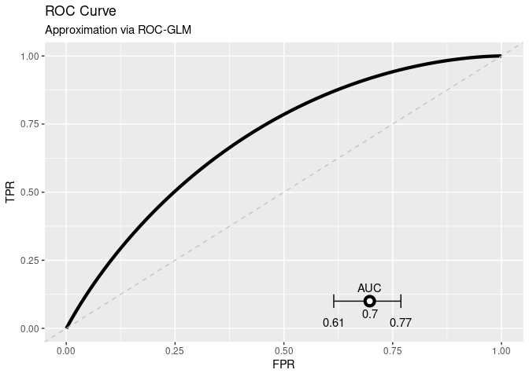

DataSHIELD Use-case
================

<!-- README.md is generated from README.Rmd. Please edit that file -->

<!-- README.md is generated from README.Rmd. Please edit that file -->

## About the repository

This repository contains a short use-case base on the three packages
`ds.predict.base`, `ds.calibration`, and `ds.roc.glm`. The main intend
is to have a use-case to demonstrate how to distributively evaluate a
model using the distributed ROC-GLM.

The following contains the preparation of test data and a test model as
“setup” while the second part is the analysis. .

### Structure of the repository

TODO

## Setup

### Install packages

Install all packages locally and also on the DataSHIELD test machine:

``` r
remotes::install_github("difuture-lmu/ds.predict.base")
#> Skipping install of 'ds.predict.base' from a github remote, the SHA1 (47fac1e7) has not changed since last install.
#>   Use `force = TRUE` to force installation
remotes::install_github("difuture-lmu/ds.calibration")
#> Skipping install of 'ds.calibration' from a github remote, the SHA1 (332c4ff5) has not changed since last install.
#>   Use `force = TRUE` to force installation
remotes::install_github("difuture-lmu/ds.roc.glm")
#> Skipping install of 'ds.roc.glm' from a github remote, the SHA1 (56d9ee4a) has not changed since last install.
#>   Use `force = TRUE` to force installation
```

### Generate data and fit model

The used data is the `GBSG2` from the `TH.data` packages. For further
details see the help page `?TH.data::GBSG2`. The task is to predict
whether hormonal therapy shows an improvement w.r.t. survival time. The
model we are using is a random forest from the `ranger` package. The
following code uses the `GBSG2` data, splits it into train and test data
with 60 % for training and 40 % for testing. The test data is further
split into 5 parts that are uploaded to DataSHIELD and used to simulate
the distributed setup.

``` r
source(here::here("R/generate-data.R"))
source(here::here("R/create-model.R"))
```

### Install package on DataSHIELD and upload data

``` r
source(here::here("R/upload-data.R"))
source(here::here("R/install-ds-packages.R"))
```

## Analysis

### Log into DataSHIELD test server

``` r
library(DSI)
library(DSOpal)
library(dsBaseClient)

library(ds.predict.base)
library(ds.calibration)
library(ds.roc.glm)

library(ggplot2)

builder = newDSLoginBuilder()

surl     = "https://opal-demo.obiba.org/"
username = "administrator"
password = "password"

datasets = paste0("SRV", seq_len(5L))
for (i in seq_along(datasets)) {
  builder$append(
    server   = paste0("ds", i),
    url      = surl,
    user     = username,
    password = password,
    table    = paste0("DIFUTURE-TEST.", datasets[i])
  )
}

## Get data of the servers:
conn = datashield.login(logins = builder$build(), assign = TRUE)
#> 
#> Logging into the collaborating servers
#>    [-------------------------------------------------------------------------------------]   0% / 0s  Login ds1 [============>---------------------------------------------------------------]  17% / 0s  Login ds2 [========================>---------------------------------------------------]  33% / 0s  Login ds3 [=====================================>--------------------------------------]  50% / 1s  Login ds4 [==================================================>-------------------------]  67% / 1s  Login ds5 [==============================================================>-------------]  83% / 2s  Logged in all servers [================================================================] 100% / 2s
#> 
#>   No variables have been specified. 
#>   All the variables in the table 
#>   (the whole dataset) will be assigned to R!
#> 
#> Assigning table data...
#>    [-------------------------------------------------------------------------------------]   0% / 0s  Assigning ds1 (DIFUTURE-TEST.SRV1) [=======>-------------------------------------------]  17% / 2s  Assigning ds2 (DIFUTURE-TEST.SRV2) [================>----------------------------------]  33% / 2s  Assigning ds3 (DIFUTURE-TEST.SRV3) [=========================>-------------------------]  50% / 2s  Assigning ds4 (DIFUTURE-TEST.SRV4) [=================================>-----------------]  67% / 3s  Assigning ds5 (DIFUTURE-TEST.SRV5) [=========================================>---------]  83% / 3s  Assigned all tables [==================================================================] 100% / 4s
datashield.symbols(conn)
#> $ds1
#> [1] "D"
#> 
#> $ds2
#> [1] "D"
#> 
#> $ds3
#> [1] "D"
#> 
#> $ds4
#> [1] "D"
#> 
#> $ds5
#> [1] "D"
```

### Push and predict

``` r
## Load the pre-calculated logistic regression:
load(here::here("data/mod.Rda"))

## Push the model to the servers:
pushObject(conn, obj = mod)
#> [2022-02-09 23:42:13] Your object is bigger than 1 MB (7.1 MB). Uploading larger objects may take some time.
#>    [-------------------------------------------------------------------------------------]   0% / 0s  Checking ds1 (mod <- decodeBinary("58-0a-00-00-00-03-00-04-01-02-00-03-05-00-00-00-00-05-55-54-...  Finalizing assignment ds1 (mod <- decodeBinary("58-0a-00-00-00-03-00-04-01-02-00-03-05-00-00-00...  Checking ds2 (mod <- decodeBinary("58-0a-00-00-00-03-00-04-01-02-00-03-05-00-00-00-00-05-55-54-...  Finalizing assignment ds2 (mod <- decodeBinary("58-0a-00-00-00-03-00-04-01-02-00-03-05-00-00-00...  Checking ds3 (mod <- decodeBinary("58-0a-00-00-00-03-00-04-01-02-00-03-05-00-00-00-00-05-55-54-...  Finalizing assignment ds3 (mod <- decodeBinary("58-0a-00-00-00-03-00-04-01-02-00-03-05-00-00-00...  Checking ds4 (mod <- decodeBinary("58-0a-00-00-00-03-00-04-01-02-00-03-05-00-00-00-00-05-55-54-...  Finalizing assignment ds4 (mod <- decodeBinary("58-0a-00-00-00-03-00-04-01-02-00-03-05-00-00-00...  Checking ds5 (mod <- decodeBinary("58-0a-00-00-00-03-00-04-01-02-00-03-05-00-00-00-00-05-55-54-...  Finalizing assignment ds5 (mod <- decodeBinary("58-0a-00-00-00-03-00-04-01-02-00-03-05-00-00-00...  Assigned expr. (mod <- decodeBinary("58-0a-00-00-00-03-00-04-01-02-00-03-05-00-00-00-00-05-55-5...
datashield.symbols(conn)
#> $ds1
#> [1] "D"   "mod"
#> 
#> $ds2
#> [1] "D"   "mod"
#> 
#> $ds3
#> [1] "D"   "mod"
#> 
#> $ds4
#> [1] "D"   "mod"
#> 
#> $ds5
#> [1] "D"   "mod"

## Predict the model on the data sets located at the servers:
predictModel(conn, mod, "probs", predict_fun = "ranger:::predict.ranger(mod, data = D)$predictions")
#>    [-------------------------------------------------------------------------------------]   0% / 0s  Checking ds1 (probs <- assignPredictModel("58-0a-00-00-00-03-00-04-01-02-00-03-05-00-00-00-00-0...  Checking ds2 (probs <- assignPredictModel("58-0a-00-00-00-03-00-04-01-02-00-03-05-00-00-00-00-0...  Checking ds3 (probs <- assignPredictModel("58-0a-00-00-00-03-00-04-01-02-00-03-05-00-00-00-00-0...  Checking ds4 (probs <- assignPredictModel("58-0a-00-00-00-03-00-04-01-02-00-03-05-00-00-00-00-0...  Checking ds5 (probs <- assignPredictModel("58-0a-00-00-00-03-00-04-01-02-00-03-05-00-00-00-00-0...  Waiting...  (probs <- assignPredictModel("58-0a-00-00-00-03-00-04-01-02-00-03-05-00-00-00-00-05...  Checking ds1 (probs <- assignPredictModel("58-0a-00-00-00-03-00-04-01-02-00-03-05-00-00-00-00-0...  Checking ds2 (probs <- assignPredictModel("58-0a-00-00-00-03-00-04-01-02-00-03-05-00-00-00-00-0...  Checking ds3 (probs <- assignPredictModel("58-0a-00-00-00-03-00-04-01-02-00-03-05-00-00-00-00-0...  Checking ds4 (probs <- assignPredictModel("58-0a-00-00-00-03-00-04-01-02-00-03-05-00-00-00-00-0...  Checking ds5 (probs <- assignPredictModel("58-0a-00-00-00-03-00-04-01-02-00-03-05-00-00-00-00-0...  Waiting...  (probs <- assignPredictModel("58-0a-00-00-00-03-00-04-01-02-00-03-05-00-00-00-00-05...  Checking ds1 (probs <- assignPredictModel("58-0a-00-00-00-03-00-04-01-02-00-03-05-00-00-00-00-0...  Finalizing assignment ds1 (probs <- assignPredictModel("58-0a-00-00-00-03-00-04-01-02-00-03-05-...  Checking ds2 (probs <- assignPredictModel("58-0a-00-00-00-03-00-04-01-02-00-03-05-00-00-00-00-0...  Finalizing assignment ds2 (probs <- assignPredictModel("58-0a-00-00-00-03-00-04-01-02-00-03-05-...  Checking ds3 (probs <- assignPredictModel("58-0a-00-00-00-03-00-04-01-02-00-03-05-00-00-00-00-0...  Finalizing assignment ds3 (probs <- assignPredictModel("58-0a-00-00-00-03-00-04-01-02-00-03-05-...  Checking ds4 (probs <- assignPredictModel("58-0a-00-00-00-03-00-04-01-02-00-03-05-00-00-00-00-0...  Finalizing assignment ds4 (probs <- assignPredictModel("58-0a-00-00-00-03-00-04-01-02-00-03-05-...  Checking ds5 (probs <- assignPredictModel("58-0a-00-00-00-03-00-04-01-02-00-03-05-00-00-00-00-0...  Finalizing assignment ds5 (probs <- assignPredictModel("58-0a-00-00-00-03-00-04-01-02-00-03-05-...  Assigned expr. (probs <- assignPredictModel("58-0a-00-00-00-03-00-04-01-02-00-03-05-00-00-00-00...
datashield.symbols(conn)
#> $ds1
#> [1] "D"     "mod"   "probs"
#> 
#> $ds2
#> [1] "D"     "mod"   "probs"
#> 
#> $ds3
#> [1] "D"     "mod"   "probs"
#> 
#> $ds4
#> [1] "D"     "mod"   "probs"
#> 
#> $ds5
#> [1] "D"     "mod"   "probs"
```

### Analyse calibration of the predictions

``` r
brier = dsBrierScore(conn, "D$cens", "probs")
#>    [-------------------------------------------------------------------------------------]   0% / 0s  Checking ds1 (brierScore("D$cens", "probs")) [-----------------------------------------]   0% / 0s  Getting aggregate ds1 (brierScore("D$cens", "probs")) [====>---------------------------]  17% / 0s  Checking ds2 (brierScore("D$cens", "probs")) [======>----------------------------------]  17% / 0s  Getting aggregate ds2 (brierScore("D$cens", "probs")) [==========>---------------------]  33% / 0s  Checking ds3 (brierScore("D$cens", "probs")) [=============>---------------------------]  33% / 0s  Getting aggregate ds3 (brierScore("D$cens", "probs")) [===============>----------------]  50% / 1s  Checking ds4 (brierScore("D$cens", "probs")) [===================>---------------------]  50% / 1s  Getting aggregate ds4 (brierScore("D$cens", "probs")) [====================>-----------]  67% / 1s  Checking ds5 (brierScore("D$cens", "probs")) [==========================>--------------]  67% / 1s  Getting aggregate ds5 (brierScore("D$cens", "probs")) [==========================>-----]  83% / 1s  Aggregated (brierScore("D$cens", "probs")) [===========================================] 100% / 1s
brier
#> [1] 0.23

cc = dsCalibrationCurve(conn, "D$cens", "probs")
#>    [-------------------------------------------------------------------------------------]   0% / 0s  Checking ds1 (calibrationCurve("D$cens", "probs", 10, TRUE)) [-------------------------]   0% / 0s  Getting aggregate ds1 (calibrationCurve("D$cens", "probs", 10, TRUE)) [==>-------------]  17% / 0s  Checking ds2 (calibrationCurve("D$cens", "probs", 10, TRUE)) [===>---------------------]  17% / 0s  Getting aggregate ds2 (calibrationCurve("D$cens", "probs", 10, TRUE)) [====>-----------]  33% / 0s  Checking ds3 (calibrationCurve("D$cens", "probs", 10, TRUE)) [=======>-----------------]  33% / 1s  Getting aggregate ds3 (calibrationCurve("D$cens", "probs", 10, TRUE)) [=======>--------]  50% / 1s  Checking ds4 (calibrationCurve("D$cens", "probs", 10, TRUE)) [===========>-------------]  50% / 1s  Getting aggregate ds4 (calibrationCurve("D$cens", "probs", 10, TRUE)) [==========>-----]  67% / 1s  Checking ds5 (calibrationCurve("D$cens", "probs", 10, TRUE)) [================>--------]  67% / 1s  Getting aggregate ds5 (calibrationCurve("D$cens", "probs", 10, TRUE)) [============>---]  83% / 1s  Aggregated (calibrationCurve("D$cens", "probs", 10, TRUE)) [===========================] 100% / 1s
gg_cal = plotCalibrationCurve(cc, size = 1)
gg_cal
#> Warning: Removed 20 rows containing missing values (geom_point).
#> Warning: Removed 20 row(s) containing missing values (geom_path).
#> Warning: Removed 1 rows containing missing values (geom_point).
#> Warning: Removed 1 row(s) containing missing values (geom_path).
```

<!-- -->

### Evaluate the model using ROC analysis

``` r
roc_glm = dsROCGLM(conn, "D$cens", "probs")
#> 
#> [2022-02-09 23:45:17] Initializing ROC-GLM
#> 
#> [2022-02-09 23:45:17] Host: Received scores of negative response
#> [2022-02-09 23:45:17] Calculating standard deviation of differences
#>    [-------------------------------------------------------------------------------------]   0% / 0s  Checking ds1 (getNegativeScoresVar("D$cens", "probs", 4)) [----------------------------]   0% / 0s  Getting aggregate ds1 (getNegativeScoresVar("D$cens", "probs", 4)) [==>----------------]  17% / 0s  Checking ds2 (getNegativeScoresVar("D$cens", "probs", 4)) [====>-----------------------]  17% / 0s  Getting aggregate ds2 (getNegativeScoresVar("D$cens", "probs", 4)) [=====>-------------]  33% / 0s  Checking ds3 (getNegativeScoresVar("D$cens", "probs", 4)) [========>-------------------]  33% / 0s  Getting aggregate ds3 (getNegativeScoresVar("D$cens", "probs", 4)) [=========>---------]  50% / 1s  Checking ds4 (getNegativeScoresVar("D$cens", "probs", 4)) [=============>--------------]  50% / 1s  Getting aggregate ds4 (getNegativeScoresVar("D$cens", "probs", 4)) [============>------]  67% / 1s  Checking ds5 (getNegativeScoresVar("D$cens", "probs", 4)) [==================>---------]  67% / 1s  Getting aggregate ds5 (getNegativeScoresVar("D$cens", "probs", 4)) [===============>---]  83% / 1s  Aggregated (...) [=====================================================================] 100% / 1s
#>    [-------------------------------------------------------------------------------------]   0% / 0s  Checking ds1 (meanDS(D$cens)) [--------------------------------------------------------]   0% / 0s  Getting aggregate ds1 (meanDS(D$cens)) [=======>---------------------------------------]  17% / 0s  Checking ds2 (meanDS(D$cens)) [========>-----------------------------------------------]  17% / 0s  Getting aggregate ds2 (meanDS(D$cens)) [===============>-------------------------------]  33% / 0s  Checking ds3 (meanDS(D$cens)) [==================>-------------------------------------]  33% / 0s  Getting aggregate ds3 (meanDS(D$cens)) [=======================>-----------------------]  50% / 1s  Checking ds4 (meanDS(D$cens)) [===========================>----------------------------]  50% / 1s  Getting aggregate ds4 (meanDS(D$cens)) [==============================>----------------]  67% / 1s  Checking ds5 (meanDS(D$cens)) [====================================>-------------------]  67% / 1s  Getting aggregate ds5 (meanDS(D$cens)) [======================================>--------]  83% / 1s  Aggregated (meanDS(D$cens)) [==========================================================] 100% / 1s
#> [2022-02-09 23:45:19] Receiving negative scores
#>    [-------------------------------------------------------------------------------------]   0% / 0s  Checking ds1 (getNegativeScores("D$cens", "probs", 0.0291762891452622, 2)) [-----------]   0% / 0s  Getting aggregate ds1 (getNegativeScores("D$cens", "probs", 0.0291762891452622, 2)) [--]  17% / 0s  Checking ds2 (getNegativeScores("D$cens", "probs", 0.0291762891452622, 2)) [=>---------]  17% / 0s  Getting aggregate ds2 (getNegativeScores("D$cens", "probs", 0.0291762891452622, 2)) [>-]  33% / 0s  Checking ds3 (getNegativeScores("D$cens", "probs", 0.0291762891452622, 2)) [===>-------]  33% / 1s  Getting aggregate ds3 (getNegativeScores("D$cens", "probs", 0.0291762891452622, 2)) [>-]  50% / 1s  Checking ds4 (getNegativeScores("D$cens", "probs", 0.0291762891452622, 2)) [=====>-----]  50% / 1s  Getting aggregate ds4 (getNegativeScores("D$cens", "probs", 0.0291762891452622, 2)) [>-]  67% / 1s  Checking ds5 (getNegativeScores("D$cens", "probs", 0.0291762891452622, 2)) [======>----]  67% / 1s  Getting aggregate ds5 (getNegativeScores("D$cens", "probs", 0.0291762891452622, 2)) [=>]  83% / 1s  Aggregated (...) [=====================================================================] 100% / 1s
#> [2022-02-09 23:45:20] Host: Pushing pooled scores
#>    [-------------------------------------------------------------------------------------]   0% / 0s  Checking ds1 (pooled_scores <- decodeBinary("58-0a-00-00-00-03-00-04-01-02-00-03-05-00-00-00-00...  Finalizing assignment ds1 (pooled_scores <- decodeBinary("58-0a-00-00-00-03-00-04-01-02-00-03-0...  Checking ds2 (pooled_scores <- decodeBinary("58-0a-00-00-00-03-00-04-01-02-00-03-05-00-00-00-00...  Finalizing assignment ds2 (pooled_scores <- decodeBinary("58-0a-00-00-00-03-00-04-01-02-00-03-0...  Checking ds3 (pooled_scores <- decodeBinary("58-0a-00-00-00-03-00-04-01-02-00-03-05-00-00-00-00...  Finalizing assignment ds3 (pooled_scores <- decodeBinary("58-0a-00-00-00-03-00-04-01-02-00-03-0...  Checking ds4 (pooled_scores <- decodeBinary("58-0a-00-00-00-03-00-04-01-02-00-03-05-00-00-00-00...  Finalizing assignment ds4 (pooled_scores <- decodeBinary("58-0a-00-00-00-03-00-04-01-02-00-03-0...  Checking ds5 (pooled_scores <- decodeBinary("58-0a-00-00-00-03-00-04-01-02-00-03-05-00-00-00-00...  Finalizing assignment ds5 (pooled_scores <- decodeBinary("58-0a-00-00-00-03-00-04-01-02-00-03-0...  Assigned expr. (pooled_scores <- decodeBinary("58-0a-00-00-00-03-00-04-01-02-00-03-05-00-00-00-...
#> [2022-02-09 23:45:21] Server: Calculating placement values and parts for ROC-GLM
#>    [-------------------------------------------------------------------------------------]   0% / 0s  Checking ds1 (roc_data <- rocGLMFrame("D$cens", "probs", "pooled_scores")) [-----------]   0% / 0s  Finalizing assignment ds1 (roc_data <- rocGLMFrame("D$cens", "probs", "pooled_scores")) []  17%...  Checking ds2 (roc_data <- rocGLMFrame("D$cens", "probs", "pooled_scores")) [=>---------]  17% / 0s  Finalizing assignment ds2 (roc_data <- rocGLMFrame("D$cens", "probs", "pooled_scores")) []  33%...  Checking ds3 (roc_data <- rocGLMFrame("D$cens", "probs", "pooled_scores")) [===>-------]  33% / 1s  Finalizing assignment ds3 (roc_data <- rocGLMFrame("D$cens", "probs", "pooled_scores")) []  50%...  Checking ds4 (roc_data <- rocGLMFrame("D$cens", "probs", "pooled_scores")) [=====>-----]  50% / 1s  Finalizing assignment ds4 (roc_data <- rocGLMFrame("D$cens", "probs", "pooled_scores")) []  67%...  Checking ds5 (roc_data <- rocGLMFrame("D$cens", "probs", "pooled_scores")) [======>----]  67% / 1s  Finalizing assignment ds5 (roc_data <- rocGLMFrame("D$cens", "probs", "pooled_scores")) []  83%...  Assigned expr. (roc_data <- rocGLMFrame("D$cens", "probs", "pooled_scores")) [=========] 100% / 1s
#> [2022-02-09 23:45:22] Server: Calculating probit regression to obtain ROC-GLM
#>    [-------------------------------------------------------------------------------------]   0% / 0s  Checking ds1 (calculateDistrGLMParts(formula = y ~ x, data = "roc_data", w = "w", ) [--]   0% / 0s  Getting aggregate ds1 (calculateDistrGLMParts(formula = y ~ x, data = "roc_data", w = "w", ) []...  Checking ds2 (calculateDistrGLMParts(formula = y ~ x, data = "roc_data", w = "w", ) [--]  17% / 0s  Getting aggregate ds2 (calculateDistrGLMParts(formula = y ~ x, data = "roc_data", w = "w", ) []...  Checking ds3 (calculateDistrGLMParts(formula = y ~ x, data = "roc_data", w = "w", ) [>-]  33% / 1s  Getting aggregate ds3 (calculateDistrGLMParts(formula = y ~ x, data = "roc_data", w = "w", ) []...  Checking ds4 (calculateDistrGLMParts(formula = y ~ x, data = "roc_data", w = "w", ) [>-]  50% / 1s  Getting aggregate ds4 (calculateDistrGLMParts(formula = y ~ x, data = "roc_data", w = "w", ) []...  Checking ds5 (calculateDistrGLMParts(formula = y ~ x, data = "roc_data", w = "w", ) [>-]  67% / 1s  Getting aggregate ds5 (calculateDistrGLMParts(formula = y ~ x, data = "roc_data", w = "w", ) []...  Aggregated (calculateDistrGLMParts(formula = y ~ x, data = "roc_data", w = "w", ) [====] 100% / 1s
#> [2022-02-09 23:45:23] Deviance of iter1=52.6631
#>    [-------------------------------------------------------------------------------------]   0% / 0s  Checking ds1 (calculateDistrGLMParts(formula = y ~ x, data = "roc_data", w = "w", ) [--]   0% / 0s  Getting aggregate ds1 (calculateDistrGLMParts(formula = y ~ x, data = "roc_data", w = "w", ) []...  Checking ds2 (calculateDistrGLMParts(formula = y ~ x, data = "roc_data", w = "w", ) [--]  17% / 0s  Getting aggregate ds2 (calculateDistrGLMParts(formula = y ~ x, data = "roc_data", w = "w", ) []...  Checking ds3 (calculateDistrGLMParts(formula = y ~ x, data = "roc_data", w = "w", ) [>-]  33% / 1s  Getting aggregate ds3 (calculateDistrGLMParts(formula = y ~ x, data = "roc_data", w = "w", ) []...  Checking ds4 (calculateDistrGLMParts(formula = y ~ x, data = "roc_data", w = "w", ) [>-]  50% / 1s  Getting aggregate ds4 (calculateDistrGLMParts(formula = y ~ x, data = "roc_data", w = "w", ) []...  Checking ds5 (calculateDistrGLMParts(formula = y ~ x, data = "roc_data", w = "w", ) [>-]  67% / 1s  Getting aggregate ds5 (calculateDistrGLMParts(formula = y ~ x, data = "roc_data", w = "w", ) []...  Aggregated (calculateDistrGLMParts(formula = y ~ x, data = "roc_data", w = "w", ) [====] 100% / 1s
#> [2022-02-09 23:45:24] Deviance of iter2=74.1008
#>    [-------------------------------------------------------------------------------------]   0% / 0s  Checking ds1 (calculateDistrGLMParts(formula = y ~ x, data = "roc_data", w = "w", ) [--]   0% / 0s  Getting aggregate ds1 (calculateDistrGLMParts(formula = y ~ x, data = "roc_data", w = "w", ) []...  Checking ds2 (calculateDistrGLMParts(formula = y ~ x, data = "roc_data", w = "w", ) [--]  17% / 0s  Getting aggregate ds2 (calculateDistrGLMParts(formula = y ~ x, data = "roc_data", w = "w", ) []...  Checking ds3 (calculateDistrGLMParts(formula = y ~ x, data = "roc_data", w = "w", ) [>-]  33% / 1s  Getting aggregate ds3 (calculateDistrGLMParts(formula = y ~ x, data = "roc_data", w = "w", ) []...  Checking ds4 (calculateDistrGLMParts(formula = y ~ x, data = "roc_data", w = "w", ) [>-]  50% / 1s  Getting aggregate ds4 (calculateDistrGLMParts(formula = y ~ x, data = "roc_data", w = "w", ) []...  Checking ds5 (calculateDistrGLMParts(formula = y ~ x, data = "roc_data", w = "w", ) [>-]  67% / 1s  Getting aggregate ds5 (calculateDistrGLMParts(formula = y ~ x, data = "roc_data", w = "w", ) []...  Aggregated (calculateDistrGLMParts(formula = y ~ x, data = "roc_data", w = "w", ) [====] 100% / 1s
#> [2022-02-09 23:45:25] Deviance of iter3=82.3748
#>    [-------------------------------------------------------------------------------------]   0% / 0s  Checking ds1 (calculateDistrGLMParts(formula = y ~ x, data = "roc_data", w = "w", ) [--]   0% / 0s  Getting aggregate ds1 (calculateDistrGLMParts(formula = y ~ x, data = "roc_data", w = "w", ) []...  Checking ds2 (calculateDistrGLMParts(formula = y ~ x, data = "roc_data", w = "w", ) [--]  17% / 0s  Getting aggregate ds2 (calculateDistrGLMParts(formula = y ~ x, data = "roc_data", w = "w", ) []...  Checking ds3 (calculateDistrGLMParts(formula = y ~ x, data = "roc_data", w = "w", ) [>-]  33% / 0s  Getting aggregate ds3 (calculateDistrGLMParts(formula = y ~ x, data = "roc_data", w = "w", ) []...  Checking ds4 (calculateDistrGLMParts(formula = y ~ x, data = "roc_data", w = "w", ) [>-]  50% / 1s  Getting aggregate ds4 (calculateDistrGLMParts(formula = y ~ x, data = "roc_data", w = "w", ) []...  Checking ds5 (calculateDistrGLMParts(formula = y ~ x, data = "roc_data", w = "w", ) [>-]  67% / 1s  Getting aggregate ds5 (calculateDistrGLMParts(formula = y ~ x, data = "roc_data", w = "w", ) []...  Aggregated (calculateDistrGLMParts(formula = y ~ x, data = "roc_data", w = "w", ) [====] 100% / 1s
#> [2022-02-09 23:45:26] Deviance of iter4=82.6891
#>    [-------------------------------------------------------------------------------------]   0% / 0s  Checking ds1 (calculateDistrGLMParts(formula = y ~ x, data = "roc_data", w = "w", ) [--]   0% / 1s  Getting aggregate ds1 (calculateDistrGLMParts(formula = y ~ x, data = "roc_data", w = "w", ) []...  Checking ds2 (calculateDistrGLMParts(formula = y ~ x, data = "roc_data", w = "w", ) [--]  17% / 1s  Getting aggregate ds2 (calculateDistrGLMParts(formula = y ~ x, data = "roc_data", w = "w", ) []...  Checking ds3 (calculateDistrGLMParts(formula = y ~ x, data = "roc_data", w = "w", ) [>-]  33% / 1s  Getting aggregate ds3 (calculateDistrGLMParts(formula = y ~ x, data = "roc_data", w = "w", ) []...  Checking ds4 (calculateDistrGLMParts(formula = y ~ x, data = "roc_data", w = "w", ) [>-]  50% / 1s  Getting aggregate ds4 (calculateDistrGLMParts(formula = y ~ x, data = "roc_data", w = "w", ) []...  Checking ds5 (calculateDistrGLMParts(formula = y ~ x, data = "roc_data", w = "w", ) [>-]  67% / 1s  Getting aggregate ds5 (calculateDistrGLMParts(formula = y ~ x, data = "roc_data", w = "w", ) []...  Aggregated (calculateDistrGLMParts(formula = y ~ x, data = "roc_data", w = "w", ) [====] 100% / 1s
#> [2022-02-09 23:45:27] Deviance of iter5=82.6895
#>    [-------------------------------------------------------------------------------------]   0% / 0s  Checking ds1 (calculateDistrGLMParts(formula = y ~ x, data = "roc_data", w = "w", ) [--]   0% / 0s  Getting aggregate ds1 (calculateDistrGLMParts(formula = y ~ x, data = "roc_data", w = "w", ) []...  Checking ds2 (calculateDistrGLMParts(formula = y ~ x, data = "roc_data", w = "w", ) [--]  17% / 0s  Getting aggregate ds2 (calculateDistrGLMParts(formula = y ~ x, data = "roc_data", w = "w", ) []...  Checking ds3 (calculateDistrGLMParts(formula = y ~ x, data = "roc_data", w = "w", ) [>-]  33% / 1s  Getting aggregate ds3 (calculateDistrGLMParts(formula = y ~ x, data = "roc_data", w = "w", ) []...  Checking ds4 (calculateDistrGLMParts(formula = y ~ x, data = "roc_data", w = "w", ) [>-]  50% / 1s  Getting aggregate ds4 (calculateDistrGLMParts(formula = y ~ x, data = "roc_data", w = "w", ) []...  Checking ds5 (calculateDistrGLMParts(formula = y ~ x, data = "roc_data", w = "w", ) [>-]  67% / 1s  Getting aggregate ds5 (calculateDistrGLMParts(formula = y ~ x, data = "roc_data", w = "w", ) []...  Aggregated (calculateDistrGLMParts(formula = y ~ x, data = "roc_data", w = "w", ) [====] 100% / 1s
#> [2022-02-09 23:45:28] Deviance of iter6=82.6895
#> [2022-02-09 23:45:28] Host: Finished calculating ROC-GLM
#> [2022-02-09 23:45:28] Host: Cleaning data on server
#> [2022-02-09 23:45:30] Host: Calculating AUC and CI
#>    [-------------------------------------------------------------------------------------]   0% / 0s  Checking ds1 (meanDS(D$cens)) [--------------------------------------------------------]   0% / 0s  Getting aggregate ds1 (meanDS(D$cens)) [=======>---------------------------------------]  17% / 0s  Checking ds2 (meanDS(D$cens)) [========>-----------------------------------------------]  17% / 0s  Getting aggregate ds2 (meanDS(D$cens)) [===============>-------------------------------]  33% / 0s  Checking ds3 (meanDS(D$cens)) [==================>-------------------------------------]  33% / 0s  Getting aggregate ds3 (meanDS(D$cens)) [=======================>-----------------------]  50% / 1s  Checking ds4 (meanDS(D$cens)) [===========================>----------------------------]  50% / 1s  Getting aggregate ds4 (meanDS(D$cens)) [==============================>----------------]  67% / 1s  Checking ds5 (meanDS(D$cens)) [====================================>-------------------]  67% / 1s  Getting aggregate ds5 (meanDS(D$cens)) [======================================>--------]  83% / 1s  Aggregated (meanDS(D$cens)) [==========================================================] 100% / 1s
#>    [-------------------------------------------------------------------------------------]   0% / 0s  Checking ds1 (getNegativeScoresVar("D$cens", "probs", 4)) [----------------------------]   0% / 0s  Getting aggregate ds1 (getNegativeScoresVar("D$cens", "probs", 4)) [==>----------------]  17% / 0s  Checking ds2 (getNegativeScoresVar("D$cens", "probs", 4)) [====>-----------------------]  17% / 0s  Getting aggregate ds2 (getNegativeScoresVar("D$cens", "probs", 4)) [=====>-------------]  33% / 0s  Checking ds3 (getNegativeScoresVar("D$cens", "probs", 4)) [========>-------------------]  33% / 0s  Getting aggregate ds3 (getNegativeScoresVar("D$cens", "probs", 4)) [=========>---------]  50% / 1s  Checking ds4 (getNegativeScoresVar("D$cens", "probs", 4)) [=============>--------------]  50% / 1s  Getting aggregate ds4 (getNegativeScoresVar("D$cens", "probs", 4)) [============>------]  67% / 1s  Checking ds5 (getNegativeScoresVar("D$cens", "probs", 4)) [==================>---------]  67% / 1s  Getting aggregate ds5 (getNegativeScoresVar("D$cens", "probs", 4)) [===============>---]  83% / 1s  Aggregated (...) [=====================================================================] 100% / 1s
#>    [-------------------------------------------------------------------------------------]   0% / 0s  Checking ds1 (getPositiveScoresVar("D$cens", "probs", 4)) [----------------------------]   0% / 0s  Getting aggregate ds1 (getPositiveScoresVar("D$cens", "probs", 4)) [==>----------------]  17% / 0s  Checking ds2 (getPositiveScoresVar("D$cens", "probs", 4)) [====>-----------------------]  17% / 0s  Getting aggregate ds2 (getPositiveScoresVar("D$cens", "probs", 4)) [=====>-------------]  33% / 0s  Checking ds3 (getPositiveScoresVar("D$cens", "probs", 4)) [========>-------------------]  33% / 1s  Getting aggregate ds3 (getPositiveScoresVar("D$cens", "probs", 4)) [=========>---------]  50% / 1s  Checking ds4 (getPositiveScoresVar("D$cens", "probs", 4)) [=============>--------------]  50% / 1s  Getting aggregate ds4 (getPositiveScoresVar("D$cens", "probs", 4)) [============>------]  67% / 1s  Checking ds5 (getPositiveScoresVar("D$cens", "probs", 4)) [==================>---------]  67% / 1s  Getting aggregate ds5 (getPositiveScoresVar("D$cens", "probs", 4)) [===============>---]  83% / 1s  Aggregated (...) [=====================================================================] 100% / 1s
#>    [-------------------------------------------------------------------------------------]   0% / 0s  Checking ds1 (getNegativeScores("D$cens", "probs", 0.0508443717439644, 2)) [-----------]   0% / 0s  Getting aggregate ds1 (getNegativeScores("D$cens", "probs", 0.0508443717439644, 2)) [--]  17% / 0s  Checking ds2 (getNegativeScores("D$cens", "probs", 0.0508443717439644, 2)) [=>---------]  17% / 0s  Getting aggregate ds2 (getNegativeScores("D$cens", "probs", 0.0508443717439644, 2)) [>-]  33% / 0s  Checking ds3 (getNegativeScores("D$cens", "probs", 0.0508443717439644, 2)) [===>-------]  33% / 1s  Getting aggregate ds3 (getNegativeScores("D$cens", "probs", 0.0508443717439644, 2)) [>-]  50% / 1s  Checking ds4 (getNegativeScores("D$cens", "probs", 0.0508443717439644, 2)) [=====>-----]  50% / 1s  Getting aggregate ds4 (getNegativeScores("D$cens", "probs", 0.0508443717439644, 2)) [>-]  67% / 1s  Checking ds5 (getNegativeScores("D$cens", "probs", 0.0508443717439644, 2)) [======>----]  67% / 1s  Getting aggregate ds5 (getNegativeScores("D$cens", "probs", 0.0508443717439644, 2)) [=>]  83% / 1s  Aggregated (...) [=====================================================================] 100% / 1s
#>    [-------------------------------------------------------------------------------------]   0% / 0s  Checking ds1 (getPositiveScores("D$cens", "probs", 0.0622326594071492, 2)) [-----------]   0% / 0s  Getting aggregate ds1 (getPositiveScores("D$cens", "probs", 0.0622326594071492, 2)) [--]  17% / 0s  Checking ds2 (getPositiveScores("D$cens", "probs", 0.0622326594071492, 2)) [=>---------]  17% / 0s  Getting aggregate ds2 (getPositiveScores("D$cens", "probs", 0.0622326594071492, 2)) [>-]  33% / 0s  Checking ds3 (getPositiveScores("D$cens", "probs", 0.0622326594071492, 2)) [===>-------]  33% / 1s  Getting aggregate ds3 (getPositiveScores("D$cens", "probs", 0.0622326594071492, 2)) [>-]  50% / 1s  Checking ds4 (getPositiveScores("D$cens", "probs", 0.0622326594071492, 2)) [=====>-----]  50% / 1s  Getting aggregate ds4 (getPositiveScores("D$cens", "probs", 0.0622326594071492, 2)) [>-]  67% / 1s  Checking ds5 (getPositiveScores("D$cens", "probs", 0.0622326594071492, 2)) [======>----]  67% / 1s  Getting aggregate ds5 (getPositiveScores("D$cens", "probs", 0.0622326594071492, 2)) [=>]  83% / 1s  Aggregated (...) [=====================================================================] 100% / 1s
#> [2022-02-09 23:45:35] Finished!
gg_distr_roc = plot(roc_glm)
gg_distr_roc
```

<!-- -->

## Cross check on pooled test data

``` r
#' Calculate TPR and FPRs to plot the empirical ROC curve
#'
#' @param labels (`integer()`) True labels as 0-1-coded vector.
#' @param scores (`numeric()`) Score values.
#' @return (`data.frame()`) of the TPR and FPRs.
simpleROC = function(labels, scores) {
  labels = labels[order(scores, decreasing = TRUE)]
  data.frame(
    TPR = cumsum(labels) / sum(labels),
    FPR = cumsum(! labels) / sum(! labels), labels)
}

# Load pooled test data and predict:
dat_test = read.csv(here::here("data/data-test.csv"), stringsAsFactors = TRUE)
probs = ranger:::predict.ranger(mod, data = dat_test)$predictions

# Calculate empirical AUC and compare with distributed ROC-GLM
auc = pROC::auc(dat_test$cens, probs)
#> Setting levels: control = 0, case = 1
#> Setting direction: controls < cases
c(auc_emp = auc, auc_distr_roc_glm = roc_glm$auc)
#>           auc_emp auc_distr_roc_glm 
#>            0.6611            0.6655

# Calculate TPR and FPR values and add to distributed ROC-GLM plot
plt_emp_roc_data = simpleROC(dat_test$cens, probs)

gg_roc_pooled = plot(roc_glm) +
  geom_line(data = plt_emp_roc_data, aes(x = FPR, y = TPR, color = "Empirical"))
gg_roc_pooled
```

<!-- -->

``` r

# Calculate pooled brier score and calibration curve
brier_pooled = mean((dat_test$cens - probs)^2)
c(brier_pooled = brier_pooled, brier_distr = brier)
#> brier_pooled  brier_distr 
#>         0.23         0.23

cc_pooled = calibrationCurve("dat_test$cens", "probs", nbins = 10)

# Visualize distributed calibration curve vs. pooled one:

gg_cal_pooled = plotCalibrationCurve(cc, size = 1.5, individuals = FALSE) +
    geom_line(data = cc_pooled, aes(x = prob, y = truth), color = "red")
gg_cal_pooled
#> Warning: Removed 1 rows containing missing values (geom_point).
#> Warning: Removed 1 row(s) containing missing values (geom_path).
#> Warning: Removed 2 row(s) containing missing values (geom_path).
```

<!-- -->

## Log out from DataSHIELD servers

``` r
datashield.logout(conn)
#>    [-------------------------------------------------------------------------------------]   0% / 0s  Logout ds1 [===========>---------------------------------------------------------------]  17% / 0s  Logout ds2 [========================>--------------------------------------------------]  33% / 0s  Logout ds3 [=====================================>-------------------------------------]  50% / 0s  Logout ds4 [=================================================>-------------------------]  67% / 1s  Logout ds5 [=============================================================>-------------]  83% / 1s  Logged out from all servers [==========================================================] 100% / 1s
```
