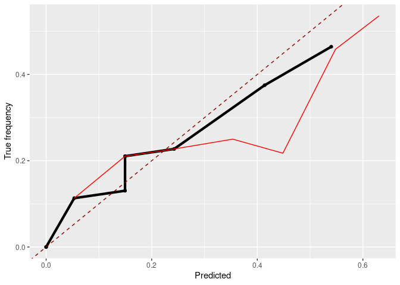

DataSHIELD Use-case: Distributed non-disclosive validation of predictive
models by a modified ROC-GLM
================

<!-- README.md is generated from README.Rmd. Please edit that file -->

- [About the repository](#about-the-repository)
  - [Structure of the repository](#structure-of-the-repository)
- [Setup](#setup)
  - [Install packages](#install-packages)
  - [Generate data and fit model](#generate-data-and-fit-model)
  - [Install package on DataSHIELD and upload
    data](#install-package-on-datashield-and-upload-data)
- [Analysis](#analysis)
  - [Log into DataSHIELD test server](#log-into-datashield-test-server)
  - [Push and predict](#push-and-predict)
  - [Analyse calibration of the
    predictions](#analyse-calibration-of-the-predictions)
  - [Evaluate the model using ROC
    analysis](#evaluate-the-model-using-roc-analysis)
  - [Cross check on pooled test data](#cross-check-on-pooled-test-data)
- [Log out from DataSHIELD servers](#log-out-from-datashield-servers)
- [Session Info](#session-info)

<!-- README.md is generated from README.Rmd. Please edit that file -->

## About the repository

This repository contains a short use-case base on the three packages
`dsPredictBase`, `dsCalibration`, and `dsROCGLM`. The main intend is to
have a use-case to demonstrate how to distributively evaluate a model
using the distributed
[ROC-GLM](https://pubmed.ncbi.nlm.nih.gov/10877289/).

The following contains the preparation of test data and a test model as
[setup](#setup) while the second part is the [analysis](#analysis).

Last time rendered: 13:37 - 12. Feb 2024 by user runner

Autobuild: [](https://github.com/difuture-lmu/datashield-demo-survival/actions/workflows/render-readme.yaml)

### Structure of the repository

- [`R`](https://github.com/difuture-lmu/datashield-roc-glm-demo/blob/main/R):
  - `create-model.R`: Creates a
    [`ranger`](https://cran.r-project.org/web/packages/ranger/ranger.pdf)
    used for the use-case based on the data in `generate-data.R`
  - [`generate-data.R`](https://github.com/difuture-lmu/datashield-roc-glm-demo/blob/main/R/generate-data.R):
    Takes the data set `GBSG2` (see `?GBSG2` for a description) from the
    [`TH.data`](https://cran.r-project.org/web/packages/TH.data/index.html),
    splits it into trian and test using 60 - 40 % of the data, and
    furhter splits the 40 % for testing into 5 parts for the distributed
    setup.
  - [`helper.R`](https://github.com/difuture-lmu/datashield-roc-glm-demo/blob/main/R/helper.R):
    Helper functions to locally calculate the
    [ROC-GLM](https://pubmed.ncbi.nlm.nih.gov/10877289/) and compute
    confidence intervals etc.
  - [`install-ds-packages.R`](https://github.com/difuture-lmu/datashield-roc-glm-demo/blob/main/R/install-ds-packages.R):
    Install the necessary packages (`ranger`, `dsPredictBase`,
    `dsCalibration`, and `dsROCGLM`) **at the DataSHIELD servers**.
  - [`install-packages.R`](https://github.com/difuture-lmu/datashield-roc-glm-demo/blob/main/R/install-packages.R):
    Install ncessary packages locally.
  - [`upload-data.R`](https://github.com/difuture-lmu/datashield-roc-glm-demo/blob/main/R/upload-data.R)
    Creates a project at the DataSHIELD server and uploads the data
    created by `generate-data.R`.
- [`data`](https://github.com/difuture-lmu/datashield-roc-glm-demo/blob/main/data):
  All data is stored here:
  - Train and test split of the GBSG2 data set (`data-train.csv` and
    `data-test.csv`).
  - The 5 splits of the `data-test.csv` for the servers (`SRV1.csv`,
    `SRV2.csv`, `SRV3.csv`, `SRV4.csv`, and `SRV5.csv`).
  - The model created by `create-model.R` (`mod.Rda`).
  - [`log.csv`](https://github.com/difuture-lmu/datashield-roc-glm-demo/blob/main/data/log.csv):
    A csv file for logging each rendering. This file can be used to get
    an overview about the important values and when each rendering was
    conducted. The main purpose is to show that the results are
    reproduced at each rendering.
  - The ROC-GLM of the last rendering (`roc-glm.Rda`).
- [`figures`](https://github.com/difuture-lmu/datashield-roc-glm-demo/blob/main/figures):
  Figures created by the rendering are placed here. These are the `.pdf`
  fuiles used in the publication but also the `.png` files of the
  README.
- [`tables`](https://github.com/difuture-lmu/datashield-roc-glm-demo/blob/main/tables):
  Tables created by the rendering are placed here.

## Setup

### Install packages

Install all packages locally:

``` r
remotes::install_github("difuture-lmu/dsPredictBase", upgrade = "never")
#> Using github PAT from envvar GITHUB_PAT
#> Downloading GitHub repo difuture-lmu/dsPredictBase@HEAD
#> Downloading GitHub repo datashield/dsBaseClient@HEAD
#> Installing 18 packages: nloptr, minqa, pbapply, mathjaxr, numDeriv, metadat, dotCall64, data.table, CompQuadForm, lme4, metafor, maps, spam, panelaggregation, gridExtra, meta, fields, DSI
#> Installing packages into '/home/runner/work/_temp/Library'
#> (as 'lib' is unspecified)
#> ── R CMD build ─────────────────────────────────────────────────────────────────
#> * checking for file ‘/tmp/RtmpmWqzmk/remotesab0825904bcc/datashield-dsBaseClient-92e2d59/DESCRIPTION’ ... OK
#> * preparing ‘dsBaseClient’:
#> * checking DESCRIPTION meta-information ... OK
#> * checking for LF line-endings in source and make files and shell scripts
#> * checking for empty or unneeded directories
#> * building ‘dsBaseClient_6.3.0.tar.gz’
#> Installing package into '/home/runner/work/_temp/Library'
#> (as 'lib' is unspecified)
#> Installing 4 packages: backports, DSI, checkmate, DSOpal
#> Installing packages into '/home/runner/work/_temp/Library'
#> (as 'lib' is unspecified)
#> Skipping install of 'dsBaseClient' from a github remote, the SHA1 (92e2d592) has not changed since last install.
#>   Use `force = TRUE` to force installation
#> ── R CMD build ─────────────────────────────────────────────────────────────────
#> * checking for file ‘/tmp/RtmpmWqzmk/remotesab087605d652/difuture-lmu-dsPredictBase-8266eff/DESCRIPTION’ ... OK
#> * preparing ‘dsPredictBase’:
#> * checking DESCRIPTION meta-information ... OK
#> * checking for LF line-endings in source and make files and shell scripts
#> * checking for empty or unneeded directories
#>   NB: this package now depends on R (>= 3.5.0)
#>   WARNING: Added dependency on R >= 3.5.0 because serialized objects in
#>   serialize/load version 3 cannot be read in older versions of R.
#>   File(s) containing such objects:
#>     ‘dsPredictBase/inst/extdata/mod.Rda’
#> * building ‘dsPredictBase_0.0.1.tar.gz’
#> Installing package into '/home/runner/work/_temp/Library'
#> (as 'lib' is unspecified)
remotes::install_github("difuture-lmu/dsCalibration", upgrade = "never")
#> Using github PAT from envvar GITHUB_PAT
#> Downloading GitHub repo difuture-lmu/dsCalibration@HEAD
#> ── R CMD build ─────────────────────────────────────────────────────────────────
#> * checking for file ‘/tmp/RtmpmWqzmk/remotesab08ba623ad/difuture-lmu-dsCalibration-1805632/DESCRIPTION’ ... OK
#> * preparing ‘dsCalibration’:
#> * checking DESCRIPTION meta-information ... OK
#> * checking for LF line-endings in source and make files and shell scripts
#> * checking for empty or unneeded directories
#> * building ‘dsCalibration_0.0.1.tar.gz’
#> Installing package into '/home/runner/work/_temp/Library'
#> (as 'lib' is unspecified)
remotes::install_github("difuture-lmu/dsROCGLM", upgrade = "never")
#> Using github PAT from envvar GITHUB_PAT
#> Downloading GitHub repo difuture-lmu/dsROCGLM@HEAD
#> ── R CMD build ─────────────────────────────────────────────────────────────────
#> * checking for file ‘/tmp/RtmpmWqzmk/remotesab081febeb16/difuture-lmu-dsROCGLM-3c2c43f/DESCRIPTION’ ... OK
#> * preparing ‘dsROCGLM’:
#> * checking DESCRIPTION meta-information ... OK
#> * checking for LF line-endings in source and make files and shell scripts
#> * checking for empty or unneeded directories
#> * building ‘dsROCGLM_1.0.0.tar.gz’
#> Installing package into '/home/runner/work/_temp/Library'
#> (as 'lib' is unspecified)
```

### Generate data and fit model

The used data is the `GBSG2` from the `TH.data` packages. For further
details see the help page `?TH.data::GBSG2`. The task is to predict
whether hormonal therapy shows an improvement w.r.t. survival time. The
model we are using is a random forest from the `ranger` package. The
following code uses the `GBSG2` data, splits it into train and test data
with 60 % for training and 40 % for testing. The test data is further
split into 5 parts that are uploaded to DataSHIELD and used to simulate
the distributed setup.

``` r
source(here::here("R/generate-data.R"))
source(here::here("R/create-model.R"))
```

### Install package on DataSHIELD and upload data

``` r
source(here::here("R/upload-data.R"))
source(here::here("R/install-ds-packages.R"))
```

## Analysis

### Log into DataSHIELD test server

``` r
library(DSI)
#> Loading required package: progress
#> Loading required package: R6
library(DSOpal)
library(dsBaseClient)

library(dsPredictBase)
library(dsCalibration)
library(dsROCGLM)
#> 
#> Attaching package: 'dsROCGLM'
#> The following objects are masked from 'package:dsCalibration':
#> 
#>     brierScore, calibrationCurve, dsBrierScore, dsCalibrationCurve,
#>     plotCalibrationCurve
#> The following objects are masked from 'package:dsPredictBase':
#> 
#>     assignPredictModel, decodeBinary, encodeObject, predictModel,
#>     pushObject, removeMissings

library(ggplot2)

builder = newDSLoginBuilder()

surl     = "https://opal-demo.obiba.org/"
username = "administrator"
password = "password"

datasets = paste0("SRV", seq_len(5L))
for (i in seq_along(datasets)) {
  builder$append(
    server   = paste0("ds", i),
    url      = surl,
    user     = username,
    password = password,
    table    = paste0("DIFUTURE-TEST.", datasets[i])
  )
}

## Get data of the servers:
conn = datashield.login(logins = builder$build(), assign = TRUE)
#> 
#> Logging into the collaborating servers
#> 
#>   No variables have been specified. 
#>   All the variables in the table 
#>   (the whole dataset) will be assigned to R!
#> 
#> Assigning table data...
datashield.symbols(conn)
#> $ds1
#> [1] "D"
#> 
#> $ds2
#> [1] "D"
#> 
#> $ds3
#> [1] "D"
#> 
#> $ds4
#> [1] "D"
#> 
#> $ds5
#> [1] "D"

## Data dimensions per server:
(ddim = ds.dim("D"))
#> $`dimensions of D in ds1`
#> [1] 56 11
#> 
#> $`dimensions of D in ds2`
#> [1] 49 11
#> 
#> $`dimensions of D in ds3`
#> [1] 60 11
#> 
#> $`dimensions of D in ds4`
#> [1] 49 11
#> 
#> $`dimensions of D in ds5`
#> [1] 60 11
#> 
#> $`dimensions of D in combined studies`
#> [1] 274  11
```

### Push and predict

``` r
## Load the pre-calculated logistic regression:
load(here::here("data/mod.Rda"))

## Push the model to the servers (upload takes ~11 Minutes):
t0 = proc.time()
pushObject(conn, obj = mod)
#> [2024-02-12 13:42:04.526881] Your object is bigger than 1 MB (6.6 MB). Uploading larger objects may take some time.
(t0 = proc.time() - t0)
#>    user  system elapsed 
#>  11.047   0.125 146.531
datashield.symbols(conn)
#> $ds1
#> [1] "D"   "mod"
#> 
#> $ds2
#> [1] "D"   "mod"
#> 
#> $ds3
#> [1] "D"   "mod"
#> 
#> $ds4
#> [1] "D"   "mod"
#> 
#> $ds5
#> [1] "D"   "mod"

## Time point:
(tpoint = which(ranger::timepoints(mod) >= 730)[1])
#> [1] 97

## Predict the model on the data sets located at the servers:
pfun = paste0("ranger:::predict.ranger(mod, data = D)$survival[, ", tpoint, "]")
predictModel(conn, mod, "probs", predict_fun = pfun, package = "ranger")
datashield.symbols(conn)
#> $ds1
#> [1] "D"     "mod"   "probs"
#> 
#> $ds2
#> [1] "D"     "mod"   "probs"
#> 
#> $ds3
#> [1] "D"     "mod"   "probs"
#> 
#> $ds4
#> [1] "D"     "mod"   "probs"
#> 
#> $ds5
#> [1] "D"     "mod"   "probs"

# Because labels are flipped for the 0-1-setting we also calculate
# 1 - probs:
datashield.assign(conn, "pinv", quote(1 - probs))
```

### Analyse calibration of the predictions

#### Figure 7, Section 6.3

``` r
brier = dsBrierScore(conn, "D$valid", "pinv")
brier
#> [1] 0.1752662

cc = dsCalibrationCurve(conn, "D$valid", "pinv")
cc
#> $individuals
#> $individuals$ds1
#>          bin  n lower upper     truth       prob
#> 1    (0,0.1]  7   0.0   0.1 0.1428571 0.03428287
#> 2  (0.1,0.2] 15   0.1   0.2 0.1333333 0.14191317
#> 3  (0.2,0.3] 16   0.2   0.3 0.1250000 0.24256183
#> 4  (0.3,0.4]  2   0.3   0.4        NA         NA
#> 5  (0.4,0.5]  2   0.4   0.5        NA         NA
#> 6  (0.5,0.6]  5   0.5   0.6 1.0000000 0.56477305
#> 7  (0.6,0.7]  6   0.6   0.7 0.3333333 0.62814721
#> 8  (0.7,0.8]  0   0.7   0.8        NA         NA
#> 9  (0.8,0.9]  0   0.8   0.9        NA         NA
#> 10   (0.9,1]  0   0.9   1.0        NA         NA
#> 
#> $individuals$ds2
#>          bin  n lower upper     truth      prob
#> 1    (0,0.1] 12   0.0   0.1 0.1666667 0.0590041
#> 2  (0.1,0.2] 12   0.1   0.2 0.1666667 0.1536756
#> 3  (0.2,0.3] 10   0.2   0.3 0.2000000 0.2458506
#> 4  (0.3,0.4]  3   0.3   0.4        NA        NA
#> 5  (0.4,0.5]  1   0.4   0.5        NA        NA
#> 6  (0.5,0.6]  7   0.5   0.6 0.2857143 0.5410863
#> 7  (0.6,0.7]  2   0.6   0.7        NA        NA
#> 8  (0.7,0.8]  0   0.7   0.8        NA        NA
#> 9  (0.8,0.9]  0   0.8   0.9        NA        NA
#> 10   (0.9,1]  0   0.9   1.0        NA        NA
#> 
#> $individuals$ds3
#>          bin  n lower upper     truth       prob
#> 1    (0,0.1] 16   0.0   0.1 0.0625000 0.06378714
#> 2  (0.1,0.2] 15   0.1   0.2 0.2666667 0.14253427
#> 3  (0.2,0.3]  9   0.2   0.3 0.3333333 0.25617144
#> 4  (0.3,0.4]  3   0.3   0.4        NA         NA
#> 5  (0.4,0.5]  3   0.4   0.5        NA         NA
#> 6  (0.5,0.6]  4   0.5   0.6        NA         NA
#> 7  (0.6,0.7]  8   0.6   0.7 0.2500000 0.63134082
#> 8  (0.7,0.8]  1   0.7   0.8        NA         NA
#> 9  (0.8,0.9]  0   0.8   0.9        NA         NA
#> 10   (0.9,1]  0   0.9   1.0        NA         NA
#> 
#> $individuals$ds4
#>          bin  n lower upper     truth       prob
#> 1    (0,0.1] 10   0.0   0.1 0.1000000 0.04007436
#> 2  (0.1,0.2]  6   0.1   0.2 0.3333333 0.16099544
#> 3  (0.2,0.3]  8   0.2   0.3 0.3750000 0.24150888
#> 4  (0.3,0.4]  3   0.3   0.4        NA         NA
#> 5  (0.4,0.5] 12   0.4   0.5 0.2500000 0.44069729
#> 6  (0.5,0.6]  5   0.5   0.6 0.4000000 0.54823617
#> 7  (0.6,0.7]  5   0.6   0.7 0.6000000 0.63767800
#> 8  (0.7,0.8]  0   0.7   0.8        NA         NA
#> 9  (0.8,0.9]  0   0.8   0.9        NA         NA
#> 10   (0.9,1]  0   0.9   1.0        NA         NA
#> 
#> $individuals$ds5
#>          bin  n lower upper      truth       prob
#> 1    (0,0.1] 13   0.0   0.1 0.07692308 0.05352202
#> 2  (0.1,0.2] 15   0.1   0.2 0.13333333 0.15701214
#> 3  (0.2,0.3]  8   0.2   0.3 0.00000000 0.23251239
#> 4  (0.3,0.4]  2   0.3   0.4         NA         NA
#> 5  (0.4,0.5]  6   0.4   0.5 0.33333333 0.46306169
#> 6  (0.5,0.6]  4   0.5   0.6         NA         NA
#> 7  (0.6,0.7]  9   0.6   0.7 0.66666667 0.62558971
#> 8  (0.7,0.8]  2   0.7   0.8         NA         NA
#> 9  (0.8,0.9]  0   0.8   0.9         NA         NA
#> 10   (0.9,1]  0   0.9   1.0         NA         NA
#> 
#> 
#> $aggregated
#>          bin lower upper     truth       prob missing_ratio
#> 1    (0,0.1]   0.0   0.1 0.1034483 0.05284747    0.00000000
#> 2  (0.1,0.2]   0.1   0.2 0.1904762 0.14971387    0.00000000
#> 3  (0.2,0.3]   0.2   0.3 0.1960784 0.24386684    0.00000000
#> 4  (0.3,0.4]   0.3   0.4 0.0000000 0.00000000    1.00000000
#> 5  (0.4,0.5]   0.4   0.5 0.2083333 0.33611407    0.25000000
#> 6  (0.5,0.6]   0.5   0.6 0.3600000 0.37410601    0.32000000
#> 7  (0.6,0.7]   0.6   0.7 0.4333333 0.58794357    0.06666667
#> 8  (0.7,0.8]   0.7   0.8 0.0000000 0.00000000    1.00000000
#> 9  (0.8,0.9]   0.8   0.9       NaN        NaN           NaN
#> 10   (0.9,1]   0.9   1.0       NaN        NaN           NaN
#> 
#> attr(,"class")
#> [1] "calibration.curve"

gg_cal = plotCalibrationCurve(cc, size = 1)
gg_cal
#> Warning: Removed 26 rows containing missing values (`geom_point()`).
#> Warning: Removed 26 rows containing missing values (`geom_line()`).
#> Warning: Removed 2 rows containing missing values (`geom_point()`).
#> Warning: Removed 2 rows containing missing values (`geom_line()`).
```

<!-- -->

### Evaluate the model using ROC analysis

#### Figure 6, Section 6.2

``` r
# Get the l2 sensitivity
(l2s = dsL2Sens(conn, "D", "pinv"))
#> [1] 0.01598668
epsilon = 0.3
delta = 0.4

# Amount of noise added:
sqrt(2 * log(1.25 / delta)) * l2s / epsilon
#> [1] 0.08044454

# Calculate ROC-GLM
roc_glm = dsROCGLM(conn, "D$valid", "pinv", dat_name = "D", seed_object = "l2s")
#> 
#> [2024-02-12 13:44:57.284956] L2 sensitivity is: 0.016
#> 
#> [2024-02-12 13:44:59.226681] Setting: epsilon = 0.3 and delta = 0.4
#> 
#> [2024-02-12 13:44:59.226989] Initializing ROC-GLM
#> 
#> [2024-02-12 13:44:59.226992] Host: Received scores of negative response
#> [2024-02-12 13:44:59.227196] Receiving negative scores
#> [2024-02-12 13:45:01.162558] Host: Pushing pooled scores
#> [2024-02-12 13:45:03.116301] Server: Calculating placement values and parts for ROC-GLM
#> [2024-02-12 13:45:05.054382] Server: Calculating probit regression to obtain ROC-GLM
#> [2024-02-12 13:45:07.001717] Deviance of iter1=32.6342
#> [2024-02-12 13:45:08.944114] Deviance of iter2=42.9688
#> [2024-02-12 13:45:10.892213] Deviance of iter3=47.2468
#> [2024-02-12 13:45:12.835801] Deviance of iter4=47.4013
#> [2024-02-12 13:45:14.786455] Deviance of iter5=47.4015
#> [2024-02-12 13:45:16.715168] Deviance of iter6=47.4015
#> [2024-02-12 13:45:16.715439] Host: Finished calculating ROC-GLM
#> [2024-02-12 13:45:16.715608] Host: Cleaning data on server
#> [2024-02-12 13:45:19.822204] Host: Calculating AUC and CI
#> [2024-02-12 13:45:33.369696] Finished!

roc_glm
#> 
#> ROC-GLM after Pepe:
#> 
#>  Binormal form: pnorm(0.64 + 1.03*qnorm(t))
#> 
#>  AUC and 0.95 CI: [0.59----0.67----0.75]
roc_glm$auc
#> [1] 0.6719936
roc_glm$ci
#> [1] 0.5891955 0.7453172

gg_distr_roc = plot(roc_glm)
gg_distr_roc
```

<!-- -->

## Cross check on pooled test data

#### Comparison of AUC values and CI on pooled data

``` r
#' Calculate TPR and FPRs to plot the empirical ROC curve
#'
#' @param labels (`integer()`) True labels as 0-1-coded vector.
#' @param scores (`numeric()`) Score values.
#' @return (`data.frame()`) of the TPR and FPRs.
simpleROC = function(labels, scores) {
  labels = labels[order(scores, decreasing = TRUE)]
  data.frame(
    TPR = cumsum(labels) / sum(labels),
    FPR = cumsum(! labels) / sum(! labels), labels)
}

# Load pooled test data and predict:
dat_test = read.csv(here::here("data/data-test.csv"), stringsAsFactors = TRUE)
probs = ranger:::predict.ranger(mod, data = dat_test)$survival[, tpoint]

# Calculate empirical AUC and compare with distributed ROC-GLM
auc = pROC::auc(dat_test$valid, 1 - probs)
#> Setting levels: control = 0, case = 1
#> Setting direction: controls < cases

source(here::here("R/helper.R"))
ci_emp = logitToAUC(pepeCI(toLogit(auc), 0.05, deLongVar(1 - probs, dat_test$valid)))

knitr::kable(data.frame(
  lower = c(ci_emp[1], roc_glm$ci[1]),
  auc   = c(auc, roc_glm$auc),
  upper = c(ci_emp[2], roc_glm$ci[2]),
  method = c("Pooled empirical", "Distribued ROC-GLM")))
```

|     lower |       auc |     upper | method             |
|----------:|----------:|----------:|:-------------------|
| 0.6003891 | 0.6803571 | 0.7509603 | Pooled empirical   |
| 0.5891955 | 0.6719936 | 0.7453172 | Distribued ROC-GLM |

#### ROC curve on pooled data vs. distributed ROC-GLM, Figure 8 (left), Section 6.4

``` r
# Calculate TPR and FPR values and add to distributed ROC-GLM plot
plt_emp_roc_data = simpleROC(dat_test$valid, 1 - probs)

gg_roc_pooled = plot(roc_glm) +
  geom_line(data = plt_emp_roc_data, aes(x = FPR, y = TPR), color = "red")
gg_roc_pooled
```

<!-- -->

#### ROC curve on pooled data vs. distributed ROC-GLM, Figure 8 (right), Section 6.4

``` r
# Calculate pooled brier score and calibration curve
brier_pooled = mean((dat_test$valid - (1 - probs))^2)
c(brier_pooled = brier_pooled, brier_distr = brier)
#> brier_pooled  brier_distr 
#>    0.1752662    0.1752662

cc_pooled = calibrationCurve("dat_test$valid", "1 - probs", nbins = 10)

# Visualize distributed calibration curve vs. pooled one:
gg_cal_pooled = plotCalibrationCurve(cc, size = 1.5, individuals = FALSE) +
    geom_line(data = cc_pooled, aes(x = prob, y = truth), color = "red")
gg_cal_pooled
#> Warning: Removed 2 rows containing missing values (`geom_point()`).
#> Warning: Removed 2 rows containing missing values (`geom_line()`).
#> Warning: Removed 3 rows containing missing values (`geom_line()`).
```

<!-- -->

#### Table of number of observations per bin, Table 2, Appendix A.3

``` r
# Table of elements per server for the calibration curve:
ll_tab = list()
for (i in seq_along(cc$individuals)) {
  ll_tab[[i]] = c(i, cc$individuals[[i]]$n)
}
tab = do.call(rbind, ll_tab)
tab = as.data.frame(rbind(tab, colSums(tab)))
colnames(tab) = c("Server", cc$individuals[[1]]$bin)
tab0 = tab
for (j in seq_along(tab)[-1]) {
  tab[[j]] = paste0("$", ifelse(tab[[j]] < 5, tab[[j]], paste0("\\bm{", tab[[j]], "}")), "$")
}
tab[[1]] = paste0("$", tab[[1]], "$")
tab[6, 1] = "$\\sum$"

# LaTeX Table:
writeLines(knitr::kable(tab, format = "latex", escape = FALSE),
  con = here::here("tables/tab-cc.tex"))

knitr::kable(tab0)
```

| Server | (0,0.1\] | (0.1,0.2\] | (0.2,0.3\] | (0.3,0.4\] | (0.4,0.5\] | (0.5,0.6\] | (0.6,0.7\] | (0.7,0.8\] | (0.8,0.9\] | (0.9,1\] |
|-------:|---------:|-----------:|-----------:|-----------:|-----------:|-----------:|-----------:|-----------:|-----------:|---------:|
|      1 |        7 |         15 |         16 |          2 |          2 |          5 |          6 |          0 |          0 |        0 |
|      2 |       12 |         12 |         10 |          3 |          1 |          7 |          2 |          0 |          0 |        0 |
|      3 |       16 |         15 |          9 |          3 |          3 |          4 |          8 |          1 |          0 |        0 |
|      4 |       10 |          6 |          8 |          3 |         12 |          5 |          5 |          0 |          0 |        0 |
|      5 |       13 |         15 |          8 |          2 |          6 |          4 |          9 |          2 |          0 |        0 |
|     15 |       58 |         63 |         51 |         13 |         24 |         25 |         30 |          3 |          0 |        0 |

``` r
# Summary of the results used in the paper:
tex_results = rbind(
  data.frame(command = "\\cidistlower", value = round(roc_glm$ci[1], 4)),
  data.frame(command = "\\cidistupper", value = round(roc_glm$ci[2], 4)),
  data.frame(command = "\\ciemplower", value = round(ci_emp[1], 4)),
  data.frame(command = "\\ciempupper", value = round(ci_emp[2], 4)),
  data.frame(command = "\\aucdist", value = round(roc_glm$auc, 4)),
  data.frame(command = "\\aucpooled", value = round(auc, 4)),
  data.frame(command = "\\rocglmparamOne", value = round(roc_glm$parameter[1], 4)),
  data.frame(command = "\\rocglmparamTwo", value = round(roc_glm$parameter[2], 4)),
  data.frame(command = "\\bsemp", value = round(brier_pooled, 4)),
  data.frame(command = "\\ts", value = 2 * 365),
  data.frame(command = "\\nOne", value = ddim[[1]][1]),
  data.frame(command = "\\nTwo", value = ddim[[2]][1]),
  data.frame(command = "\\nThree", value = ddim[[3]][1]),
  data.frame(command = "\\nFour", value = ddim[[4]][1]),
  data.frame(command = "\\nFive", value = ddim[[5]][1]),
  data.frame(command = "\\privparOne", value = epsilon),
  data.frame(command = "\\privparTwo", value = delta),
  data.frame(command = "\\ltwosensUC", value = round(l2s, 4)),
  data.frame(command = "\\AUCdiffusecase", value = round(abs(auc - roc_glm$auc), 4)),
  data.frame(command = "\\CIdiffusecase", value = round(sum(abs(ci_emp - roc_glm$ci)), 4))
)
writeLines(paste0("\\newcommand{", tex_results[[1]], "}{", tex_results[[2]], "}"),
  here::here("tables/tab-results.tex"))
```

## Log out from DataSHIELD servers

``` r
datashield.logout(conn)
```

## Session Info

``` r
sessionInfo()
#> R version 4.3.2 (2023-10-31)
#> Platform: x86_64-pc-linux-gnu (64-bit)
#> Running under: Ubuntu 22.04.3 LTS
#> 
#> Matrix products: default
#> BLAS:   /usr/lib/x86_64-linux-gnu/openblas-pthread/libblas.so.3 
#> LAPACK: /usr/lib/x86_64-linux-gnu/openblas-pthread/libopenblasp-r0.3.20.so;  LAPACK version 3.10.0
#> 
#> locale:
#>  [1] LC_CTYPE=C.UTF-8       LC_NUMERIC=C           LC_TIME=C.UTF-8       
#>  [4] LC_COLLATE=C.UTF-8     LC_MONETARY=C.UTF-8    LC_MESSAGES=C.UTF-8   
#>  [7] LC_PAPER=C.UTF-8       LC_NAME=C              LC_ADDRESS=C          
#> [10] LC_TELEPHONE=C         LC_MEASUREMENT=C.UTF-8 LC_IDENTIFICATION=C   
#> 
#> time zone: UTC
#> tzcode source: system (glibc)
#> 
#> attached base packages:
#> [1] stats     graphics  grDevices utils     datasets  methods   base     
#> 
#> other attached packages:
#>  [1] dsROCGLM_1.0.0      dsCalibration_0.0.1 dsPredictBase_0.0.1
#>  [4] dsBaseClient_6.3.0  DSOpal_1.4.0        DSI_1.5.0          
#>  [7] R6_2.5.1            progress_1.2.3      ggsci_3.0.0        
#> [10] ggplot2_3.4.4       opalr_3.4.1         httr_1.4.7         
#> 
#> loaded via a namespace (and not attached):
#>  [1] gtable_0.3.4      xfun_0.42         remotes_2.4.2.1   processx_3.8.3   
#>  [5] lattice_0.21-9    callr_3.7.3       tzdb_0.4.0        vctrs_0.6.5      
#>  [9] tools_4.3.2       ps_1.7.6          generics_0.1.3    curl_5.2.0       
#> [13] tibble_3.2.1      fansi_1.0.6       highr_0.10        pkgconfig_2.0.3  
#> [17] Matrix_1.6-1.1    checkmate_2.3.1   data.table_1.15.0 desc_1.4.3       
#> [21] lifecycle_1.0.4   farver_2.1.1      stringr_1.5.1     compiler_4.3.2   
#> [25] munsell_0.5.0     htmltools_0.5.7   yaml_2.3.8        Rttf2pt1_1.3.12  
#> [29] pillar_1.9.0      crayon_1.5.2      extrafontdb_1.0   MASS_7.3-60      
#> [33] mime_0.12         tidyselect_1.2.0  digest_0.6.34     stringi_1.8.3    
#> [37] dplyr_1.1.4       labeling_0.4.3    forcats_1.0.0     splines_4.3.2    
#> [41] extrafont_0.19    labelled_2.12.0   rprojroot_2.0.4   fastmap_1.1.1    
#> [45] grid_4.3.2        here_1.0.1        colorspace_2.1-0  cli_3.6.2        
#> [49] magrittr_2.0.3    survival_3.5-7    pkgbuild_1.4.3    utf8_1.2.4       
#> [53] TH.data_1.1-2     readr_2.1.5       withr_3.0.0       backports_1.4.1  
#> [57] prettyunits_1.2.0 scales_1.3.0      rmarkdown_2.25    sysfonts_0.8.8   
#> [61] ranger_0.16.0     hms_1.1.3         evaluate_0.23     knitr_1.45       
#> [65] haven_2.5.4       rlang_1.1.3       Rcpp_1.0.12       glue_1.7.0       
#> [69] pROC_1.18.5       jsonlite_1.8.8    plyr_1.8.9
```
