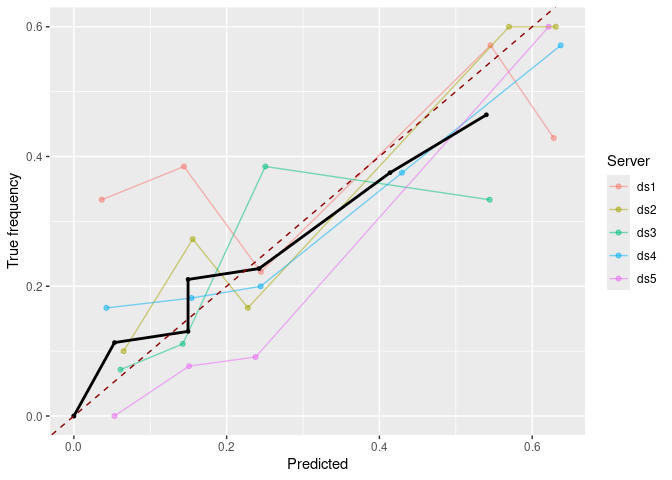

DataSHIELD Use-case
================

<!-- README.md is generated from README.Rmd. Please edit that file -->

<!-- README.md is generated from README.Rmd. Please edit that file -->

## About the repository

This repository contains a short use-case base on the three packages
`ds.predict.base`, `ds.calibration`, and `ds.roc.glm`. The main intend
is to have a use-case to demonstrate how to distributively evaluate a
model using the distributed ROC-GLM.

The following contains the preparation of test data and a test model as
“setup” while the second part is the analysis. .

### Structure of the repository

TODO

## Setup

### Install packages

Install all packages locally and also on the DataSHIELD test machine:

``` r
remotes::install_github("difuture-lmu/ds.predict.base")
#> Skipping install of 'ds.predict.base' from a github remote, the SHA1 (47fac1e7) has not changed since last install.
#>   Use `force = TRUE` to force installation
remotes::install_github("difuture-lmu/ds.calibration")
#> Skipping install of 'ds.calibration' from a github remote, the SHA1 (332c4ff5) has not changed since last install.
#>   Use `force = TRUE` to force installation
remotes::install_github("difuture-lmu/ds.roc.glm")
#> Skipping install of 'ds.roc.glm' from a github remote, the SHA1 (fac1ef5c) has not changed since last install.
#>   Use `force = TRUE` to force installation
```

### Generate data and fit model

The used data is the `GBSG2` from the `TH.data` packages. For further
details see the help page `?TH.data::GBSG2`. The task is to predict
whether hormonal therapy shows an improvement w.r.t. survival time. The
model we are using is a random forest from the `ranger` package. The
following code uses the `GBSG2` data, splits it into train and test data
with 60 % for training and 40 % for testing. The test data is further
split into 5 parts that are uploaded to DataSHIELD and used to simulate
the distributed setup.

``` r
source(here::here("R/generate-data.R"))
source(here::here("R/create-model.R"))
```

### Install package on DataSHIELD and upload data

``` r
source(here::here("R/upload-data.R"))
source(here::here("R/install-ds-packages.R"))
```

## Analysis

### Log into DataSHIELD test server

``` r
library(DSI)
#> Loading required package: progress
#> Loading required package: R6
library(DSOpal)
library(dsBaseClient)

library(ds.predict.base)
library(ds.calibration)
library(ds.roc.glm)

library(ggplot2)

builder = newDSLoginBuilder()

surl     = "https://opal-demo.obiba.org/"
username = "administrator"
password = "password"

datasets = paste0("SRV", seq_len(5L))
for (i in seq_along(datasets)) {
  builder$append(
    server   = paste0("ds", i),
    url      = surl,
    user     = username,
    password = password,
    table    = paste0("DIFUTURE-TEST.", datasets[i])
  )
}

## Get data of the servers:
conn = datashield.login(logins = builder$build(), assign = TRUE)
#> 
#> Logging into the collaborating servers
#>    [-------------------------------------------------------------------------------------]   0% / 0s  Login ds1 [============>---------------------------------------------------------------]  17% / 0s  Login ds2 [========================>---------------------------------------------------]  33% / 0s  Login ds3 [=====================================>--------------------------------------]  50% / 1s  Login ds4 [==================================================>-------------------------]  67% / 1s  Login ds5 [==============================================================>-------------]  83% / 1s  Logged in all servers [================================================================] 100% / 2s
#> 
#>   No variables have been specified. 
#>   All the variables in the table 
#>   (the whole dataset) will be assigned to R!
#> 
#> Assigning table data...
#>    [-------------------------------------------------------------------------------------]   0% / 0s  Assigning ds1 (DIFUTURE-TEST.SRV1) [=======>-------------------------------------------]  17% / 1s  Assigning ds2 (DIFUTURE-TEST.SRV2) [================>----------------------------------]  33% / 2s  Assigning ds3 (DIFUTURE-TEST.SRV3) [=========================>-------------------------]  50% / 2s  Assigning ds4 (DIFUTURE-TEST.SRV4) [=================================>-----------------]  67% / 2s  Assigning ds5 (DIFUTURE-TEST.SRV5) [=========================================>---------]  83% / 3s  Assigned all tables [==================================================================] 100% / 3s
datashield.symbols(conn)
#> $ds1
#> [1] "D"
#> 
#> $ds2
#> [1] "D"
#> 
#> $ds3
#> [1] "D"
#> 
#> $ds4
#> [1] "D"
#> 
#> $ds5
#> [1] "D"
ds.summary("D")
#>    [-------------------------------------------------------------------------------------]   0% / 0s  Checking ds1 (exists("D")) [-----------------------------------------------------------]   0% / 0s  Getting aggregate ds1 (exists("D")) [=======>------------------------------------------]  17% / 0s  Checking ds2 (exists("D")) [=========>-------------------------------------------------]  17% / 0s  Getting aggregate ds2 (exists("D")) [================>---------------------------------]  33% / 0s  Checking ds3 (exists("D")) [===================>---------------------------------------]  33% / 0s  Getting aggregate ds3 (exists("D")) [========================>-------------------------]  50% / 1s  Checking ds4 (exists("D")) [=============================>-----------------------------]  50% / 1s  Getting aggregate ds4 (exists("D")) [================================>-----------------]  67% / 1s  Checking ds5 (exists("D")) [======================================>--------------------]  67% / 1s  Getting aggregate ds5 (exists("D")) [=========================================>--------]  83% / 1s  Aggregated (exists("D")) [=============================================================] 100% / 1s
#>    [-------------------------------------------------------------------------------------]   0% / 0s  Aggregating ds1 (classDS("D")) [========>----------------------------------------------]  17% / 0s  Aggregating ds2 (classDS("D")) [=================>-------------------------------------]  33% / 0s  Aggregating ds3 (classDS("D")) [===========================>---------------------------]  50% / 0s  Aggregating ds4 (classDS("D")) [====================================>------------------]  67% / 0s  Aggregating ds5 (classDS("D")) [=============================================>---------]  83% / 0s  Checking ds1 (classDS("D")) [----------------------------------------------------------]   0% / 0s  Getting aggregate ds1 (classDS("D")) [=======>-----------------------------------------]  17% / 0s  Checking ds2 (classDS("D")) [=========>------------------------------------------------]  17% / 0s  Getting aggregate ds2 (classDS("D")) [===============>---------------------------------]  33% / 0s  Checking ds3 (classDS("D")) [==================>---------------------------------------]  33% / 0s  Getting aggregate ds3 (classDS("D")) [=======================>-------------------------]  50% / 0s  Checking ds4 (classDS("D")) [============================>-----------------------------]  50% / 0s  Getting aggregate ds4 (classDS("D")) [================================>----------------]  67% / 0s  Checking ds5 (classDS("D")) [======================================>-------------------]  67% / 0s  Getting aggregate ds5 (classDS("D")) [========================================>--------]  83% / 0s  Aggregated (classDS("D")) [============================================================] 100% / 0s
#>    [-------------------------------------------------------------------------------------]   0% / 0s  Checking ds1 (isValidDS(D)) [----------------------------------------------------------]   0% / 0s  Getting aggregate ds1 (isValidDS(D)) [=======================>-------------------------]  50% / 0s  Aggregated (isValidDS(D)) [============================================================] 100% / 0s
#>    [-------------------------------------------------------------------------------------]   0% / 0s  Checking ds1 (dimDS("D")) [------------------------------------------------------------]   0% / 0s  Getting aggregate ds1 (dimDS("D")) [=========================>-------------------------]  50% / 0s  Aggregated (dimDS("D")) [==============================================================] 100% / 0s
#>    [-------------------------------------------------------------------------------------]   0% / 0s  Checking ds1 (colnamesDS("D")) [-------------------------------------------------------]   0% / 0s  Getting aggregate ds1 (colnamesDS("D")) [======================>-----------------------]  50% / 0s  Aggregated (colnamesDS("D")) [=========================================================] 100% / 0s
#>    [-------------------------------------------------------------------------------------]   0% / 0s  Checking ds2 (isValidDS(D)) [----------------------------------------------------------]   0% / 0s  Getting aggregate ds2 (isValidDS(D)) [=======================>-------------------------]  50% / 0s  Aggregated (isValidDS(D)) [============================================================] 100% / 0s
#>    [-------------------------------------------------------------------------------------]   0% / 0s  Checking ds2 (dimDS("D")) [------------------------------------------------------------]   0% / 0s  Getting aggregate ds2 (dimDS("D")) [=========================>-------------------------]  50% / 0s  Aggregated (dimDS("D")) [==============================================================] 100% / 0s
#>    [-------------------------------------------------------------------------------------]   0% / 0s  Checking ds2 (colnamesDS("D")) [-------------------------------------------------------]   0% / 0s  Getting aggregate ds2 (colnamesDS("D")) [======================>-----------------------]  50% / 0s  Aggregated (colnamesDS("D")) [=========================================================] 100% / 0s
#>    [-------------------------------------------------------------------------------------]   0% / 0s  Checking ds3 (isValidDS(D)) [----------------------------------------------------------]   0% / 0s  Getting aggregate ds3 (isValidDS(D)) [=======================>-------------------------]  50% / 0s  Aggregated (isValidDS(D)) [============================================================] 100% / 0s
#>    [-------------------------------------------------------------------------------------]   0% / 0s  Checking ds3 (dimDS("D")) [------------------------------------------------------------]   0% / 0s  Getting aggregate ds3 (dimDS("D")) [=========================>-------------------------]  50% / 0s  Aggregated (dimDS("D")) [==============================================================] 100% / 0s
#>    [-------------------------------------------------------------------------------------]   0% / 0s  Checking ds3 (colnamesDS("D")) [-------------------------------------------------------]   0% / 0s  Getting aggregate ds3 (colnamesDS("D")) [======================>-----------------------]  50% / 0s  Aggregated (colnamesDS("D")) [=========================================================] 100% / 0s
#>    [-------------------------------------------------------------------------------------]   0% / 0s  Checking ds4 (isValidDS(D)) [----------------------------------------------------------]   0% / 0s  Getting aggregate ds4 (isValidDS(D)) [=======================>-------------------------]  50% / 0s  Aggregated (isValidDS(D)) [============================================================] 100% / 0s
#>    [-------------------------------------------------------------------------------------]   0% / 0s  Checking ds4 (dimDS("D")) [------------------------------------------------------------]   0% / 0s  Getting aggregate ds4 (dimDS("D")) [=========================>-------------------------]  50% / 0s  Aggregated (dimDS("D")) [==============================================================] 100% / 0s
#>    [-------------------------------------------------------------------------------------]   0% / 0s  Checking ds4 (colnamesDS("D")) [-------------------------------------------------------]   0% / 0s  Getting aggregate ds4 (colnamesDS("D")) [======================>-----------------------]  50% / 0s  Aggregated (colnamesDS("D")) [=========================================================] 100% / 0s
#>    [-------------------------------------------------------------------------------------]   0% / 0s  Checking ds5 (isValidDS(D)) [----------------------------------------------------------]   0% / 0s  Getting aggregate ds5 (isValidDS(D)) [=======================>-------------------------]  50% / 0s  Aggregated (isValidDS(D)) [============================================================] 100% / 0s
#>    [-------------------------------------------------------------------------------------]   0% / 0s  Checking ds5 (dimDS("D")) [------------------------------------------------------------]   0% / 0s  Getting aggregate ds5 (dimDS("D")) [=========================>-------------------------]  50% / 0s  Aggregated (dimDS("D")) [==============================================================] 100% / 0s
#>    [-------------------------------------------------------------------------------------]   0% / 0s  Checking ds5 (colnamesDS("D")) [-------------------------------------------------------]   0% / 0s  Getting aggregate ds5 (colnamesDS("D")) [======================>-----------------------]  50% / 0s  Aggregated (colnamesDS("D")) [=========================================================] 100% / 0s
#> $ds1
#> $ds1$class
#> [1] "data.frame"
#> 
#> $ds1$`number of rows`
#> [1] 52
#> 
#> $ds1$`number of columns`
#> [1] 10
#> 
#> $ds1$`variables held`
#>  [1] "horTh"    "age"      "menostat" "tsize"    "tgrade"   "pnodes"   "progrec"  "estrec"   "time"     "cens"    
#> 
#> 
#> $ds2
#> $ds2$class
#> [1] "data.frame"
#> 
#> $ds2$`number of rows`
#> [1] 46
#> 
#> $ds2$`number of columns`
#> [1] 10
#> 
#> $ds2$`variables held`
#>  [1] "horTh"    "age"      "menostat" "tsize"    "tgrade"   "pnodes"   "progrec"  "estrec"   "time"     "cens"    
#> 
#> 
#> $ds3
#> $ds3$class
#> [1] "data.frame"
#> 
#> $ds3$`number of rows`
#> [1] 55
#> 
#> $ds3$`number of columns`
#> [1] 10
#> 
#> $ds3$`variables held`
#>  [1] "horTh"    "age"      "menostat" "tsize"    "tgrade"   "pnodes"   "progrec"  "estrec"   "time"     "cens"    
#> 
#> 
#> $ds4
#> $ds4$class
#> [1] "data.frame"
#> 
#> $ds4$`number of rows`
#> [1] 59
#> 
#> $ds4$`number of columns`
#> [1] 10
#> 
#> $ds4$`variables held`
#>  [1] "horTh"    "age"      "menostat" "tsize"    "tgrade"   "pnodes"   "progrec"  "estrec"   "time"     "cens"    
#> 
#> 
#> $ds5
#> $ds5$class
#> [1] "data.frame"
#> 
#> $ds5$`number of rows`
#> [1] 63
#> 
#> $ds5$`number of columns`
#> [1] 10
#> 
#> $ds5$`variables held`
#>  [1] "horTh"    "age"      "menostat" "tsize"    "tgrade"   "pnodes"   "progrec"  "estrec"   "time"     "cens"
```

### Push and predict

``` r
## Load the pre-calculated logistic regression:
load(here::here("data/mod.Rda"))

## Push the model to the servers:
pushObject(conn, obj = mod)
#> [2022-02-11 10:31:42] Your object is bigger than 1 MB (7.2 MB). Uploading larger objects may take some time.
#>    [-------------------------------------------------------------------------------------]   0% / 0s  Checking ds1 (mod <- decodeBinary("58-0a-00-00-00-03-00-04-01-02-00-03-05-00-00-00-00-05-55-54-...  Finalizing assignment ds1 (mod <- decodeBinary("58-0a-00-00-00-03-00-04-01-02-00-03-05-00-00-00...  Checking ds2 (mod <- decodeBinary("58-0a-00-00-00-03-00-04-01-02-00-03-05-00-00-00-00-05-55-54-...  Finalizing assignment ds2 (mod <- decodeBinary("58-0a-00-00-00-03-00-04-01-02-00-03-05-00-00-00...  Checking ds3 (mod <- decodeBinary("58-0a-00-00-00-03-00-04-01-02-00-03-05-00-00-00-00-05-55-54-...  Finalizing assignment ds3 (mod <- decodeBinary("58-0a-00-00-00-03-00-04-01-02-00-03-05-00-00-00...  Checking ds4 (mod <- decodeBinary("58-0a-00-00-00-03-00-04-01-02-00-03-05-00-00-00-00-05-55-54-...  Finalizing assignment ds4 (mod <- decodeBinary("58-0a-00-00-00-03-00-04-01-02-00-03-05-00-00-00...  Checking ds5 (mod <- decodeBinary("58-0a-00-00-00-03-00-04-01-02-00-03-05-00-00-00-00-05-55-54-...  Finalizing assignment ds5 (mod <- decodeBinary("58-0a-00-00-00-03-00-04-01-02-00-03-05-00-00-00...  Assigned expr. (mod <- decodeBinary("58-0a-00-00-00-03-00-04-01-02-00-03-05-00-00-00-00-05-55-5...
datashield.symbols(conn)
#> $ds1
#> [1] "D"   "mod"
#> 
#> $ds2
#> [1] "D"   "mod"
#> 
#> $ds3
#> [1] "D"   "mod"
#> 
#> $ds4
#> [1] "D"   "mod"
#> 
#> $ds5
#> [1] "D"   "mod"

## Predict the model on the data sets located at the servers:
predictModel(conn, mod, "probs", predict_fun = "ranger:::predict.ranger(mod, data = D)$predictions")
#>    [-------------------------------------------------------------------------------------]   0% / 0s  Checking ds1 (probs <- assignPredictModel("58-0a-00-00-00-03-00-04-01-02-00-03-05-00-00-00-00-0...  Checking ds2 (probs <- assignPredictModel("58-0a-00-00-00-03-00-04-01-02-00-03-05-00-00-00-00-0...  Checking ds3 (probs <- assignPredictModel("58-0a-00-00-00-03-00-04-01-02-00-03-05-00-00-00-00-0...  Checking ds4 (probs <- assignPredictModel("58-0a-00-00-00-03-00-04-01-02-00-03-05-00-00-00-00-0...  Checking ds5 (probs <- assignPredictModel("58-0a-00-00-00-03-00-04-01-02-00-03-05-00-00-00-00-0...  Waiting...  (probs <- assignPredictModel("58-0a-00-00-00-03-00-04-01-02-00-03-05-00-00-00-00-05...  Checking ds1 (probs <- assignPredictModel("58-0a-00-00-00-03-00-04-01-02-00-03-05-00-00-00-00-0...  Checking ds2 (probs <- assignPredictModel("58-0a-00-00-00-03-00-04-01-02-00-03-05-00-00-00-00-0...  Checking ds3 (probs <- assignPredictModel("58-0a-00-00-00-03-00-04-01-02-00-03-05-00-00-00-00-0...  Checking ds4 (probs <- assignPredictModel("58-0a-00-00-00-03-00-04-01-02-00-03-05-00-00-00-00-0...  Checking ds5 (probs <- assignPredictModel("58-0a-00-00-00-03-00-04-01-02-00-03-05-00-00-00-00-0...  Waiting...  (probs <- assignPredictModel("58-0a-00-00-00-03-00-04-01-02-00-03-05-00-00-00-00-05...  Checking ds1 (probs <- assignPredictModel("58-0a-00-00-00-03-00-04-01-02-00-03-05-00-00-00-00-0...  Finalizing assignment ds1 (probs <- assignPredictModel("58-0a-00-00-00-03-00-04-01-02-00-03-05-...  Checking ds2 (probs <- assignPredictModel("58-0a-00-00-00-03-00-04-01-02-00-03-05-00-00-00-00-0...  Finalizing assignment ds2 (probs <- assignPredictModel("58-0a-00-00-00-03-00-04-01-02-00-03-05-...  Checking ds3 (probs <- assignPredictModel("58-0a-00-00-00-03-00-04-01-02-00-03-05-00-00-00-00-0...  Finalizing assignment ds3 (probs <- assignPredictModel("58-0a-00-00-00-03-00-04-01-02-00-03-05-...  Checking ds4 (probs <- assignPredictModel("58-0a-00-00-00-03-00-04-01-02-00-03-05-00-00-00-00-0...  Finalizing assignment ds4 (probs <- assignPredictModel("58-0a-00-00-00-03-00-04-01-02-00-03-05-...  Checking ds5 (probs <- assignPredictModel("58-0a-00-00-00-03-00-04-01-02-00-03-05-00-00-00-00-0...  Finalizing assignment ds5 (probs <- assignPredictModel("58-0a-00-00-00-03-00-04-01-02-00-03-05-...  Assigned expr. (probs <- assignPredictModel("58-0a-00-00-00-03-00-04-01-02-00-03-05-00-00-00-00...
datashield.symbols(conn)
#> $ds1
#> [1] "D"     "mod"   "probs"
#> 
#> $ds2
#> [1] "D"     "mod"   "probs"
#> 
#> $ds3
#> [1] "D"     "mod"   "probs"
#> 
#> $ds4
#> [1] "D"     "mod"   "probs"
#> 
#> $ds5
#> [1] "D"     "mod"   "probs"
```

### Analyse calibration of the predictions

``` r
brier = dsBrierScore(conn, "D$cens", "probs")
#>    [-------------------------------------------------------------------------------------]   0% / 0s  Checking ds1 (brierScore("D$cens", "probs")) [-----------------------------------------]   0% / 0s  Getting aggregate ds1 (brierScore("D$cens", "probs")) [====>---------------------------]  17% / 0s  Checking ds2 (brierScore("D$cens", "probs")) [======>----------------------------------]  17% / 0s  Getting aggregate ds2 (brierScore("D$cens", "probs")) [==========>---------------------]  33% / 0s  Checking ds3 (brierScore("D$cens", "probs")) [=============>---------------------------]  33% / 0s  Getting aggregate ds3 (brierScore("D$cens", "probs")) [===============>----------------]  50% / 1s  Checking ds4 (brierScore("D$cens", "probs")) [===================>---------------------]  50% / 1s  Getting aggregate ds4 (brierScore("D$cens", "probs")) [====================>-----------]  67% / 1s  Checking ds5 (brierScore("D$cens", "probs")) [==========================>--------------]  67% / 1s  Getting aggregate ds5 (brierScore("D$cens", "probs")) [==========================>-----]  83% / 1s  Aggregated (brierScore("D$cens", "probs")) [===========================================] 100% / 1s
brier
#> [1] 0.2264

cc = dsCalibrationCurve(conn, "D$cens", "probs")
#>    [-------------------------------------------------------------------------------------]   0% / 0s  Checking ds1 (calibrationCurve("D$cens", "probs", 10, TRUE)) [-------------------------]   0% / 0s  Getting aggregate ds1 (calibrationCurve("D$cens", "probs", 10, TRUE)) [==>-------------]  17% / 0s  Checking ds2 (calibrationCurve("D$cens", "probs", 10, TRUE)) [===>---------------------]  17% / 0s  Getting aggregate ds2 (calibrationCurve("D$cens", "probs", 10, TRUE)) [====>-----------]  33% / 0s  Checking ds3 (calibrationCurve("D$cens", "probs", 10, TRUE)) [=======>-----------------]  33% / 1s  Getting aggregate ds3 (calibrationCurve("D$cens", "probs", 10, TRUE)) [=======>--------]  50% / 1s  Checking ds4 (calibrationCurve("D$cens", "probs", 10, TRUE)) [===========>-------------]  50% / 1s  Getting aggregate ds4 (calibrationCurve("D$cens", "probs", 10, TRUE)) [==========>-----]  67% / 1s  Checking ds5 (calibrationCurve("D$cens", "probs", 10, TRUE)) [================>--------]  67% / 1s  Getting aggregate ds5 (calibrationCurve("D$cens", "probs", 10, TRUE)) [============>---]  83% / 1s  Aggregated (calibrationCurve("D$cens", "probs", 10, TRUE)) [===========================] 100% / 1s
cc
#> $individuals
#> $individuals$ds1
#>          bin  n lower upper  truth   prob
#> 1    (0,0.1]  0   0.0   0.1     NA     NA
#> 2  (0.1,0.2]  5   0.1   0.2 0.6000 0.1311
#> 3  (0.2,0.3] 12   0.2   0.3 0.2500 0.2429
#> 4  (0.3,0.4] 12   0.3   0.4 0.2500 0.3453
#> 5  (0.4,0.5]  7   0.4   0.5 0.4286 0.4428
#> 6  (0.5,0.6]  5   0.5   0.6 0.6000 0.5423
#> 7  (0.6,0.7]  9   0.6   0.7 0.7778 0.6504
#> 8  (0.7,0.8]  1   0.7   0.8     NA     NA
#> 9  (0.8,0.9]  1   0.8   0.9     NA     NA
#> 10   (0.9,1]  0   0.9   1.0     NA     NA
#> 
#> $individuals$ds2
#>          bin  n lower upper  truth   prob
#> 1    (0,0.1]  0   0.0   0.1     NA     NA
#> 2  (0.1,0.2]  7   0.1   0.2 0.1429 0.1723
#> 3  (0.2,0.3]  7   0.2   0.3 0.2857 0.2375
#> 4  (0.3,0.4] 10   0.3   0.4 0.3000 0.3518
#> 5  (0.4,0.5] 10   0.4   0.5 0.7000 0.4386
#> 6  (0.5,0.6]  7   0.5   0.6 0.5714 0.5393
#> 7  (0.6,0.7]  2   0.6   0.7     NA     NA
#> 8  (0.7,0.8]  3   0.7   0.8     NA     NA
#> 9  (0.8,0.9]  0   0.8   0.9     NA     NA
#> 10   (0.9,1]  0   0.9   1.0     NA     NA
#> 
#> $individuals$ds3
#>          bin  n lower upper  truth   prob
#> 1    (0,0.1]  1   0.0   0.1     NA     NA
#> 2  (0.1,0.2]  4   0.1   0.2     NA     NA
#> 3  (0.2,0.3]  9   0.2   0.3 0.3333 0.2361
#> 4  (0.3,0.4]  7   0.3   0.4 0.2857 0.3609
#> 5  (0.4,0.5] 14   0.4   0.5 0.3571 0.4513
#> 6  (0.5,0.6] 10   0.5   0.6 0.6000 0.5455
#> 7  (0.6,0.7]  5   0.6   0.7 0.8000 0.6481
#> 8  (0.7,0.8]  4   0.7   0.8     NA     NA
#> 9  (0.8,0.9]  1   0.8   0.9     NA     NA
#> 10   (0.9,1]  0   0.9   1.0     NA     NA
#> 
#> $individuals$ds4
#>          bin  n lower upper  truth   prob
#> 1    (0,0.1]  2   0.0   0.1     NA     NA
#> 2  (0.1,0.2]  9   0.1   0.2 0.1111 0.1509
#> 3  (0.2,0.3]  4   0.2   0.3     NA     NA
#> 4  (0.3,0.4] 16   0.3   0.4 0.4375 0.3469
#> 5  (0.4,0.5] 10   0.4   0.5 0.5000 0.4733
#> 6  (0.5,0.6]  6   0.5   0.6 0.6667 0.5543
#> 7  (0.6,0.7]  7   0.6   0.7 0.7143 0.6400
#> 8  (0.7,0.8]  5   0.7   0.8 0.8000 0.7561
#> 9  (0.8,0.9]  0   0.8   0.9     NA     NA
#> 10   (0.9,1]  0   0.9   1.0     NA     NA
#> 
#> $individuals$ds5
#>          bin  n lower upper  truth   prob
#> 1    (0,0.1]  0   0.0   0.1     NA     NA
#> 2  (0.1,0.2]  4   0.1   0.2     NA     NA
#> 3  (0.2,0.3]  7   0.2   0.3 0.2857 0.2501
#> 4  (0.3,0.4] 15   0.3   0.4 0.3333 0.3530
#> 5  (0.4,0.5] 14   0.4   0.5 0.4286 0.4463
#> 6  (0.5,0.6]  5   0.5   0.6 0.6000 0.5261
#> 7  (0.6,0.7]  8   0.6   0.7 0.3750 0.6172
#> 8  (0.7,0.8]  7   0.7   0.8 0.4286 0.7325
#> 9  (0.8,0.9]  3   0.8   0.9     NA     NA
#> 10   (0.9,1]  0   0.9   1.0     NA     NA
#> 
#> 
#> $aggregated
#>          bin lower upper  truth   prob missing_ratio
#> 1    (0,0.1]   0.0   0.1 0.0000 0.0000       1.00000
#> 2  (0.1,0.2]   0.1   0.2 0.1724 0.1110       0.27586
#> 3  (0.2,0.3]   0.2   0.3 0.2564 0.2167       0.10256
#> 4  (0.3,0.4]   0.3   0.4 0.3333 0.3506       0.00000
#> 5  (0.4,0.5]   0.4   0.5 0.4727 0.4506       0.00000
#> 6  (0.5,0.6]   0.5   0.6 0.6061 0.5424       0.00000
#> 7  (0.6,0.7]   0.6   0.7 0.6129 0.5971       0.06452
#> 8  (0.7,0.8]   0.7   0.8 0.3500 0.4454       0.40000
#> 9  (0.8,0.9]   0.8   0.9 0.0000 0.0000       1.00000
#> 10   (0.9,1]   0.9   1.0    NaN    NaN           NaN

ll_tab = list()
for (i in seq_along(cc$individuals)) {
  ll_tab[[i]] = c(i, cc$individuals[[i]]$n)
}
tab = do.call(rbind, ll_tab)
tab = as.data.frame(rbind(tab, colSums(tab)))
colnames(tab) = c("Server", cc$individuals[[1]]$bin)
knitr::kable(tab, format = "latex")
```

``` r

gg_cal = plotCalibrationCurve(cc, size = 1)
gg_cal
#> Warning: Removed 22 rows containing missing values (geom_point).
#> Warning: Removed 22 row(s) containing missing values (geom_path).
#> Warning: Removed 1 rows containing missing values (geom_point).
#> Warning: Removed 1 row(s) containing missing values (geom_path).
```

<!-- -->

### Evaluate the model using ROC analysis

``` r
# Get the l2 sensitivity
(l2s = dsL2Sens(conn, "D", "probs"))
#>    [-------------------------------------------------------------------------------------]   0% / 0s  Checking ds1 (dimDS("D")) [------------------------------------------------------------]   0% / 0s  Getting aggregate ds1 (dimDS("D")) [=======>-------------------------------------------]  17% / 0s  Checking ds2 (dimDS("D")) [=========>--------------------------------------------------]  17% / 0s  Getting aggregate ds2 (dimDS("D")) [================>----------------------------------]  33% / 0s  Checking ds3 (dimDS("D")) [===================>----------------------------------------]  33% / 0s  Getting aggregate ds3 (dimDS("D")) [=========================>-------------------------]  50% / 1s  Checking ds4 (dimDS("D")) [=============================>------------------------------]  50% / 1s  Getting aggregate ds4 (dimDS("D")) [=================================>-----------------]  67% / 1s  Checking ds5 (dimDS("D")) [=======================================>--------------------]  67% / 1s  Getting aggregate ds5 (dimDS("D")) [=========================================>---------]  83% / 1s  Aggregated (dimDS("D")) [==============================================================] 100% / 1s
#>    [-------------------------------------------------------------------------------------]   0% / 0s  Checking ds1 (xXcols <- decodeBinary("58-0a-00-00-00-03-00-04-01-02-00-03-05-00-00-00-00-05-55-...  Finalizing assignment ds1 (xXcols <- decodeBinary("58-0a-00-00-00-03-00-04-01-02-00-03-05-00-00...  Checking ds2 (xXcols <- decodeBinary("58-0a-00-00-00-03-00-04-01-02-00-03-05-00-00-00-00-05-55-...  Finalizing assignment ds2 (xXcols <- decodeBinary("58-0a-00-00-00-03-00-04-01-02-00-03-05-00-00...  Checking ds3 (xXcols <- decodeBinary("58-0a-00-00-00-03-00-04-01-02-00-03-05-00-00-00-00-05-55-...  Finalizing assignment ds3 (xXcols <- decodeBinary("58-0a-00-00-00-03-00-04-01-02-00-03-05-00-00...  Checking ds4 (xXcols <- decodeBinary("58-0a-00-00-00-03-00-04-01-02-00-03-05-00-00-00-00-05-55-...  Finalizing assignment ds4 (xXcols <- decodeBinary("58-0a-00-00-00-03-00-04-01-02-00-03-05-00-00...  Checking ds5 (xXcols <- decodeBinary("58-0a-00-00-00-03-00-04-01-02-00-03-05-00-00-00-00-05-55-...  Finalizing assignment ds5 (xXcols <- decodeBinary("58-0a-00-00-00-03-00-04-01-02-00-03-05-00-00...  Assigned expr. (xXcols <- decodeBinary("58-0a-00-00-00-03-00-04-01-02-00-03-05-00-00-00-00-05-5...
#>    [-------------------------------------------------------------------------------------]   0% / 0s  Checking ds1 (l2sens("D", "probs", 91, "xXcols")) [------------------------------------]   0% / 0s  Getting aggregate ds1 (l2sens("D", "probs", 91, "xXcols")) [===>-----------------------]  17% / 0s  Checking ds2 (l2sens("D", "probs", 91, "xXcols")) [=====>------------------------------]  17% / 0s  Getting aggregate ds2 (l2sens("D", "probs", 91, "xXcols")) [========>------------------]  33% / 0s  Checking ds3 (l2sens("D", "probs", 91, "xXcols")) [===========>------------------------]  33% / 0s  Getting aggregate ds3 (l2sens("D", "probs", 91, "xXcols")) [=============>-------------]  50% / 0s  Checking ds4 (l2sens("D", "probs", 91, "xXcols")) [=================>------------------]  50% / 1s  Getting aggregate ds4 (l2sens("D", "probs", 91, "xXcols")) [=================>---------]  67% / 1s  Checking ds5 (l2sens("D", "probs", 91, "xXcols")) [=======================>------------]  67% / 1s  Getting aggregate ds5 (l2sens("D", "probs", 91, "xXcols")) [=====================>-----]  83% / 1s  Aggregated (...) [=====================================================================] 100% / 1s
#>    [-------------------------------------------------------------------------------------]   0% / 0s  Checking ds1 (rmDS("xXcols")) [--------------------------------------------------------]   0% / 0s  Getting aggregate ds1 (rmDS("xXcols")) [=======>---------------------------------------]  17% / 1s  Checking ds2 (rmDS("xXcols")) [========>-----------------------------------------------]  17% / 1s  Getting aggregate ds2 (rmDS("xXcols")) [===============>-------------------------------]  33% / 1s  Checking ds3 (rmDS("xXcols")) [==================>-------------------------------------]  33% / 1s  Getting aggregate ds3 (rmDS("xXcols")) [=======================>-----------------------]  50% / 1s  Checking ds4 (rmDS("xXcols")) [===========================>----------------------------]  50% / 1s  Getting aggregate ds4 (rmDS("xXcols")) [==============================>----------------]  67% / 1s  Checking ds5 (rmDS("xXcols")) [====================================>-------------------]  67% / 1s  Getting aggregate ds5 (rmDS("xXcols")) [======================================>--------]  83% / 1s  Aggregated (rmDS("xXcols")) [==========================================================] 100% / 1s
#> [1] 0.01599
epsilon = 0.3
delta = 0.2

# Amount of noise added:
sqrt(2 * log(1.25 / delta)) * l2s / epsilon
#> [1] 0.1021


# Calculate ROC-GLM
roc_glm = dsROCGLM(conn, "D$cens", "probs", epsilon = epsilon,
  delta = delta, dat_name = "D", seed = 123, seed_object = "D")
#>    [-------------------------------------------------------------------------------------]   0% / 0s  Checking ds1 (dimDS("D")) [------------------------------------------------------------]   0% / 0s  Getting aggregate ds1 (dimDS("D")) [=======>-------------------------------------------]  17% / 0s  Checking ds2 (dimDS("D")) [=========>--------------------------------------------------]  17% / 0s  Getting aggregate ds2 (dimDS("D")) [================>----------------------------------]  33% / 0s  Checking ds3 (dimDS("D")) [===================>----------------------------------------]  33% / 0s  Getting aggregate ds3 (dimDS("D")) [=========================>-------------------------]  50% / 0s  Checking ds4 (dimDS("D")) [=============================>------------------------------]  50% / 1s  Getting aggregate ds4 (dimDS("D")) [=================================>-----------------]  67% / 1s  Checking ds5 (dimDS("D")) [=======================================>--------------------]  67% / 1s  Getting aggregate ds5 (dimDS("D")) [=========================================>---------]  83% / 1s  Aggregated (dimDS("D")) [==============================================================] 100% / 1s
#>    [-------------------------------------------------------------------------------------]   0% / 0s  Checking ds1 (xXcols <- decodeBinary("58-0a-00-00-00-03-00-04-01-02-00-03-05-00-00-00-00-05-55-...  Finalizing assignment ds1 (xXcols <- decodeBinary("58-0a-00-00-00-03-00-04-01-02-00-03-05-00-00...  Checking ds2 (xXcols <- decodeBinary("58-0a-00-00-00-03-00-04-01-02-00-03-05-00-00-00-00-05-55-...  Finalizing assignment ds2 (xXcols <- decodeBinary("58-0a-00-00-00-03-00-04-01-02-00-03-05-00-00...  Checking ds3 (xXcols <- decodeBinary("58-0a-00-00-00-03-00-04-01-02-00-03-05-00-00-00-00-05-55-...  Finalizing assignment ds3 (xXcols <- decodeBinary("58-0a-00-00-00-03-00-04-01-02-00-03-05-00-00...  Checking ds4 (xXcols <- decodeBinary("58-0a-00-00-00-03-00-04-01-02-00-03-05-00-00-00-00-05-55-...  Finalizing assignment ds4 (xXcols <- decodeBinary("58-0a-00-00-00-03-00-04-01-02-00-03-05-00-00...  Checking ds5 (xXcols <- decodeBinary("58-0a-00-00-00-03-00-04-01-02-00-03-05-00-00-00-00-05-55-...  Finalizing assignment ds5 (xXcols <- decodeBinary("58-0a-00-00-00-03-00-04-01-02-00-03-05-00-00...  Assigned expr. (xXcols <- decodeBinary("58-0a-00-00-00-03-00-04-01-02-00-03-05-00-00-00-00-05-5...
#>    [-------------------------------------------------------------------------------------]   0% / 0s  Checking ds1 (l2sens("D", "probs", 91, "xXcols")) [------------------------------------]   0% / 0s  Getting aggregate ds1 (l2sens("D", "probs", 91, "xXcols")) [===>-----------------------]  17% / 0s  Checking ds2 (l2sens("D", "probs", 91, "xXcols")) [=====>------------------------------]  17% / 0s  Getting aggregate ds2 (l2sens("D", "probs", 91, "xXcols")) [========>------------------]  33% / 0s  Checking ds3 (l2sens("D", "probs", 91, "xXcols")) [===========>------------------------]  33% / 1s  Getting aggregate ds3 (l2sens("D", "probs", 91, "xXcols")) [=============>-------------]  50% / 1s  Checking ds4 (l2sens("D", "probs", 91, "xXcols")) [=================>------------------]  50% / 1s  Getting aggregate ds4 (l2sens("D", "probs", 91, "xXcols")) [=================>---------]  67% / 1s  Checking ds5 (l2sens("D", "probs", 91, "xXcols")) [=======================>------------]  67% / 1s  Getting aggregate ds5 (l2sens("D", "probs", 91, "xXcols")) [=====================>-----]  83% / 1s  Aggregated (...) [=====================================================================] 100% / 1s
#>    [-------------------------------------------------------------------------------------]   0% / 0s  Checking ds1 (rmDS("xXcols")) [--------------------------------------------------------]   0% / 0s  Getting aggregate ds1 (rmDS("xXcols")) [=======>---------------------------------------]  17% / 0s  Checking ds2 (rmDS("xXcols")) [========>-----------------------------------------------]  17% / 0s  Getting aggregate ds2 (rmDS("xXcols")) [===============>-------------------------------]  33% / 0s  Checking ds3 (rmDS("xXcols")) [==================>-------------------------------------]  33% / 0s  Getting aggregate ds3 (rmDS("xXcols")) [=======================>-----------------------]  50% / 1s  Checking ds4 (rmDS("xXcols")) [===========================>----------------------------]  50% / 1s  Getting aggregate ds4 (rmDS("xXcols")) [==============================>----------------]  67% / 1s  Checking ds5 (rmDS("xXcols")) [====================================>-------------------]  67% / 1s  Getting aggregate ds5 (rmDS("xXcols")) [======================================>--------]  83% / 1s  Aggregated (rmDS("xXcols")) [==========================================================] 100% / 1s
#> 
#> [2022-02-11 10:35:16] L2 sensitivity is: 0.016
#> 
#>    [-------------------------------------------------------------------------------------]   0% / 0s  Checking ds1 (l2s <- decodeBinary("58-0a-00-00-00-03-00-04-01-02-00-03-05-00-00-00-00-05-55-54-...  Finalizing assignment ds1 (l2s <- decodeBinary("58-0a-00-00-00-03-00-04-01-02-00-03-05-00-00-00...  Checking ds2 (l2s <- decodeBinary("58-0a-00-00-00-03-00-04-01-02-00-03-05-00-00-00-00-05-55-54-...  Finalizing assignment ds2 (l2s <- decodeBinary("58-0a-00-00-00-03-00-04-01-02-00-03-05-00-00-00...  Checking ds3 (l2s <- decodeBinary("58-0a-00-00-00-03-00-04-01-02-00-03-05-00-00-00-00-05-55-54-...  Finalizing assignment ds3 (l2s <- decodeBinary("58-0a-00-00-00-03-00-04-01-02-00-03-05-00-00-00...  Checking ds4 (l2s <- decodeBinary("58-0a-00-00-00-03-00-04-01-02-00-03-05-00-00-00-00-05-55-54-...  Finalizing assignment ds4 (l2s <- decodeBinary("58-0a-00-00-00-03-00-04-01-02-00-03-05-00-00-00...  Checking ds5 (l2s <- decodeBinary("58-0a-00-00-00-03-00-04-01-02-00-03-05-00-00-00-00-05-55-54-...  Finalizing assignment ds5 (l2s <- decodeBinary("58-0a-00-00-00-03-00-04-01-02-00-03-05-00-00-00...  Assigned expr. (l2s <- decodeBinary("58-0a-00-00-00-03-00-04-01-02-00-03-05-00-00-00-00-05-55-5...
#> 
#> [2022-02-11 10:35:17] Initializing ROC-GLM
#> 
#> [2022-02-11 10:35:17] Host: Received scores of negative response
#> 
#> [2022-02-11 10:35:17] Receiving negative scores
#>    [-------------------------------------------------------------------------------------]   0% / 0s  Checking ds1 (getNegativeScores("D$cens", "probs", 0.3, 0.2,123, "D")) [---------------]   0% / 0s  Getting aggregate ds1 (getNegativeScores("D$cens", "probs", 0.3, 0.2,123, "D")) [>-----]  17% / 0s  Checking ds2 (getNegativeScores("D$cens", "probs", 0.3, 0.2,123, "D")) [=>-------------]  17% / 0s  Getting aggregate ds2 (getNegativeScores("D$cens", "probs", 0.3, 0.2,123, "D")) [=>----]  33% / 0s  Checking ds3 (getNegativeScores("D$cens", "probs", 0.3, 0.2,123, "D")) [====>----------]  33% / 0s  Getting aggregate ds3 (getNegativeScores("D$cens", "probs", 0.3, 0.2,123, "D")) [==>---]  50% / 1s  Checking ds4 (getNegativeScores("D$cens", "probs", 0.3, 0.2,123, "D")) [=======>-------]  50% / 1s  Getting aggregate ds4 (getNegativeScores("D$cens", "probs", 0.3, 0.2,123, "D")) [===>--]  67% / 1s  Checking ds5 (getNegativeScores("D$cens", "probs", 0.3, 0.2,123, "D")) [=========>-----]  67% / 1s  Getting aggregate ds5 (getNegativeScores("D$cens", "probs", 0.3, 0.2,123, "D")) [====>-]  83% / 1s  Aggregated (...) [=====================================================================] 100% / 1s
#> [2022-02-11 10:35:18] Host: Pushing pooled scores
#>    [-------------------------------------------------------------------------------------]   0% / 0s  Checking ds1 (pooled_scores <- decodeBinary("58-0a-00-00-00-03-00-04-01-02-00-03-05-00-00-00-00...  Finalizing assignment ds1 (pooled_scores <- decodeBinary("58-0a-00-00-00-03-00-04-01-02-00-03-0...  Checking ds2 (pooled_scores <- decodeBinary("58-0a-00-00-00-03-00-04-01-02-00-03-05-00-00-00-00...  Finalizing assignment ds2 (pooled_scores <- decodeBinary("58-0a-00-00-00-03-00-04-01-02-00-03-0...  Checking ds3 (pooled_scores <- decodeBinary("58-0a-00-00-00-03-00-04-01-02-00-03-05-00-00-00-00...  Finalizing assignment ds3 (pooled_scores <- decodeBinary("58-0a-00-00-00-03-00-04-01-02-00-03-0...  Checking ds4 (pooled_scores <- decodeBinary("58-0a-00-00-00-03-00-04-01-02-00-03-05-00-00-00-00...  Finalizing assignment ds4 (pooled_scores <- decodeBinary("58-0a-00-00-00-03-00-04-01-02-00-03-0...  Checking ds5 (pooled_scores <- decodeBinary("58-0a-00-00-00-03-00-04-01-02-00-03-05-00-00-00-00...  Finalizing assignment ds5 (pooled_scores <- decodeBinary("58-0a-00-00-00-03-00-04-01-02-00-03-0...  Assigned expr. (pooled_scores <- decodeBinary("58-0a-00-00-00-03-00-04-01-02-00-03-05-00-00-00-...
#> [2022-02-11 10:35:19] Server: Calculating placement values and parts for ROC-GLM
#>    [-------------------------------------------------------------------------------------]   0% / 0s  Checking ds1 (roc_data <- rocGLMFrame("D$cens", "probs", "pooled_scores")) [-----------]   0% / 0s  Finalizing assignment ds1 (roc_data <- rocGLMFrame("D$cens", "probs", "pooled_scores")) []  17%...  Checking ds2 (roc_data <- rocGLMFrame("D$cens", "probs", "pooled_scores")) [=>---------]  17% / 0s  Finalizing assignment ds2 (roc_data <- rocGLMFrame("D$cens", "probs", "pooled_scores")) []  33%...  Checking ds3 (roc_data <- rocGLMFrame("D$cens", "probs", "pooled_scores")) [===>-------]  33% / 1s  Finalizing assignment ds3 (roc_data <- rocGLMFrame("D$cens", "probs", "pooled_scores")) []  50%...  Checking ds4 (roc_data <- rocGLMFrame("D$cens", "probs", "pooled_scores")) [=====>-----]  50% / 1s  Finalizing assignment ds4 (roc_data <- rocGLMFrame("D$cens", "probs", "pooled_scores")) []  67%...  Checking ds5 (roc_data <- rocGLMFrame("D$cens", "probs", "pooled_scores")) [======>----]  67% / 1s  Finalizing assignment ds5 (roc_data <- rocGLMFrame("D$cens", "probs", "pooled_scores")) []  83%...  Assigned expr. (roc_data <- rocGLMFrame("D$cens", "probs", "pooled_scores")) [=========] 100% / 1s
#> [2022-02-11 10:35:20] Server: Calculating probit regression to obtain ROC-GLM
#>    [-------------------------------------------------------------------------------------]   0% / 0s  Checking ds1 (calculateDistrGLMParts(formula = y ~ x, data = "roc_data", w = "w", ) [--]   0% / 0s  Getting aggregate ds1 (calculateDistrGLMParts(formula = y ~ x, data = "roc_data", w = "w", ) []...  Checking ds2 (calculateDistrGLMParts(formula = y ~ x, data = "roc_data", w = "w", ) [--]  17% / 0s  Getting aggregate ds2 (calculateDistrGLMParts(formula = y ~ x, data = "roc_data", w = "w", ) []...  Checking ds3 (calculateDistrGLMParts(formula = y ~ x, data = "roc_data", w = "w", ) [>-]  33% / 1s  Getting aggregate ds3 (calculateDistrGLMParts(formula = y ~ x, data = "roc_data", w = "w", ) []...  Checking ds4 (calculateDistrGLMParts(formula = y ~ x, data = "roc_data", w = "w", ) [>-]  50% / 1s  Getting aggregate ds4 (calculateDistrGLMParts(formula = y ~ x, data = "roc_data", w = "w", ) []...  Checking ds5 (calculateDistrGLMParts(formula = y ~ x, data = "roc_data", w = "w", ) [>-]  67% / 1s  Getting aggregate ds5 (calculateDistrGLMParts(formula = y ~ x, data = "roc_data", w = "w", ) []...  Aggregated (calculateDistrGLMParts(formula = y ~ x, data = "roc_data", w = "w", ) [====] 100% / 1s
#> [2022-02-11 10:35:21] Deviance of iter1=52.6631
#>    [-------------------------------------------------------------------------------------]   0% / 0s  Checking ds1 (calculateDistrGLMParts(formula = y ~ x, data = "roc_data", w = "w", ) [--]   0% / 0s  Getting aggregate ds1 (calculateDistrGLMParts(formula = y ~ x, data = "roc_data", w = "w", ) []...  Checking ds2 (calculateDistrGLMParts(formula = y ~ x, data = "roc_data", w = "w", ) [--]  17% / 0s  Getting aggregate ds2 (calculateDistrGLMParts(formula = y ~ x, data = "roc_data", w = "w", ) []...  Checking ds3 (calculateDistrGLMParts(formula = y ~ x, data = "roc_data", w = "w", ) [>-]  33% / 0s  Getting aggregate ds3 (calculateDistrGLMParts(formula = y ~ x, data = "roc_data", w = "w", ) []...  Checking ds4 (calculateDistrGLMParts(formula = y ~ x, data = "roc_data", w = "w", ) [>-]  50% / 1s  Getting aggregate ds4 (calculateDistrGLMParts(formula = y ~ x, data = "roc_data", w = "w", ) []...  Checking ds5 (calculateDistrGLMParts(formula = y ~ x, data = "roc_data", w = "w", ) [>-]  67% / 1s  Getting aggregate ds5 (calculateDistrGLMParts(formula = y ~ x, data = "roc_data", w = "w", ) []...  Aggregated (calculateDistrGLMParts(formula = y ~ x, data = "roc_data", w = "w", ) [====] 100% / 1s
#> [2022-02-11 10:35:22] Deviance of iter2=81.4061
#>    [-------------------------------------------------------------------------------------]   0% / 0s  Checking ds1 (calculateDistrGLMParts(formula = y ~ x, data = "roc_data", w = "w", ) [--]   0% / 0s  Getting aggregate ds1 (calculateDistrGLMParts(formula = y ~ x, data = "roc_data", w = "w", ) []...  Checking ds2 (calculateDistrGLMParts(formula = y ~ x, data = "roc_data", w = "w", ) [--]  17% / 0s  Getting aggregate ds2 (calculateDistrGLMParts(formula = y ~ x, data = "roc_data", w = "w", ) []...  Checking ds3 (calculateDistrGLMParts(formula = y ~ x, data = "roc_data", w = "w", ) [>-]  33% / 0s  Getting aggregate ds3 (calculateDistrGLMParts(formula = y ~ x, data = "roc_data", w = "w", ) []...  Checking ds4 (calculateDistrGLMParts(formula = y ~ x, data = "roc_data", w = "w", ) [>-]  50% / 1s  Getting aggregate ds4 (calculateDistrGLMParts(formula = y ~ x, data = "roc_data", w = "w", ) []...  Checking ds5 (calculateDistrGLMParts(formula = y ~ x, data = "roc_data", w = "w", ) [>-]  67% / 1s  Getting aggregate ds5 (calculateDistrGLMParts(formula = y ~ x, data = "roc_data", w = "w", ) []...  Aggregated (calculateDistrGLMParts(formula = y ~ x, data = "roc_data", w = "w", ) [====] 100% / 1s
#> [2022-02-11 10:35:22] Deviance of iter3=93.6834
#>    [-------------------------------------------------------------------------------------]   0% / 0s  Checking ds1 (calculateDistrGLMParts(formula = y ~ x, data = "roc_data", w = "w", ) [--]   0% / 0s  Getting aggregate ds1 (calculateDistrGLMParts(formula = y ~ x, data = "roc_data", w = "w", ) []...  Checking ds2 (calculateDistrGLMParts(formula = y ~ x, data = "roc_data", w = "w", ) [--]  17% / 0s  Getting aggregate ds2 (calculateDistrGLMParts(formula = y ~ x, data = "roc_data", w = "w", ) []...  Checking ds3 (calculateDistrGLMParts(formula = y ~ x, data = "roc_data", w = "w", ) [>-]  33% / 0s  Getting aggregate ds3 (calculateDistrGLMParts(formula = y ~ x, data = "roc_data", w = "w", ) []...  Checking ds4 (calculateDistrGLMParts(formula = y ~ x, data = "roc_data", w = "w", ) [>-]  50% / 1s  Getting aggregate ds4 (calculateDistrGLMParts(formula = y ~ x, data = "roc_data", w = "w", ) []...  Checking ds5 (calculateDistrGLMParts(formula = y ~ x, data = "roc_data", w = "w", ) [>-]  67% / 1s  Getting aggregate ds5 (calculateDistrGLMParts(formula = y ~ x, data = "roc_data", w = "w", ) []...  Aggregated (calculateDistrGLMParts(formula = y ~ x, data = "roc_data", w = "w", ) [====] 100% / 1s
#> [2022-02-11 10:35:23] Deviance of iter4=94.4494
#>    [-------------------------------------------------------------------------------------]   0% / 0s  Checking ds1 (calculateDistrGLMParts(formula = y ~ x, data = "roc_data", w = "w", ) [--]   0% / 0s  Getting aggregate ds1 (calculateDistrGLMParts(formula = y ~ x, data = "roc_data", w = "w", ) []...  Checking ds2 (calculateDistrGLMParts(formula = y ~ x, data = "roc_data", w = "w", ) [--]  17% / 0s  Getting aggregate ds2 (calculateDistrGLMParts(formula = y ~ x, data = "roc_data", w = "w", ) []...  Checking ds3 (calculateDistrGLMParts(formula = y ~ x, data = "roc_data", w = "w", ) [>-]  33% / 0s  Getting aggregate ds3 (calculateDistrGLMParts(formula = y ~ x, data = "roc_data", w = "w", ) []...  Checking ds4 (calculateDistrGLMParts(formula = y ~ x, data = "roc_data", w = "w", ) [>-]  50% / 1s  Getting aggregate ds4 (calculateDistrGLMParts(formula = y ~ x, data = "roc_data", w = "w", ) []...  Checking ds5 (calculateDistrGLMParts(formula = y ~ x, data = "roc_data", w = "w", ) [>-]  67% / 1s  Getting aggregate ds5 (calculateDistrGLMParts(formula = y ~ x, data = "roc_data", w = "w", ) []...  Aggregated (calculateDistrGLMParts(formula = y ~ x, data = "roc_data", w = "w", ) [====] 100% / 1s
#> [2022-02-11 10:35:24] Deviance of iter5=94.4521
#>    [-------------------------------------------------------------------------------------]   0% / 0s  Checking ds1 (calculateDistrGLMParts(formula = y ~ x, data = "roc_data", w = "w", ) [--]   0% / 0s  Getting aggregate ds1 (calculateDistrGLMParts(formula = y ~ x, data = "roc_data", w = "w", ) []...  Checking ds2 (calculateDistrGLMParts(formula = y ~ x, data = "roc_data", w = "w", ) [--]  17% / 0s  Getting aggregate ds2 (calculateDistrGLMParts(formula = y ~ x, data = "roc_data", w = "w", ) []...  Checking ds3 (calculateDistrGLMParts(formula = y ~ x, data = "roc_data", w = "w", ) [>-]  33% / 0s  Getting aggregate ds3 (calculateDistrGLMParts(formula = y ~ x, data = "roc_data", w = "w", ) []...  Checking ds4 (calculateDistrGLMParts(formula = y ~ x, data = "roc_data", w = "w", ) [>-]  50% / 1s  Getting aggregate ds4 (calculateDistrGLMParts(formula = y ~ x, data = "roc_data", w = "w", ) []...  Checking ds5 (calculateDistrGLMParts(formula = y ~ x, data = "roc_data", w = "w", ) [>-]  67% / 1s  Getting aggregate ds5 (calculateDistrGLMParts(formula = y ~ x, data = "roc_data", w = "w", ) []...  Aggregated (calculateDistrGLMParts(formula = y ~ x, data = "roc_data", w = "w", ) [====] 100% / 1s
#> [2022-02-11 10:35:25] Deviance of iter6=94.4521
#> [2022-02-11 10:35:25] Host: Finished calculating ROC-GLM
#> [2022-02-11 10:35:25] Host: Cleaning data on server
#> [2022-02-11 10:35:27] Host: Calculating AUC and CI
#>    [-------------------------------------------------------------------------------------]   0% / 0s  Checking ds1 (meanDS(D$cens)) [--------------------------------------------------------]   0% / 0s  Getting aggregate ds1 (meanDS(D$cens)) [=======>---------------------------------------]  17% / 0s  Checking ds2 (meanDS(D$cens)) [========>-----------------------------------------------]  17% / 0s  Getting aggregate ds2 (meanDS(D$cens)) [===============>-------------------------------]  33% / 0s  Checking ds3 (meanDS(D$cens)) [==================>-------------------------------------]  33% / 1s  Getting aggregate ds3 (meanDS(D$cens)) [=======================>-----------------------]  50% / 1s  Checking ds4 (meanDS(D$cens)) [===========================>----------------------------]  50% / 1s  Getting aggregate ds4 (meanDS(D$cens)) [==============================>----------------]  67% / 1s  Checking ds5 (meanDS(D$cens)) [====================================>-------------------]  67% / 1s  Getting aggregate ds5 (meanDS(D$cens)) [======================================>--------]  83% / 1s  Aggregated (meanDS(D$cens)) [==========================================================] 100% / 1s
#>    [-------------------------------------------------------------------------------------]   0% / 0s  Checking ds1 (getNegativeScoresVar("D$cens", "probs")) [-------------------------------]   0% / 0s  Getting aggregate ds1 (getNegativeScoresVar("D$cens", "probs")) [===>------------------]  17% / 0s  Checking ds2 (getNegativeScoresVar("D$cens", "probs")) [====>--------------------------]  17% / 0s  Getting aggregate ds2 (getNegativeScoresVar("D$cens", "probs")) [======>---------------]  33% / 0s  Checking ds3 (getNegativeScoresVar("D$cens", "probs")) [=========>---------------------]  33% / 0s  Getting aggregate ds3 (getNegativeScoresVar("D$cens", "probs")) [==========>-----------]  50% / 1s  Checking ds4 (getNegativeScoresVar("D$cens", "probs")) [===============>---------------]  50% / 1s  Getting aggregate ds4 (getNegativeScoresVar("D$cens", "probs")) [==============>-------]  67% / 1s  Checking ds5 (getNegativeScoresVar("D$cens", "probs")) [====================>----------]  67% / 1s  Getting aggregate ds5 (getNegativeScoresVar("D$cens", "probs")) [=================>----]  83% / 1s  Aggregated (...) [=====================================================================] 100% / 1s
#>    [-------------------------------------------------------------------------------------]   0% / 0s  Checking ds1 (getPositiveScoresVar("D$cens", "probs")) [-------------------------------]   0% / 0s  Getting aggregate ds1 (getPositiveScoresVar("D$cens", "probs")) [===>------------------]  17% / 0s  Checking ds2 (getPositiveScoresVar("D$cens", "probs")) [====>--------------------------]  17% / 0s  Getting aggregate ds2 (getPositiveScoresVar("D$cens", "probs")) [======>---------------]  33% / 0s  Checking ds3 (getPositiveScoresVar("D$cens", "probs")) [=========>---------------------]  33% / 1s  Getting aggregate ds3 (getPositiveScoresVar("D$cens", "probs")) [==========>-----------]  50% / 1s  Checking ds4 (getPositiveScoresVar("D$cens", "probs")) [===============>---------------]  50% / 1s  Getting aggregate ds4 (getPositiveScoresVar("D$cens", "probs")) [==============>-------]  67% / 1s  Checking ds5 (getPositiveScoresVar("D$cens", "probs")) [====================>----------]  67% / 1s  Getting aggregate ds5 (getPositiveScoresVar("D$cens", "probs")) [=================>----]  83% / 1s  Aggregated (...) [=====================================================================] 100% / 1s
#>    [-------------------------------------------------------------------------------------]   0% / 0s  Checking ds1 (getNegativeScores("D$cens", "probs", 0.3, 0.2,123, "D")) [---------------]   0% / 0s  Getting aggregate ds1 (getNegativeScores("D$cens", "probs", 0.3, 0.2,123, "D")) [>-----]  17% / 0s  Checking ds2 (getNegativeScores("D$cens", "probs", 0.3, 0.2,123, "D")) [=>-------------]  17% / 0s  Getting aggregate ds2 (getNegativeScores("D$cens", "probs", 0.3, 0.2,123, "D")) [=>----]  33% / 0s  Checking ds3 (getNegativeScores("D$cens", "probs", 0.3, 0.2,123, "D")) [====>----------]  33% / 0s  Getting aggregate ds3 (getNegativeScores("D$cens", "probs", 0.3, 0.2,123, "D")) [==>---]  50% / 0s  Checking ds4 (getNegativeScores("D$cens", "probs", 0.3, 0.2,123, "D")) [=======>-------]  50% / 1s  Getting aggregate ds4 (getNegativeScores("D$cens", "probs", 0.3, 0.2,123, "D")) [===>--]  67% / 1s  Checking ds5 (getNegativeScores("D$cens", "probs", 0.3, 0.2,123, "D")) [=========>-----]  67% / 1s  Getting aggregate ds5 (getNegativeScores("D$cens", "probs", 0.3, 0.2,123, "D")) [====>-]  83% / 1s  Aggregated (...) [=====================================================================] 100% / 1s
#>    [-------------------------------------------------------------------------------------]   0% / 0s  Checking ds1 (getPositiveScores("D$cens", "probs", 0.3, 0.2,123,"D")) [----------------]   0% / 0s  Getting aggregate ds1 (getPositiveScores("D$cens", "probs", 0.3, 0.2,123,"D")) [>------]  17% / 0s  Checking ds2 (getPositiveScores("D$cens", "probs", 0.3, 0.2,123,"D")) [==>-------------]  17% / 0s  Getting aggregate ds2 (getPositiveScores("D$cens", "probs", 0.3, 0.2,123,"D")) [=>-----]  33% / 0s  Checking ds3 (getPositiveScores("D$cens", "probs", 0.3, 0.2,123,"D")) [====>-----------]  33% / 1s  Getting aggregate ds3 (getPositiveScores("D$cens", "probs", 0.3, 0.2,123,"D")) [===>---]  50% / 1s  Checking ds4 (getPositiveScores("D$cens", "probs", 0.3, 0.2,123,"D")) [=======>--------]  50% / 1s  Getting aggregate ds4 (getPositiveScores("D$cens", "probs", 0.3, 0.2,123,"D")) [====>--]  67% / 1s  Checking ds5 (getPositiveScores("D$cens", "probs", 0.3, 0.2,123,"D")) [==========>-----]  67% / 1s  Getting aggregate ds5 (getPositiveScores("D$cens", "probs", 0.3, 0.2,123,"D")) [=====>-]  83% / 1s  Aggregated (...) [=====================================================================] 100% / 1s
#> [2022-02-11 10:35:32] Finished!
roc_glm
#> 
#> ROC-GLM after Pepe:
#> 
#>  Binormal form: pnorm(0.68 + 1.07*qnorm(t))
#> 
#>  AUC and 0.95 CI: [0.59----0.68----0.76]

gg_distr_roc = plot(roc_glm)
gg_distr_roc
```

<!-- -->

## Cross check on pooled test data

``` r
#' Calculate TPR and FPRs to plot the empirical ROC curve
#'
#' @param labels (`integer()`) True labels as 0-1-coded vector.
#' @param scores (`numeric()`) Score values.
#' @return (`data.frame()`) of the TPR and FPRs.
simpleROC = function(labels, scores) {
  labels = labels[order(scores, decreasing = TRUE)]
  data.frame(
    TPR = cumsum(labels) / sum(labels),
    FPR = cumsum(! labels) / sum(! labels), labels)
}

# Load pooled test data and predict:
dat_test = read.csv(here::here("data/data-test.csv"), stringsAsFactors = TRUE)
probs = ranger:::predict.ranger(mod, data = dat_test)$predictions

# Calculate empirical AUC and compare with distributed ROC-GLM
auc = pROC::auc(dat_test$cens, probs)
#> Setting levels: control = 0, case = 1
#> Setting direction: controls < cases
c(auc_emp = auc, auc_distr_roc_glm = roc_glm$auc)
#>           auc_emp auc_distr_roc_glm 
#>            0.6725            0.6791

source(here::here("R/helper.R"))
logitToAUC(pepeCI(toLogit(auc), 0.05, deLongVar(probs, dat_test$cens)))
#> [1] 0.6055 0.7330


# Calculate TPR and FPR values and add to distributed ROC-GLM plot
plt_emp_roc_data = simpleROC(dat_test$cens, probs)

gg_roc_pooled = plot(roc_glm) +
  geom_line(data = plt_emp_roc_data, aes(x = FPR, y = TPR), color = "red")
gg_roc_pooled
```

<!-- -->

``` r

# Calculate pooled brier score and calibration curve
brier_pooled = mean((dat_test$cens - probs)^2)
c(brier_pooled = brier_pooled, brier_distr = brier)
#> brier_pooled  brier_distr 
#>       0.2264       0.2264

cc_pooled = calibrationCurve("dat_test$cens", "probs", nbins = 10)

# Visualize distributed calibration curve vs. pooled one:

gg_cal_pooled = plotCalibrationCurve(cc, size = 1.5, individuals = FALSE) +
    geom_line(data = cc_pooled, aes(x = prob, y = truth), color = "red")
gg_cal_pooled
#> Warning: Removed 1 rows containing missing values (geom_point).
#> Warning: Removed 1 row(s) containing missing values (geom_path).
#> Warning: Removed 2 row(s) containing missing values (geom_path).
```

<!-- -->

## Log out from DataSHIELD servers

``` r
datashield.logout(conn)
#>    [-------------------------------------------------------------------------------------]   0% / 0s  Logout ds1 [===========>---------------------------------------------------------------]  17% / 0s  Logout ds2 [========================>--------------------------------------------------]  33% / 0s  Logout ds3 [=====================================>-------------------------------------]  50% / 0s  Logout ds4 [=================================================>-------------------------]  67% / 1s  Logout ds5 [=============================================================>-------------]  83% / 1s  Logged out from all servers [==========================================================] 100% / 1s
```
